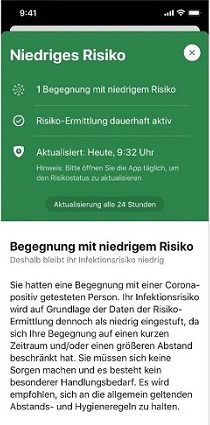

Die Corona-Warn-App hat ein Update erhalten, das für alle Nutzerinnen und Nutzer im App Store von Apple und dem Google Play Store zum Download bereitsteht. Programmversion 1.3 verbessert unter anderem die Textverständlichkeit beim Risikostatus und bei Testergebnissen, sowie die Verständlichkeit von Meldungen beim Scannen von QR-Codes.  
<!-- overview -->

Wesentliche Neuerungen sind **zusätzliche Informationen zum Risikostatus**. Falls eine Begegnung mit niedrigem Risiko vorliegt, erhalten Nutzerinnen und Nutzer in der Detailansicht zum Risikostatus nun eine kurze Erläuterung, warum trotz einer oder mehrerer Begegnungen mit einer positiv auf COVID-19 getesteten Person weiterhin das Infektionsrisiko als niedrig eingestuft wird. Die Empfehlung, die Corona-Warn-App zur Sicherheit einmal täglich zu öffnen, wird nun auch in der App angezeigt.

Darüber hinaus enthält Corona-Warn-App Version 1.3 im Impressum einen **Link zu einem Kontaktformular** des Robert Koch-Instituts, über das Nutzerinnen und Nutzern die Kontaktaufnahme bei Fragen und Anregungen erleichtert wird. 

Auf iOS-Geräten zeigt die App zudem den Status „Unbekanntes Risiko“ an, falls der Risikostatus seit 48 Stunden nicht aktualisiert wurde. Das kann beispielsweise der Fall sein, wenn die [Hintergrundaktualisierung](/de/faq/#no_risk_update_ios) nicht aktiviert wurde. Nutzerinnen und Nutzer können den Risikostatus dann in der App manuell aktualisieren.
