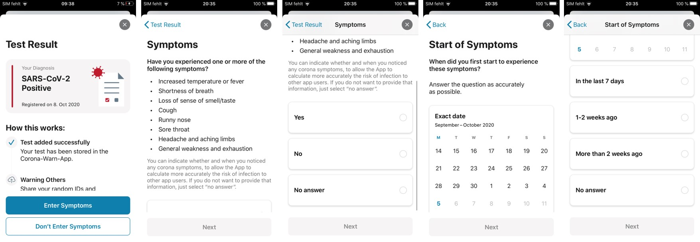

A new update for the Corona-Warn-App is now available in both the Google Play Store and the Apple App Store. Version 1.5 of the App introduces new features such as symptom detection or support of the European Corona App gateway. In addition, some "bugs" have been fixed and further improvements are delivered.  

Note for iOS users: Version 1.5 of the app requires at least iOS version 13.6. So please check if your phone is on iOS 13.6 or higher before you update the app to the new app version 1.5.

<!-- overview -->
 

## Support of the EU Interoperability Gateway   

The new version 1.5 of the German Corona-Warn-App supports the new European interoperability gateway service, which allows national contact tracing and warning apps to interact with each other.  After successful installation of the new version, users will receive detailed information about the connection to the European interoperability gateway as well as the adapted [data protection guidelines](/assets/documents/cwa-privacy-notice-en.pdf) and [terms of use](/assets/documents/cwa-eula-en.pdf) when they start the app for the first time. 

Both Android and iOS users can get access to this list via “Exposure Logging” on the top of the home of the app, where they have to go to “Transnational Exposure Logging” afterwards to see all the participating countries at a glance.

Since Brussels launched the [European interoperability gateway service](https://ec.europa.eu/commission/presscorner/detail/en/ip_20_1904) today, random IDs and diagnostic keys can now be shared with the Corona warning apps of the participating countries in the EU. Germany, Italy and Ireland will soon be followed by other states.   

The gateway service ensures the pseudonymization and security of the shared keys, which means that the identity of the users remains hidden. At the same time, it acts as a universal “translator”, allowing the various IT systems in the individual countries to communicate with each other. If a new app is connected to the gateway, each country can also flexibly decide how the information about an infection is transmitted. Thereby the German Corona-Warn-App uses the option called “One Europe”. According to this, all diagnostic keys from all participating countries are distributed via the national and European gateway to all app users from all participating countries. Learn more about the European interoperability gateway service in the [blog](https://news.sap.com/2020/10/eu-corona-gateway-live/) of Juergen Mueller, member of the Board of Management of SAP SE and Chief Technology Officer (CTO), and Adel Al-Saleh, member of the Board of Management of Deutsche Telekom AG and CEO of T-Systems.  

 

## Symptom Recording  

After receiving a positive test result, users can now voluntarily record their symptoms in the app. This allows to define the infectivity of the users who shared diagnosis keys more precisely. The app can thus evaluate more accurately how high the risk of infection is in an encounter.   

Users who wish to record their symptoms are asked to enter the start of their symptoms in a calendar.   

 

## Improved Texts  

The update also follows feedback from the open source community on GitHub to improve the clarity of texts in the app, such as error messages and explanations. These include descriptions when scanning QR codes (iOS) or information on using location services (Android).  

 

## Bug Fixes  

For **Android users**, two previously common bugs have been fixed:  

First, in some cases the app performed risk checks so frequently that the limit for the number of risk checks per day was reached and an error message was displayed. This daily limit has now been increased in cooperation with Google. This means that from now on more encounters per day can be checked.  

On the other hand, some devices experienced start-up difficulties when opening the app. With version 1.5, it now resets itself automatically in such cases and can be used without problems.   

A corresponding message clearly indicates that resetting the app has no effect on risk detection and status. The active days are reset to 0, also without effect on risk detection and status. It also indicates that the app reset will invalidate a QR code that has just been scanned. In this case, users must request the test result directly from the doctor or laboratory.   
