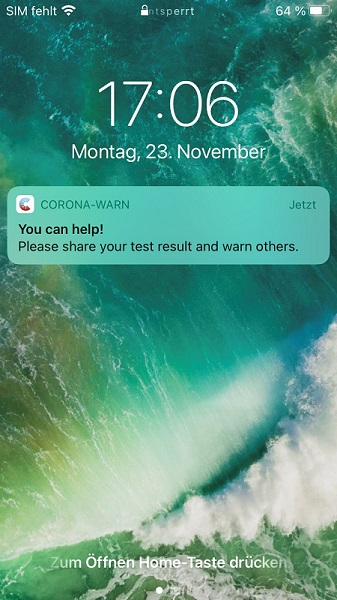

Corona-Warn-App Version 1.7 is now available in the Google Play Store and Apple’s App Store. With the update, Deutsche Telekom and SAP's project team enabled the exposure check to  run several times a day. In addition, users who have tested positive will now receive a reminder if they haven’t shared their test result. 
 
<!-- overview -->

With Corona-Warn-App Version 1.7, the **exposure check** can be run several times a day so that users are informed about possible risk encounters sooner. This repeated daily check is performed automatically. However, it requires a Wi-Fi connection. The standard daily exposure check is still performed once a day, no matter if the smartphone is connected to a Wi-Fi network or not.  

Furthermore, two hours after users have opened their positive test result in the app, they will receive a **reminder to share their result** if they haven’t done so. After another four hours, users get a second reminder if they still haven’t shared the test result. By clicking on the reminder, users can go directly to the function for sharing their result in the Corona-Warn-App. 

Moreover, version 1.7 comes with further improvements such as a smoother interaction between the app and QR codes. Additionally, some minor bugs have been fixed. Among other things, the [error message 'ExposureDetectionIsAlreadyRunning'](/en/faq/#ExposureDetectionIsAlreadyRunning), which was incorrectly displayed to users, no longer appears in CWA version 1.7.  

With the release of version 1.7, we changed to a **controlled rollout** in the App Stores, since the Corona-Warn-App is being downloaded in large numbers. That means: The app is  available to users in waves. This procedure is common for apps with such a wide reach.
While users can manually trigger an update in Apple’s App Store, this option is not available in the Google Play Store. There, the Corona-Warn-App’s new version can be available up to 48 hours later. 
