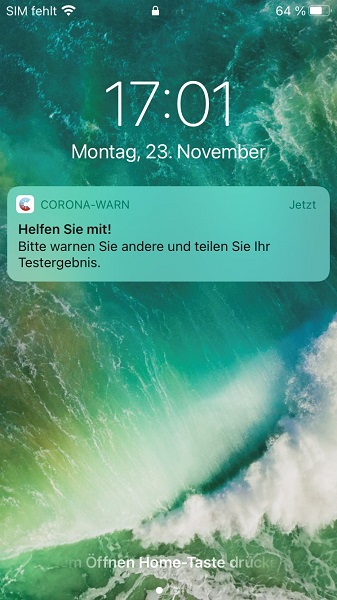

Corona-Warn-App Version 1.7 ist ab sofort im Google Play Store und dem App Store von Apple erhältlich. Mit dem Update ermöglicht das Projektteam der Deutschen Telekom und SAP eine mehrmals tägliche Risikoüberprüfung. Außerdem erhalten positiv getestete Nutzer\*innen in Version 1.7 eine Erinnerung, wenn sie ihr Testergebnis noch nicht geteilt haben sollten. 

 
 
<!-- overview -->

Mit Corona-Warn-App Version 1.7 kann die **Risikoüberprüfung mehrmals täglich** durchgeführt werden, sodass Nutzer*innen schneller über mögliche Risikobegegnungen informiert sind. Die mehrmals tägliche Überprüfung erfolgt automatisch. Voraussetzung dafür ist allerdings, dass das Smartphone mit dem WLAN verbunden ist. Die standardmäßige, tägliche Risikoüberprüfung wird weiterhin unabhängig vom WLAN einmal am Tag durchgeführt.  

Des Weiteren erhalten Nutzer\*innen zwei Stunden nachdem sie das positive Testergebnis in der App geöffnet haben, eine **Erinnerung das Ergebnis zu teilen**, sofern das noch nicht geschehen ist. Nach weiteren vier Stunden erfolgt eine zweite Erinnerung sollte der oder die Nutzer\*in das Testergebnis dann noch nicht geteilt haben. Mit einem Klick auf die Erinnerung gelangen Nutzer\*innen direkt zur Funktion zum Teilen ihres Ergebnisses.  
 

 
Zudem wurden **weitere Verbesserungen** eingearbeitet, wie beispielsweise ein harmonischeres Zusammenspiel von App und QR-Code. Zusätzlich wurden kleinere Bugs behoben. Unter anderem erscheint die [Fehlermeldung 'ExposureDetectionIsAlreadyRunning'](/de/faq/#ExposureDetectionIsAlreadyRunning), die Nutzer\*innen fälschlicherweise angezeigt wurde, in CWA Version 1.7 nicht mehr.  

Mit Einführung von Version 1.7 der Corona-Warn-App wurde auf einen **kontrollierten Rollout** in den App Stores umgestellt, da mittlerweile ein sehr hohes Downloadaufkommen der Corona-Warn-App vorherrscht. Das bedeutet: Die App wird den Nutzer\*innen in Wellen zur Verfügung gestellt. Dieses Verfahren ist üblich bei Apps mit solch einer großen Reichweite.
Während die Nutzer\*innen im Apple Appstore manuell ein Update anstoßen können, besteht diese Möglichkeit im Google Play Store nicht. Hier kann es vorkommen, dass die neue Version der Corona-Warn-App bis zu 48 Stunden später zur Verfügung steht.
