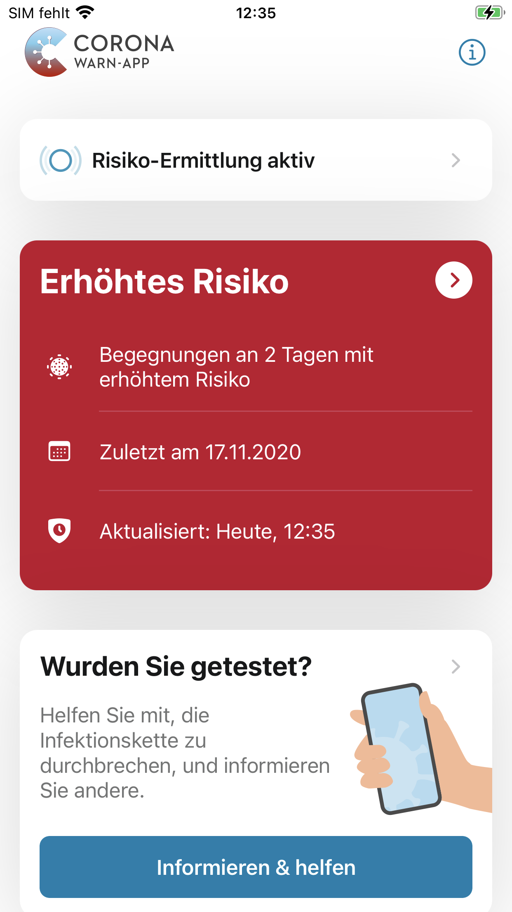

Mit der heute veröffentlichten Version 1.8 greift die Corona-Warn-App auf Version 2 des Exposure Notification Frameworks (ENF) von Apple und Google zurück. Die beiden Unternehmen haben die Schnittstelle erheblich weiterentwickelt, sodass nun mehr pseudonyme Informationen über Begegnungen zur Verfügung  gestellt werden können. 
 
<!-- overview -->

Mit ENF Version 2 erhöht sich somit die Genauigkeit der Risikoermittlung. Nutzer*innen können nun die Anzahl an Tage sehen, an denen Risikobegegnungen stattgefunden haben. Außerdem wird ihnen bei mehreren Begegnungen mit erhöhtem Risiko das Datum der letzten Begegnung angezeigt. 

 

| Tables        | Are           |
| ------------- |:-------------:| 
| col 3 is      | right-aligned | 
 

Außerdem wurden weitere Verbesserung vorgenommen. Auf iOS-Geräten werden die Systemdateien der Corona-Warn-App beispielsweise in kürzeren Abständen aufgeräumt und gelöscht, da es in der Vergangenheit auf Geräten mit großem Speicherplatz zu einer erhöhten Einnahme von Speicherplatz durch die Corona-Warn-App kommen konnte. 
 
Wie schon Version 1.7, wird auch dieses Update in einem kontrollierten Rollout ausgeliefert. Das bedeutet, dass Nutzer*innen die neue Version in Wellen zur Verfügung gestellt wird, da das Downloadaufkommen der Corona-Warn-App mittlerweile sehr hoch ist. Dieses Verfahren ist üblich bei Apps mit solch einer großen Reichweite. Während die neue Version im App Store von Apple bereitsteht und die Nutzer*innen manuell ein Update anstoßen können, besteht diese Möglichkeit im Google Play Store nicht. Hier kann es vorkommen, dass die neue Version der Corona-Warn-App bis zu 48 Stunden später zur Verfügung steht.

