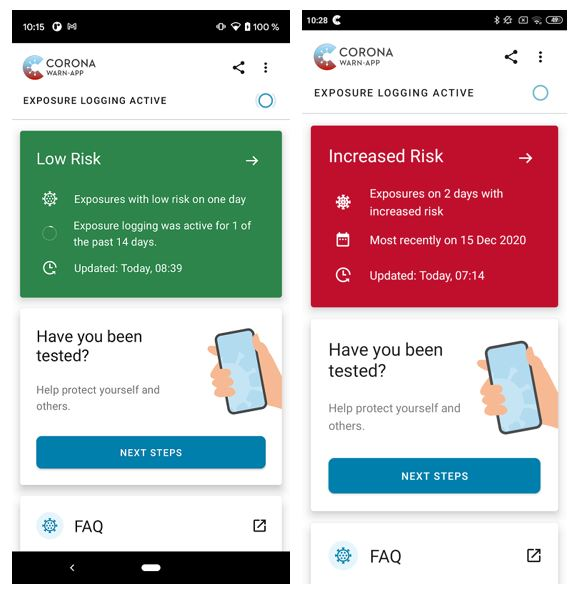

Deutsche Telekom and SAP's project team published a new version of the Corona-Warn-App which will be rolled out to all devices over the next 48 hours. Version 1.9 uses the updated version of the Exposure Notification Framework (ENF) provided by Apple and Google. The two companies have evolved the framework so that more precise pseudonymous information about encounters can be provided. 

 
<!-- overview -->

If a user had multiple encounters with a high risk (red), he or she will see the date when the latest high-risk encounter took place. In addition, the epidemiological **risk assessment is now even more accurate**. Now, multiple - individually considered - low-risk encounters (green) can lead to an increased risk (red): depending on infectivity, 15-30 minutes of low-risk encounters (green) can result in an increased-risk encounter (red). Furthermore, users can now see the **number of days** on which they had an encounter with a high or low risk instead of the number of encounters. With the change to ENF 2.0, it is no longer a single encounter that is decisive for the risk assessment, but the sum of the risk minutes per day. Thus, even several short encounters can lead to an increased risk.

  

 

  

In addition, the **process** from scanning the QR code of a test result to sharing the diagnosis keys has been improved in order to **encourage more users** to share their diagnosis keys and warn others with their positive test result. The developers are working with Google and Apple to further improve and optimize this process. 

Moreover, further improvements have been made in version 1.9. On iOS devices, for example, the Corona-Warn-App system files are cleaned up and deleted at shorter intervals, as the operating system released these files with a delay in the past. 

As it was already the case for the previous version, this update will be delivered in a **controlled rollout** in the App Store and Google Play Store, since the Corona-Warn-App is being downloaded in large numbers. That means: The app is available to users in waves. This procedure is common for apps with such a wide reach. While users can manually trigger an update in Apple’s App Store, this option is not available in the Google Play Store. There, the Corona-Warn-App’s new version can be available **up to 48 hours later**.

