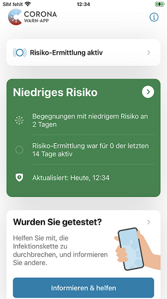
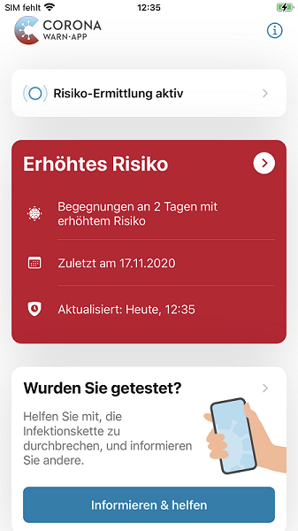

 
Über die nächsten 48 Stunden wird die neue Version 1.9 der Corona-Warn-App auf alle Geräte ausgerollt. Das Projektteam der Deutschen Telekom und SAP stellt damit auf  Version 2 des Exposure Notification Frameworks (ENF) um, das von Apple und Google zur Verfügung gestellt wird. Beide Unternehmen haben die Schnittstelle weiterentwickelt, sodass nun genauere pseudonyme Informationen über Begegnungen zur Verfügung  gestellt werden können.
 
<!-- overview -->

Bei mehreren Begegnungen mit erhöhtem Risiko (rot) wird Nutzer\*innen nun das Datum angezeigt, an dem die letzte Begegnung mit erhöhtem Risiko stattgefunden hat. Zudem wird die epidemiologische **Risikobewertung nun noch genauer**. Nun können mehrere – einzeln betrachtete – Begegnungen mit niedrigem Risiko (grün) zu einem erhöhten Risiko (rot) führen: je nach Infektiösität werden 15-30 Minuten an Begegnungen mit niedrigem Risiko (grün) zu einer Begegnung mit erhöhtem Risiko (rot). Auch die Anzeige ändert sich. Nutzer\*innen werden nun die **Anzahl an Tagen** angezeigt, an denen Risikobegegnungen stattgefunden haben, dafür aber nicht mehr die Anzahl an Begegnungen. Für die Risikobewertung ist mit der Umstellung auf das ENF 2.0 nicht mehr eine einzige Begegnung ausschlaggebend, sondern die Summe der Risikominuten pro Tag. So können auch mehrere, kurzzeitige Risikobegegnungen zu einem erhöhten Risiko führen.

  
  

  

  

Des Weiteren wurde der **Ablauf** vom Einscannen des Testergebnisses bis zum Teilen der Diagnoseschlüssel verbessert, um **mehr Nutzer\*innen zu ermutigen** ihre Diagnoseschlüssel zu teilen und mit ihrem positiven Testergebnis andere zu warnen. Gemeinsam mit Google und Apple arbeiten die Entwickler\*innen daran, den Ablauf noch weiter zu verbessern und zu optimieren. 

Zudem wurden weitere Verbesserungen vorgenommen. Auf iOS-Geräten werden die temporären Dateien der Corona-Warn-App beispielsweise in kürzeren Abständen aufgeräumt und gelöscht, da diese Dateien in der Vergangenheit vom Betriebssystem erst verspätet freigegeben worden sind. 

Wie schon bei der vorherigen Version, wird auch dieses Update in einem **kontrollierten Rollout** ausgeliefert. Das bedeutet, dass Nutzer\*innen die neue Version in Wellen zur Verfügung gestellt wird, da das Downloadaufkommen der Corona-Warn-App mittlerweile sehr hoch ist. Während Version 1.9 im App Store von Apple bereitsteht, sodass iOS-Nutzer\*innen manuell ein Update anstoßen können, besteht diese Möglichkeit im Google Play Store nicht. Hier kann es vorkommen, dass die neue Version der Corona-Warn-App **bis zu 48 Stunden später** zur Verfügung steht.

