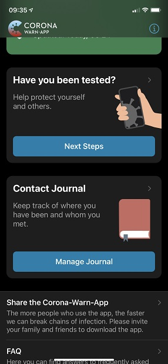

 

With the Corona-Warn-App's next update (version 1.10), Deutsche Telekom and SAP's project team add a contact journal to the app, where users can note the names of people they’ve met and locations they’ve visited.
 
<!-- overview -->

With whom have I met in the past 14 days? What places did I visit? This is important information for the health department and for tracing infection chains. However, it is difficult to recall that information over a time period of two weeks so the contact journal serves as a **useful memory aid**. The new version with the journal is currently in beta testing and will be available for download soon. Detailed information on how the contact journal works can be found in this blog as soon as the new version is available.
 

  

  

