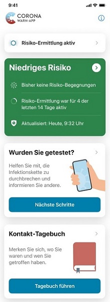

 
Mit dem nächsten Update auf Version 1.10 fügt das Projektteam der Deutschen Telekom und SAP der Corona-Warn-App ein Kontakt-Tagebuch hinzu. Nutzer\*innen können darin Begegnungen und Orte notieren.
 
<!-- overview -->

Wen habe ich in den letzten vierzehn Tagen getroffen? Welche Orte habe ich in den vergangenen zwei Wochen besucht? Für das Gesundheitsamt und das damit verbundene Aufspüren von Infektionsketten sind das wichtige Informationen. Aber wer kann sich schon so lange zurückerinnern? Das Kontakt-Tagebuch ist daher eine **nützliche Gedächtnisstütze**. Die neue Version 1.10 mit Kontakt-Tagebuch ist gerade im Beta-Test und steht bald zum Download bereit. Dann erhalten Sie hier detailliertere Informationen darüber, wie das neue Feature genau funktioniert.

  

  

