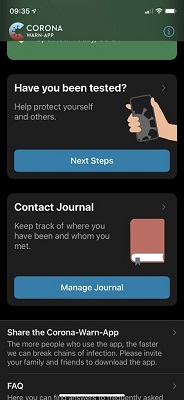
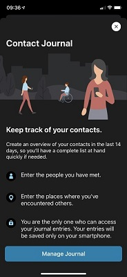
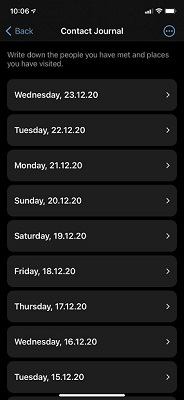
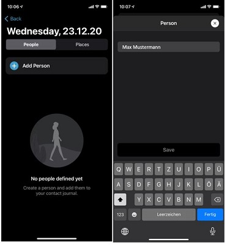
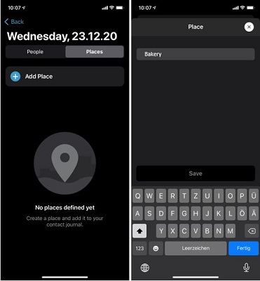
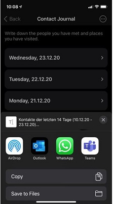
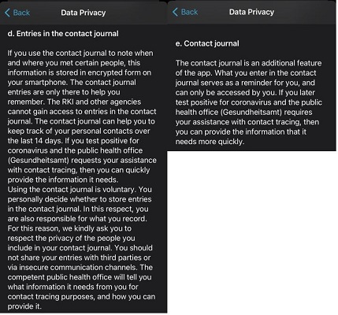

 
Deutsche Telekom and SAP's project team published the next update of the Corona-Warn-App. It will be available for download in  the next 48 hours. The most important innovation in version 1.10 of the Corona-Warn-App is a **contact journal**. Users can use the app to voluntarily note the people they’ve met and places they’ve visited. This is important information for the health department and for tracing infection chains. However, it is difficult to recall that information over a time period of two weeks so the contact journal serves as a useful memory aid.
 
<!-- overview -->

### How the contact journal works

The Corona-Warn-App screen now shows the new contact journal section (Figure 1). By tapping the *Manage Journal* button, users get a brief explanation about the new feature (Figure 2). After that, they are taken to a view of the past 14 days. There, users can enter people they’ve met and places they’ve visited (Figure 3).

  

    

  

### Adding people and locations

In order to add people and locations to the journal, users can click on the corresponding day in the list. They can select whether they want to add people or places with the help of the slider. By tapping on the blue plus sign, a new window opens. There, users can enter the name and/or location and save the changes. Name and/or place will then appear under the selected date. 

  

  
   

  

  

**Useful tip**: If users visit a place or meet a person repeatedly it is not necessary to enter the names and locations a second time. The journal records both the names and locations in a list. With a single tap both names and locations can be selected from the list for another day.

### Deleting and editing data

The Corona-Warn-App automatically deletes the information stored on a user’s smartphone after 16 days for privacy reasons and to free storage space. A risk of infection generally exists for 14 days, however, time differences for example, can cause the time period to be exceeded. Therefore, the app grants a two-day buffer before deleting the contact information. 

**Important**: The app only stores contact data on the smartphone, not on a server. Of course, users can also delete people and places manually at any time. To do so, they can tap the button in the upper right corner and select *Edit People* or *Edit Places*. Individual people and places can be deleted as well as the entire list. 

In this menu, users can also change information about existing person and location entries, such as adding a last name to the first name. After they've clicked on the three dots and selected *Edit people* or *Edit places*, they can tap on the place or person they want to edit. 

### Exporting data

When selected, the button at the upper right corner also hows the *Export Entries* function. A user can tap this button to create a contact list of the past 14 days. Users can **voluntarily** send this list to the health department if needed. In case of an infection, this information is a great help to the health department’s staff as it can allow them to quickly find and warn contacts that there is a risk of infection. Anyone wishing to use this function should always enter the contacts' first and last names. The use of nicknames can slow the process of finding and alerting individuals that may be at risk of infection.

The app exports the contact list in RTF (Rich Text Format) which is widely used. Computers, smartphones or tablets can usually read this format. When exporting, the operating system offers apps for sending the list. That works by mail as well as via WhatsApp, iMessage (iPhone) or simple short message. Before sending the list to the health department, the app shows a **data protection notice**: *The following list is used by the responsible health department for contact tracing* according to § 25 Infection Protection Act (German: [Infektionsschutzgesetz (IfSG)](https://www.bundestag.de/resource/blob/690734/c5bec62e6b1a9dd40cef93bce90b9a43/WD-9-009-20-pdf-data.pdf). 

  

  

  

### Important data protection notices

Sharing contact lists is sensitive. Users are therefore well advised to read the information on data processing. This information  can be found in the Contact Journal by tapping the button at the top right corner under *Info*. 
Note the following **important message** users will see on the app: *Please think carefully about with whom you share the information recorded in your contact journal, and how you share it. The information is meant to help you remember – it is not intended for anyone else. If the public health office (Gesundheitsamt) asks for your help with contact tracing, then sharing your entries is appropriate.*

*Private individuals as well as companies are not allowed to make you disclose the information you have recorded. Please respect the wishes of anyone who does not want to be recorded in your contact journal.* 

Further instructions can be found in the **privacy notice**, which can also be accessed via the Info menu item. Points 5d and 6e are particularly important. Among other things, under point 5d it states: 

*Using the contact journal is voluntary. You personally decide whether to store entries in the contact journal. In this respect, you are also responsible for what you record. For this reason, we kindly ask you to respect the privacy of the people you include in your contact journal. You should not share your entries with third parties or via insecure communication channels. The public health office will ask for the information it needs for contact tracing purposes, and how to provide it.* 

  

  

  

Users can think of the new feature as a handwritten note or a Word document that records contacts from the past two weeks. 

While the new feature requires some additional work, it ultimately helps public health departments trace infection chains more quickly. Thus, finding chains of infection through the contact journal and breaking chains of infection by sharing a positive test result are now combined in the Corona-Warn-App. Hence, it becomes an **active, daily companion** to help contain the spread of the pandemic.

### Availability for iOS and Android users

As it was already the case for the previous versions, this update will be delivered in a controlled rollout in the App Store and Google Play Store, since the Corona-Warn-App is being downloaded in large numbers. That means: The app is **available to users in waves**. This procedure is common for apps with such a wide reach. While users can manually trigger an update in Apple’s App Store, this option is not available in the Google Play Store. There, the Corona-Warn-App’s new version can be available up to 48 hours later.
