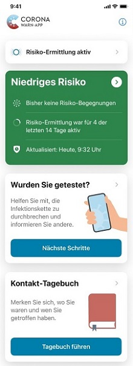
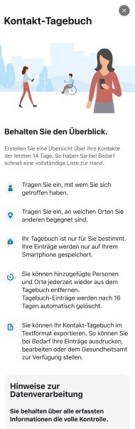
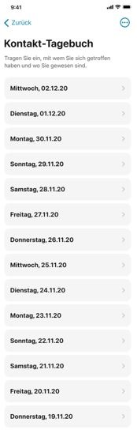
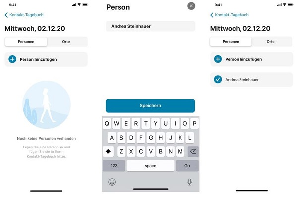
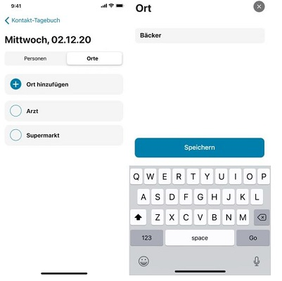
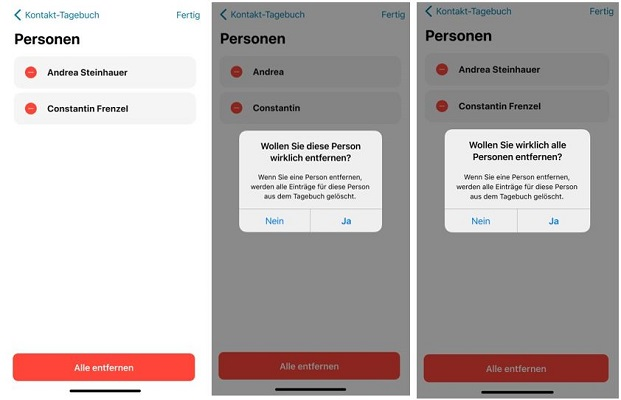
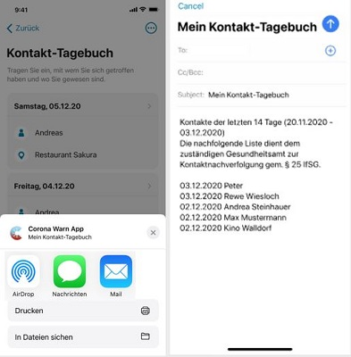
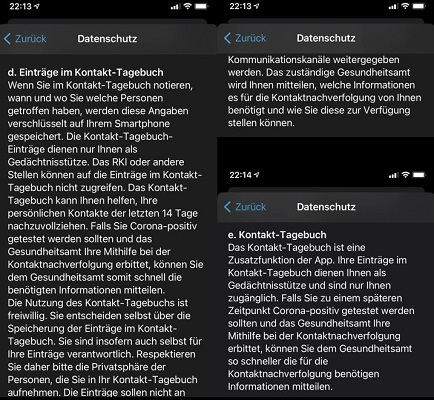

 
Das Projektteam der Deutschen Telekom und SAP hat das nächste Update der Corona-Warn-App veröffentlicht. Nutzer\*innen können es innerhalb der nächsten 48 Stunden herunterladen. Wichtigste Neuerung: Version 1.10 führt ein **Kontakt-Tagebuch** ein. Nutzer\*innen können darin **freiwillig** Begegnungen und Orte notieren. Wen habe ich in den letzten vierzehn Tagen getroffen? Welche Orte habe ich in den vergangenen zwei Wochen besucht? Für das Gesundheitsamt und das Auffinden von Infektionsketten sind das wichtige Informationen. Aber wer kann sich schon so lange zurückerinnern? Das Kontakt-Tagebuch ist daher eine nützliche Gedächtnisstütze. Die Corona-Warn-App wird mit diesem neuen Feature zu einem aktiven täglichen Begleiter, um die Ausbreitung der Pandemie einzudämmen.
 
<!-- overview -->

### So funktioniert das Kontakt-Tagebuch

Der Bildschirm der Corona-Warn-App zeigt nun den neuen Bereich Kontakt-Tagebuch (Bild 1). Mit einem Tippen auf die Schaltfläche *Tagebuch führen* erhalten Nutzer\*innen eine kurze Erklärung der neuen Funktion (Bild 2). Danach kommen sie zu einer Übersicht der zurückliegenden 14 Tage. Sie können dort Begegnungen mit Personen oder besuchte Orte eintragen (Bild 3). 

  

   

  

### Personen und Orte hinzufügen
Dazu klicken Nutzer\*innen auf den entsprechenden Tag in der Liste. Mit den Schaltflächen wählen sie, ob sie Personen oder Orte hinzufügen wollen.  Mit Auswahl des blauen Plus-Zeichens öffnet sich ein neues Fenster: dort den Namen und/oder Ort eintragen und anschließend speichern. Name und/oder Ort erscheinen dann unter dem gewählten Datum.   

  

 
   

 

  

Praktisch: Wer einen Ort erneut besucht oder eine Person wiederholt trifft, muss das kein zweites Mal eingeben. Beides hält das Kontakt-Tagebuch in einer Liste fest, sodass es sich für einen weiteren Tag bequem von der Liste auswählen lässt.

### Löschen und Bearbeiten der Daten
Die Corona-Warn-App löscht die auf dem Smartphone gespeicherten Angaben automatisch nach 16 Tagen aus Datenschutzgründen und, um Speicherplatz freizugeben. Eine Ansteckungsgefahr besteht allgemein 14 Tage lang. Durch Zeitverschiebungen beispielsweise kann es aber zu Überschreitungen dieser 14 Tage kommen. Daher gewährt die App zwei Tage Puffer, bevor sie die Kontaktinformationen löscht.

**Wichtig:** Kontaktdaten speichert die App grundsätzlich lediglich auf dem Smartphone, nicht aber auf einem Server. Nutzer\*innen können Personen und Orte selbstverständlich jederzeit auch manuell löschen. Sie tippen dazu auf das dafür vorgesehene Symbol (die drei eingekreisten Punkte) am oberen rechten Rand. Dort wählen sie *Personen bearbeiten* beziehungsweise *Orte bearbeiten* aus. Einzelne Personen und Orte lassen sich ebenso löschen wie die gesamte Liste. 

In diesem Menu können Nutzer\*innen zudem bestehende Personen- sowie Ortseinträge nachträglich ändern, um beispielsweise den Vornamen mit einem Nachnamen zu ergänzen. Nachdem Nutzer\*innen auf die drei eingekreisten Punkte und *Personen bearbeiten* oder *Orte bearbeiten* geklickt haben, können sie durch Tippen auf den Ort oder die Person den entsprechenden Eintrag bearbeiten. 
  

 

  

### Exportieren der Daten

Das Symbol am oberen rechten Rand zeigt bei Auswahl ein Menü mit der Funktion *Einträge exportieren*. Angetippt erstellt sie eine Kontaktliste der zurückliegenden 14 Tage. Nutzer\*innen können die Liste bei Bedarf an das Gesundheitsamt senden. Das ist selbstverständlich freiwillig. Bei einer Infektion sind diese Angaben allerdings eine große Hilfe für die Mitarbeiter\*innen der Gesundheitsämter. Sie gewinnen wertvolle Zeit, um gefährdete Kontakte zu finden und zu warnen. Wer diese Funktion nutzen möchte, trägt daher stets die Kontakte mit Vor- und Nachnamen ein. Spitznamen führen zu vermeidbaren Nachfragen.

Die App exportiert die Kontaktliste im Format RTF (Rich Text Format). RTF ist weit verbreitet. Computer, Smartphones oder Tablets können das Format in der Regel verarbeiten. Beim Export bietet das Betriebssystem Apps zum Versand an: Der Versand funktioniert per Mail ebenso wie mit WhatsApp, iMessage (iPhone) oder schlichter SMS. Vor Versand an das Gesundheitsamt stellt die App der Liste einen Datenschutzhinweis voran: *Die nachfolgende Liste dient dem zuständigen Gesundheitsamt zur Kontaktnachverfolgung gem.* [§ 25 IfSG](https://www.bundestag.de/resource/blob/690734/c5bec62e6b1a9dd40cef93bce90b9a43/WD-9-009-20-pdf-data.pdf). Hierbei handelt es sich um das Infektionsschutzgesetz.

  

 

  

### Besonders wichtig: Datenschutzhinweise lesen

Das Teilen von Kontaktlisten ist grundsätzlich sensibel. Nutzer\*innen sind daher gut beraten, die **Hinweise zur Datenverarbeitung** zu beachten. Sie lassen sich im Kontakt-Tagebuch ebenfalls durch Tippen der Schaltfläche oben rechts unter dem Menüpunkt Info aufrufen. Besonders wichtig ist der folgende **Hinweis**: *Bitte prüfen Sie genau, mit wem und auf welche Weise Sie die in ihrem Kontakt-Tagebuch erfassten Informationen teilen. Die Informationen sollen Ihnen als Gedächtnisstütze dienen – sie sind nicht für Dritte bestimmt. Wenn das Gesundheitsamt Sie im Rahmen der Kontaktnachverfolgung um Ihre Mithilfe bittet, ist die Weitergabe von Einträgen sachgerecht.*

*Private Personen oder Unternehmen dürfen von Ihnen nicht die Weitergabe der von Ihnen erfassten Informationen verlangen. Bitte respektieren Sie, wenn jemand nicht im Kontakt-Tagebuch erfasst werden möchte.*

Weitere Hinweise finden sich auch in der **Datenschutzerklärung**, die ebenfalls über den Menüpunkt Info zugänglich ist. Wichtig sind insbesondere die Punkte 5d und 6e. Bei Punkt 5d heißt es unter anderem: 

*Die Nutzung des Kontakt-Tagebuchs ist freiwillig. Sie entscheiden selbst über die Speicherung der Einträge im Kontakt-Tagebuch. Sie sind insofern auch selbst für Ihre Einträge verantwortlich. Respektieren Sie daher bitte die Privatsphäre der Personen, die Sie in Ihr Kontakt-Tagebuch aufnehmen. Die Einträge sollen nicht an Dritte und nicht über unsichere Kommunikationskanäle weitergegeben werden. Das zuständige Gesundheitsamt wird Ihnen mitteilen, welche Informationen es für die Kontaktnachverfolgung von Ihnen benötigt und wie Sie diese zur Verfügung stellen können.*

  

 

  

Nutzer\*innen können sich die neue Funktion wie eine handgeschriebene Notiz oder ein Word-Dokument vorstellen, in dem sie Kontakte der vergangenen zwei Wochen festgehalten haben. 

Die neue Funktion erfordert zwar einen gewissen Mehraufwand, hilft den Gesundheitsämtern letztlich aber, Infektionsketten schneller zurückzuverfolgen. Somit werden das Auffinden von Infektionsketten durch das Kontakt-Tagebuch und das Durchbrechen von Infektionsketten durch das Teilen eines positiven Testergebnisses nun an einem Ort vereint: der Corona-Warn-App. Sie wird damit zu einem **aktiven, täglichen Begleiter**, um die Ausbreitung der Pandemie einzudämmen.

### Update nicht für alle auf einmal

iOS-Nutzer\*innen können sich die aktuelle App-Version ab sofort aus dem Store von Apple manuell herunterladen. Wegen der inzwischen fast 25 Millionen Downloads, steht die Corona-Warn-App in der aktuellen Version 1.10 in den nächsten Tagen – wie schon bei vorherigen Updates – in Wellen zum Download bereit. Der Google Play Store bietet keine Möglichkeit, ein manuelles Update anzustoßen. Hier steht Nutzer\*innen die neue Version der Corona-Warn-App über die nächsten 48 Stunden zur Verfügung.

