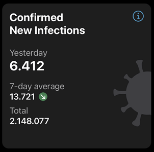
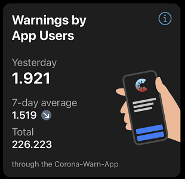
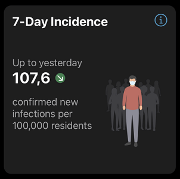
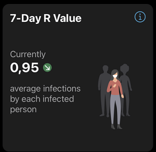
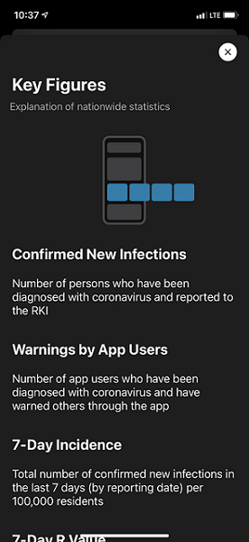
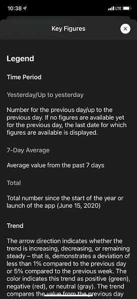
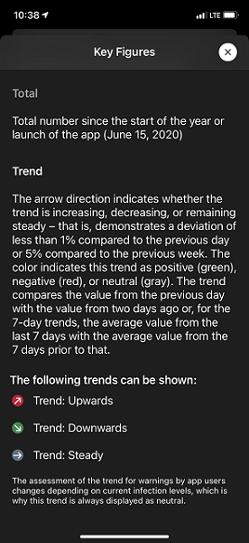

 
Within the next 48 hours, users will be able to download the Corona-Warn-App’s next update. With version 1.11, the Deutsche Telekom and SAP's project team added an additional area with statistics to the app’s home screen. There, users can see current key figures on the infection numbers in Germany, as well as the number of users tested positive who have warned their fellow citizens via the app.
 
<!-- overview -->

The new feature gives the more than 25 million users the opportunity to find out about the current Corona situation in Germany directly in the app and encourages them to warn others in case they’ve been tested positive. 

While the figures on the infection numbers come from the Robert Koch Institute, the number of transmitted warnings comes from the Corona-Warn-App’s IT system. The numbers are updated hourly and edited for the app. The statistics show changes as soon as new information is available. 

With a **swipe to the left**, users can scroll through the figures. The app first shows them the number of people who have tested positive for COVID-19 recently and the number of total infections. Users can also see the average number of people who have tested positive for COVID-19 over the past seven days.

The **arrow directions and colors** behind the numbers indicate the trend. It compares the figures from the previous day with those from two days ago, or – for the 7-day trends –  the average value of the last seven days with the average value of the seven days prior to that. 

 
  

 

  

The app then displays the number of users tested positive who have **warned their fellows via the app**. Again, it also displays the average number of users who have warned others via the app over the past seven days. **The arrow indicating this trend is always displayed as neutral (grey). A rise or fall in the figure cannot necessarily be classified as positive or negative, as it is dependent on current infection levels.**

  

 
   

Users also see the **7-day incidence rate**, which is the confirmed new infections per 100,000 inhabitants, and the **7-day R value**. This R value indicates to how many other people an infected person passes the virus on average.

  

  
   

By tapping the circled "i"   in the upper right corner of the statistics, users can get more detailed explanations on the figures.

  

  
   

In addition to the new function, the developers have further adjusted and improved the app and will continue to do so in the future. As part of this, the Corona-Warn-App will soon be available for **older iPhones**. More information will be available here as soon as the update is published. 

Version 1.11 - like previous versions – will be delivered in a controlled rollout and is made available for users in waves. While users can manually trigger an update in Apple’s App Store, this option is not available in the Google Play Store. There, the Corona-Warn-App’s new version can be available up to 48 hours later.

