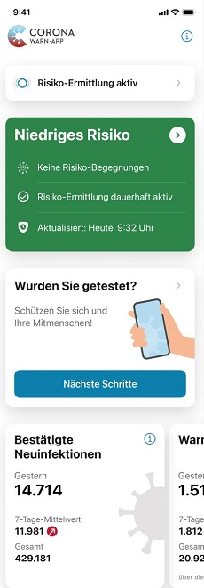
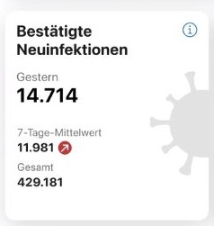
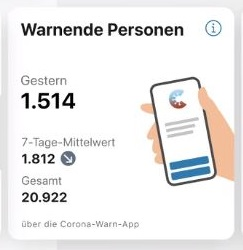
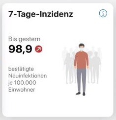
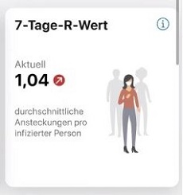
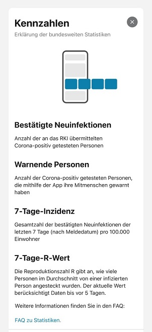
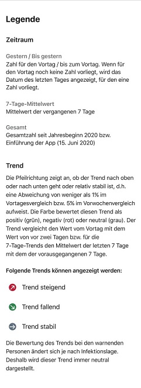

 
Innerhalb der nächsten 48 Stunden können Nutzer\*innen das nächste Update der Corona-Warn-App herunterladen. Mit Version 1.11 hat das Projektteam der Deutschen Telekom und SAP dem Home-Bildschirm der App erstmals einen Bereich mit Statistiken hinzugefügt. Dort können Nutzer\*innen sowohl die wichtigsten Kennzahlen zum aktuellen Infektionsgeschehen in Deutschland sehen, als auch die Anzahl positiver getesteter Nutzer*innen, die ihre Mitmenschen über die App gewarnt haben.
 
<!-- overview -->

Die neue Funktion gibt den mittlerweile mehr als 25 Millionen Nutzer\*innen die Möglichkeit, sich direkt in der App über die aktuelle Corona-Lage in Deutschland zu informieren und ermutigt sie, Mitmenschen im Falle einer Infektion durch das Teilen ihres positiven Testergebnisses zu warnen. 

Quelle der Statistiken zum Infektionsgeschehen ist das Robert-Koch-Institut. Die Zahl der übermittelten Warnungen kommt aus dem IT-System der Corona-Warn-App. Die Werte werden stündlich aktualisiert und für die App aufbereitet. Die Statistik zeigt Veränderungen an, sobald neue Informationen vorliegen.

  

 

  

Mit einem **Wisch nach links** können Nutzer*innen sich durch die Kennzahlen blättern. Die App zeigt ihnen zunächst die bestätigten Neuinfektionen an, die an das Robert Koch-Institut übermittelt wurden, sowie die aktuelle Gesamtzahl an Corona-positiv getesteten Personen. Der 7-Tage-Mittelwert gibt die durchschnittliche Anzahl an Personen an, die in den vergangenen sieben Tage positiv auf das Corona-Virus getestet wurden. 

Die **Pfeilrichtungen und -farben** hinter den Zahlen zeigen den Trend an. Dieser vergleicht den Wert vom Vortag mit dem Wert von vor zwei Tagen, beziehungsweise den Mittelwert der letzten sieben Tage mit dem Mittelwert der vorausgegangenen sieben Tage für die 7-Tage-Trends. 
 

  

 

  

Danach zeigt die App die Anzahl der Corona-positiv getesteten Nutzer\*innen an, die ihre Mitmenschen **mithilfe der App gewarnt** haben. Auch hier gibt der 7-Tage-Mittelwert wieder die durchschnittliche Anzahl an Nutzer\*innen an, die ihr Testergebnis in den vergangenen sieben Tagen geteilt haben. **Der Trend-Pfeil ist bei dieser Kennzahl immer grau, da ein Steigen oder Fallen der Zahl nicht zwangsläufig als positiv oder negativ eingeordnet werden kann, sondern abhängig vom Infektionsgeschehen ist**.  

  

  
   

Nutzer*innen sehen außerdem die **7-Tage-Inzidenz**, also die bestätigen Neuinfektionen pro 100.000 Einwohner und den **7-Tage-R-Wert**. Dieser R-Wert gibt an, wie viele weitere Personen eine infizierte Person im Durchschnitt ansteckt. 

  

  
   

Mit einem Klick auf das eingekreiste "i"  
in der oberen rechte Ecke der Statistiken, gelangen Nutzer*innen zu detaillierteren Erklärungen der Kennzahlen. 

  

  
   

Neben der neuen Funktion haben die Entwickler*innen weitere Anpassungen und Verbesserungen vorgenommen. Auch in Zukunft wird die Corona-Warn-App weiter ausgebaut und verbessert. Im Zuge dessen wird sie bald auch für **ältere iPhones** zur Verfügung stehen. Weitere Informationen erhalten Sie hier, sobald das entsprechende Update zur Verfügung steht. 

Version 1.11 wird – wie schon vorherige Versionen – schrittweise über mehrere Tage an alle Nutzer\*innen ausgerollt. iOS-Nutzer\*innen können sich die aktuelle App-Version ab sofort aus dem Store von Apple manuell herunterladen. Der Google Play Store bietet keine Möglichkeit, ein manuelles Update anzustoßen. Hier steht Nutzer\*innen die neue Version der Corona-Warn-App über die nächsten 48 Stunden zur Verfügung.
