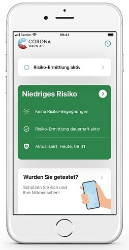

 
Deutsche Telekom and SAP’s project team has released an update of the Corona-Warn-App, which will be available to users within the next 48 hours. There are two major innovations in version 1.12: First, the Corona-Warn-App now runs on the iPhone 5s, 6, and 6 Plus. Secondly, users can now find their exposure history in the contact journal. 
 
<!-- overview -->

With version 1.12, users who have an **iPhone 5s, 6 or 6 Plus** can now use the Corona-Warn-App. That amounts to an estimated maximum of 1.7 million devices. Until recently, the interface for contact tracing apps developed by Apple and Google, which the Corona-Warn-App uses, required at least iOS 13.5. With an update to the iOS 12.5 operating system released in December, Apple expanded its support for the interface and made it available for older iPhones. 

  

 

  

Users can use the Corona-Warn-App on iOS 12.5 without restrictions. The only difference: Under iOS 12.5, the Corona-Warn-App updates the risk calculation **in the background** up to two times a day, while it does so up to six times a day under iOS 13.7 and above, given the smartphone is connected to Wifi. If users open the Corona-Warn-App under iOS 12.5 when connected to Wifi, they can trigger risk calculation manually, so that it can also be updated up to six times a day. 

To use the Corona-Warn-App, owners of an iPhone 5s, 6 or 6 Plus should first install the latest supported operating system (iOS 12.5). Then, they can download the app from Apple's app store.

## Contact journal with exposure history

Another new feature in version 1.12 is the **exposure history**, which users can find in the contact journal’s overview. It allows users to better assess the risk they’ve been exposed to: While the app’s home screen only shows the date of the latest encounter in case of several risk encounters, users now can use the contact journal to see when other encounters with a high or low risk took place. If they've had encounters with a high or low risk in the past 15 days, users can find the exposure history in the overview of their contact journal after they've selected "Open Journal".

  

 

  

### Don’t draw false conclusions

**Important note**: The contact journal serves as a private memory aid and is independent from the app’s contact tracing system. Therefore, it is very important to distinguish between the personal entries in the contact journal (places and people) and the app's tracing system: For privacy reasons, the Corona-Warn-App does not know where users have been or whom they’ve met. It only receives pseudonymized IDs of other smartphones. That’s why it cannot identify or display a connection between a place or person added to the contact journal and an increased risk. Hence there’s a note after each risk encounter in the exposure history: *"Increased risk based on the encounters evaluated by the app. __They are not necessarily related to the people and places you have recorded__."* This means users must not draw false conclusions. An encounter with a high or low risk may or may not have taken place at a location or with a person added to the contact journal.

Such a separation of private entries and the app’s contact-tracing-system is also the reason why Apple and Google do not allow their interface to access users' address books.

Thus, this new function is an **additional support** for users and is independent of entries in the contact journal. However, it provides users with a better overview of their risk encounters and helps them to better understand when they have been exposed to risk. With this new function, the project team is **responding to feedback** from users who wished for more detailed information in this regard.  

Version 1.12 - like previous versions – will be delivered in a controlled rollout and is made available for users in waves. While users can manually trigger an update in Apple’s App Store, this option is not available in the Google Play Store. There, the Corona-Warn-App’s new version can be available up to 48 hours later.

