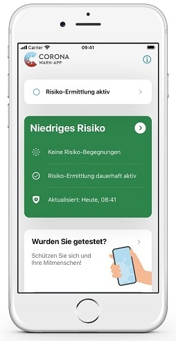
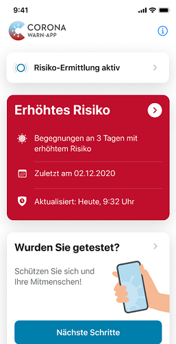
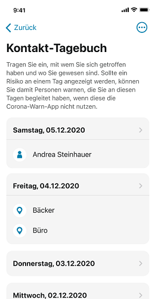
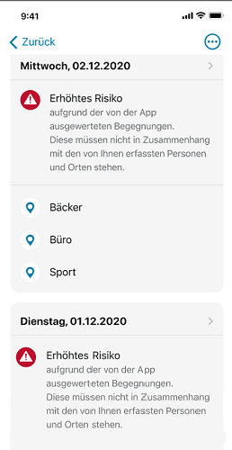
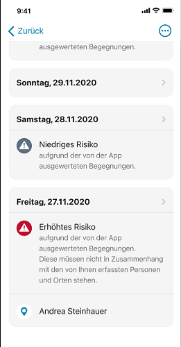

 
Das Projektteam der Deutschen Telekom und SAP hat ein Update der Corona-Warn-App veröffentlicht, das Nutzer*innen innerhalb der nächsten 48 Stunden zur Verfügung steht. In Version 1.12 gibt es zwei große Neuerungen: Zum einen läuft die Corona-Warn-App nun auch auf dem iPhone 5s, dem iPhone 6 und 6 Plus. Zum anderen verfügt das Kontakt-Tagebuch nun über eine Begegnungshistorie. 
 
<!-- overview -->

Mit Version 1.12 können nun auch Nutzer*innen, die ein **iPhone 5s, 6 oder 6 Plus** haben, die Corona-Warn-App nutzen. Schätzungen haben ergeben, dass wir dabei von maximal 1,7 Millionen Geräten ausgehen können. Bislang setzte die von Apple und Google entwickelte Contact-Tracing-Schnittstelle, auf die auch die Corona-Warn-App zugreift, auf Apple-Seite mindestens iOS 13.5 voraus. Mit einem im Dezember veröffentlichten Update auf das Betriebssystem iOS 12.5, beziehungsweise 12.5.1, erweiterte Apple die Unterstützung für die Schnittstelle und machte sie für ältere iPhones verfügbar. 

  

 

  

Nutzer\*innen können die Corona-Warn-App unter iOS 12.5, beziehungsweise 12.5.1, uneingeschränkt verwenden. Der einzige Unterschied: Unter iOS 12.5 aktualisiert die Corona-Warn-App die Risikoberechnung im Hintergrund bis zu zwei Mal am Tag, während das unter iOS 13.7 oder höher bis zu sechs Mal am Tag möglich ist, sofern das Smartphone mit dem WLAN verbunden ist. Öffnen Nutzer\*innen die Corona-Warn-App unter iOS 12.5 im WLAN, können sie die Risikoberechnung manuell auslösen, sodass sie dann ebenfalls bis zu sechs Mal am Tag aktualisiert werden kann.

Um die Corona-Warn-App zu nutzen, sollten Besitzer\*innen eines iPhones 5s, 6 oder 6 Plus also zunächst das neue Betriebssystem (iOS 12.5.1) installieren. Anschließend können sie die App in Apples App-Store herunterladen.

## Kontakt-Tagebuch mit Begegnungshistorie

Eine weitere Neuerung in Version 1.12 ist die **Begegnungshistorie**, die das Projektteam dem Kontakt-Tagebuch hinzugefügt hat. Nutzer*innen können so das eigene Risiko besser einschätzen. Denn während sie auf dem Home-Screen der App im Falle mehrerer Risikobegegnungen nur das Datum der letzten Begegnung sehen, können sie in der Begegnungshistorie auch die Tage der anderen Begegnungen nachschauen. 

  

    

  

Sofern sie in den vergangenen 15 Tagen Risikobegegnungen hatten, können Nutzer*innen die Begegnungshistorie in der Übersicht ihres Kontakt-Tagebuchs sehen, nachdem sie in der App „Tagebuch öffnen“ gewählt haben. 

### Keine falschen Rückschlüsse ziehen

**Wichtig**: Das Kontakt-Tagebuch dient als private Gedächtnisstütze und läuft unabhängig vom Contact-Tracing-System der Corona-Warn-App. Daher ist es sehr wichtig, zwischen den persönlichen Einträgen im Kontakt-Tagebuch (Orte und Personen) und dem System der App zu unterscheiden: Aus Datenschutzgründen weiß die Corona-Warn-App nicht, an welchen Orten Nutzer\*innen waren oder wen sie getroffen haben. Sie empfängt lediglich pseudonymisierte IDs anderer Smartphones. Aus diesem Grund kann sie auch keinen Zusammenhang zwischen einem im Kontakt-Tagebuch eingetragenen Ort oder einer eingetragenen Person und einem erhöhten Risiko erkennen und anzeigen. Deshalb der Hinweis hinter jeder Risikobegegnung in der Historie: *„Erhöhtes Risiko aufgrund der von der App ausgewerteten Begegnungen. __Diese müssen nicht in Zusammenhang mit den von Ihnen erfassten Personen und Orten stehen.“__*  Das bedeutet: Nutzer\*innen dürfen keine falschen Rückschlüsse ziehen. Eine Risikobegegnung kann an einem im Tagebuch eingetragenen Ort oder mit einer eingetragenen Person stattgefunden haben, muss es aber nicht.

Diese Trennung von privaten Einträgen und Tracing-System ist auch der Grund, warum Apple und Google ihrer Schnittstelle bei den Corona-Tracing-Apps den Zugriff auf die Adressbücher der Nutzer\*innen nicht erlauben.

Es handelt sich bei dieser neuen Funktion also um **ein Extra**, das unabhängig von Einträgen im Kontakt-Tagebuch zu betrachten ist. Die neue Funktion bietet Nutzer\*innen einen besseren Überblick über ihre Risikobegegnungen und unterstützt sie darin, selbst gezielter nachvollziehen zu können, wann sie einem Risiko ausgesetzt gewesen waren. Das Projektteam reagiert mit dieser neuen Funktion auf das **Feedback von Nutzer*innen**, die sich genauere Informationen dieser Hinsicht gewünscht hatten. 

Version 1.12 wird schrittweise über zwei Tage an alle Nutzer\*innen ausgerollt. iOS-Nutzer\*innen können sich die aktuelle App-Version ab sofort aus dem Store von Apple manuell herunterladen. Der Google Play Store bietet keine Möglichkeit, ein manuelles Update anzustoßen. Hier steht Nutzer\*innen die neue Version der Corona-Warn-App über die nächsten 48 Stunden zur Verfügung.
