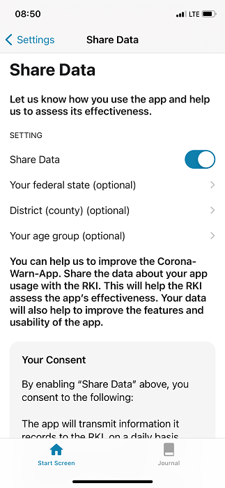

 
Deutsche Telekom and SAP’s project team have released the Corona-Warn-App’s next update that will be available to users within the next 48 hours. With version 1.13, users now have the option to **voluntarily donate data** to help improve the app. In addition, the app now includes a link to a **scientific survey** conducted by the Robert Koch Institute (RKI).

<!-- overview -->

Users who have a red tile, i.e. an increased risk, can take part in the survey via the link in the app. If users provide more information about their behavior before the risk notification and their planned behavior afterwards, experts can analyze the app’s effectiveness and understand it even better. As a result, the project team can further improve the app based on user feedback.  

## Voluntary data donation

If users activate the data donation, the app transmits whether there is a **red or a green tile**, i.e. a low or increased risk. This allows the RKI's experts to see how many people were exposed to which risk in each case. Users also have the option of specifying their **state, county, and age** so that the experts can make a possible connection between warnings and local incidence rates. They can also see, for example, whether there are more red or green tiles in certain age groups than in others. The voluntarily provided data can help experts evaluate the effectiveness of the app and further improve it. 

**Important note**: It is not possible to draw any conclusions about individual persons, so that the **privacy of the users is protected**. 

### How can users provide their data?

When users open the Corona-Warn-App for the first time after the update to version 1.13, a window opens in which users can activate the data donation. They can change the approval in the app settings at any time. To do this, users must scroll down in the app and tap *Settings* at the end. Then, they can activate and deactivate data donation via the slider. There, they can also agree to the consent form and add their age as well as their state and county.  

  

   

  

Once data donation is activated, users do not have to do anything else. The data is automatically transmitted in the background as long as data donation is activated. This does not incur any costs for users. The network operators cover the costs for data transmission in the mobile network, provided the user uses a German SIM card.

In addition, the project team implemented a **separate tab** for the contact journal. Now, users can access their journals more quickly and switch between the home screen and the contact journal faster.
