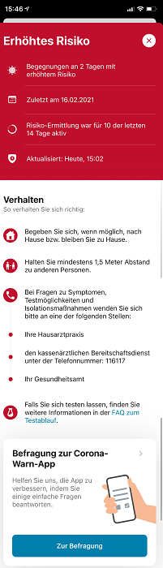
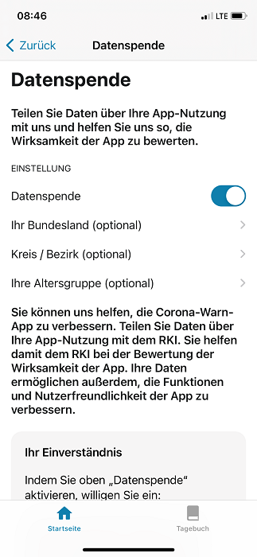
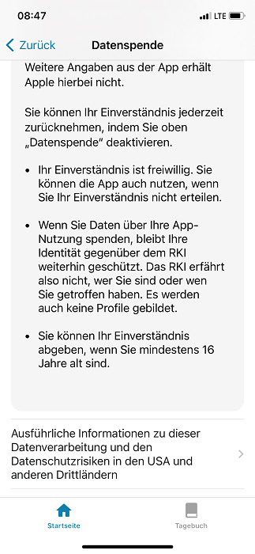

 
Das Projektteam der Deutschen Telekom und SAP hat ein Update der Corona-Warn-App veröffentlicht, das Nutzer*innen innerhalb der nächsten 48 Stunden zur Verfügung steht. Mit Version 1.13 haben sie nun die Möglichkeit **freiwillig Daten zu teilen**, um zur Verbesserung der App beizutragen. Außerdem enthält die App nun einen Link zu einer **wissenschaftlichen Befragung** des Robert Koch-Instituts (RKI).

<!-- overview -->

Der Link zur Befragung wird allen Nutzer\*innen angezeigt, die eine rote Kachel, also ein erhöhtes Risiko, haben. Sie dient dazu, die Wirksamkeit der App zu analysieren und besser zu verstehen, indem die Expert\*innen mehr über das Verhalten der Nutzer\*innen vor der Risikoberechnung und über ihr geplantes Verhalten danach erfahren. Damit können die Projektbeteiligten die App basierend auf dem Feedback der Nutzer\*innen weiter verbessern. 

  

 

  

## Freiwillige Datenspende

Aktivieren Nutzer\*innen die Datenspende in ihrer Corona-Warn-App, übermittelt die App, ob eine **rote oder eine grüne Kachel**, also ein niedriges oder erhöhtes Risiko, vorliegt. So können die Expert\*innen des RKI sehen, wie viele Personen jeweils welchem Risiko ausgesetzt waren. Nutzer\*innen haben außerdem die Möglichkeit ihr **Bundesland, ihren Landkreis und ihr Alter** anzugeben. Die Expert\*innen können dadurch einen möglichen Zusammenhang zwischen Warnungen und lokaler Inzidenz herstellen und beispielsweise erkennen, ob es in bestimmten Altersgruppen mehr rote oder grüne Kacheln gibt, als in anderen. Die freiwillige Datenspende der Nutzer\*innen kann den Expert\*innen helfen, die Wirksamkeit der App zu bewerten und sie weiter zu verbessern. 

**Wichtig**: Die Datenspende lässt keine Rückschlüsse auf individuelle Personen zu, sodass die **Privatsphäre der Nutzer\*innen** gewahrt wird. 

### Wie können Nutzer\*innen ihre Daten teilen?

Beim ersten Öffnen der App nach dem Update auf Version 1.13 öffnet sich ein Popup-Fenster, in dem Nutzer\*innen die Datenspende aktivieren können. Sie können die Freigabe in den Einstellungen der App jederzeit ändern. Dazu müssen Nutzer\*innen in der Corona-Warn-App nach unten scrollen und dort auf *Einstellungen* tippen. Danach können sie die Datenspende über den Schieberegler aktivieren und deaktivieren, sowie der Einverständniserklärung zustimmen. Außerdem können Nutzer\*innen dort auch ihr Alter und ihr Bundesland, beziehungsweise ihren Landkreis hinzufügen. 

  

   

  

Sobald die Datenspende aktiviert ist, müssen Nutzer\*innen nichts weiter tun. Die freigegebenen Daten werden im Hintergrund automatisch übermittelt, solange die Datenspende aktiviert ist.  Für die Nutzer\*innen entstehen dadurch keine Kosten. Die Kosten für die Datenübertragung im Mobilfunknetz werden von den Netzbetreibern getragen, sofern der oder die Nutzer\*in eine deutsche SIM-Karte nutzt.

Desweiteren hat das Projektteam eine eigene **Registerkarte** für das Kontakt-Tagebuch eingeführt, damit Nutzer\*innen schneller auf ihr Tagebuch zugreifen und zwischen Startseite und Kontakt-Tagebuch wechseln können.  
