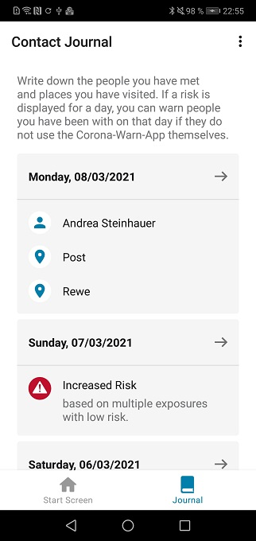
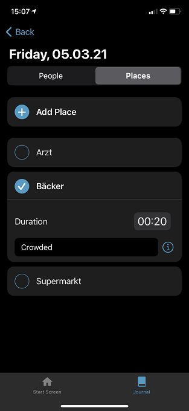
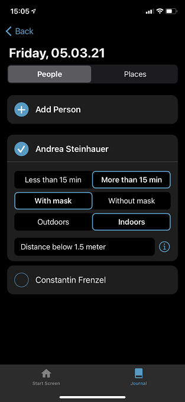
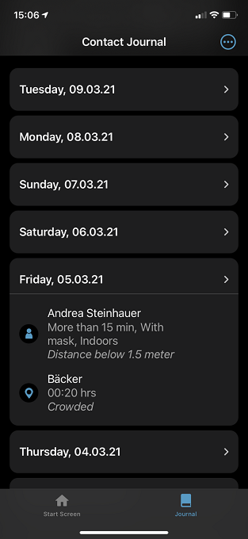

 
In the Corona-Warn-App’s new version, Deutsche Telekom and SAP’s project team have added more **features to the contact journal** as well as more **data points** to the voluntary data donation. Version 1.14 will be available to users within the next 48 hours.

<!-- overview -->

In version 1.14, the developers have once again implemented feedback from app users. In case of a red tile, users can now see whether an increased risk resulted from one or more encounter(s) with an increased risk or from multiple encounters with low risk. 

  

 

  

In addition, the project team added favored functions to the contact journal. Users can now enter how long they’ve stayed at a location. They can also specify whether they’ve met another person for more than 15 minutes or less, whether they wore a mask during the meeting, and whether they were outside or indoors.

  

  

  

Users can also add their own notes for locations as well as people. For example, they can record circumstances that may affect the risk of infection: "sat close to each other", "sang", "crowded". This additional information can help users remember the situation later. For reasons of plausibility, however, users should make sure that the time entered in connection with people matches the time entered in connection with the location. For example, it might be confusing if users enter *less than 15 min* for a person they met, but *20 minutes* for the location where they met the person.

  

 

  

In addition, the project team also expanded the voluntary data donation feature introduced in [version 1.13](/en/blog/2021-03-04-corona-warn-app-version-1-13/). If users have activated the data donation, the app now also transmits, among other things, how an increased risk (red tile) is composed: Did it result from several low-risk encounters or is it based on other parameters, such as distance during or duration of an encounter?

With version 1.14, users can also get to their contact journal even faster and add an entry without having to open the app: a pop-up menu opens when users press and hold the Corona-Warn-App icon on their smartphone screen for a few seconds. Via the menu, users can select **Add Journal Entry for Today**.  
