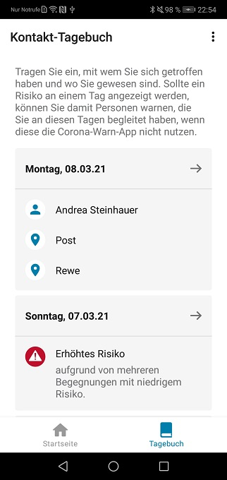
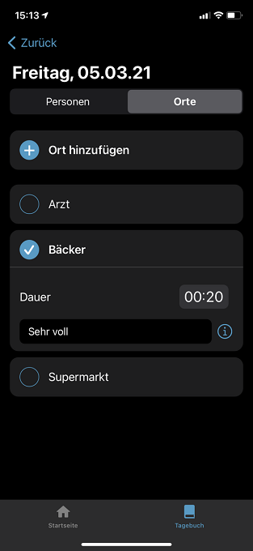
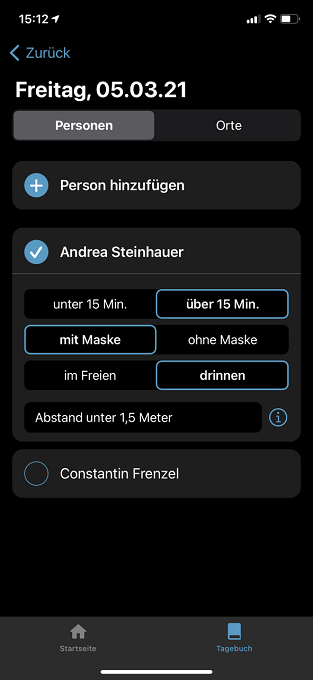

 
In der neuen Version der Corona-Warn-App erweitert das Projektteam der Deutschen Telekom und SAP das Kontakt-Tagebuch um weitere Funktionen und fügt der freiwilligen Datenspende weitere Datenpunkte hinzu. **Version 1.14** steht Nutzer\*innen innerhalb der nächsten 48 Stunden zur Verfügung.

<!-- overview -->

In Version 1.14 haben die Entwickler\*innen erneut Feedback der App-Nutzer\*innen umgesetzt. **Im Falle einer roten Kachel** können Nutzer\*innen nun in der Kontakthistorie ihres Kontakt-Tagebuchs sehen, ob sich das erhöhte Risiko aus einer oder mehreren Begegnung(en) mit erhöhtem Risiko ergeben hat oder aufgrund von mehreren Begegnungen mit niedrigem Risiko. Das ist unter [Version 2 der Schnittstelle](/de/blog/2020-12-16-corona-warn-app-version-1-9/) von Apple und Google (ENF V2), auf die die Corona-Warn-App zugreift, möglich.
  

  

 

  

Desweiteren haben die Entwickler\*innen das Kontakt-Tagebuch um gewünschte Funktionen erweitert. Dort können Nutzer\*innen nun bei jedem Ort die Dauer des Aufenthalts hinzufügen. 

  

 

  

Bei den im Kontakt-Tagebuch eingetragenen Personen können Nutzer*innen angeben, ob das Treffen länger oder kürzer als 15 Minuten gedauert hat, ob sie während des Treffens eine Maske getragen haben und ob sie sich im Freien oder drinnen aufgehalten haben. 

  

 

  

Sowohl bei Orten als auch bei Personen, können Nutzer\*innen außerdem eigene Notizen hinzufügen. So können sie beispielsweise **Umstände der Begegnung oder des Aufenthalts** festhalten, die sich auf das Infektionsrisiko auswirken können: „saßen nah beieinander“, „haben gesungen“, „wenig Platz“. Diese Zusatz-Informationen können Nutzer\*innen später helfen, sich besser zu erinnern. Aus Plausibilitätsgründen sollten Nutzer\*innen darauf achten, dass die Zeitangabe in Verbindung mit Personen mit der Zeitangabe in Verbindung mit dem Ort übereinstimmt. Beispielsweise hilft es später wenig, wenn Nutzer\*innen bei einer Person, die sie getroffen haben *unter 15 Min.* angeben, bei dem Ort, an dem sie die Person getroffen haben aber beispielsweise *20 Minuten* eintragen.

**Video-Walkthrough: So funktioniert die neue Funktion** (iOS-Beispiel)
{{/assets/video/cwa-1-14-walk-through}}
  

Zusätzlich zur Erweiterung des Kontakt-Tagebuchs, hat das Projektteam auch die **freiwillige Datenspende**, die mit [Version 1.13](/de/blog/2021-03-04-corona-warn-app-version-1-13/) eingeführt wurde, erweitert. Haben Nutzer\*innen die Datenspende aktiviert, übermittelt die App nun unter anderem zusätzlich, wie sich ein erhöhtes Risiko (rote Kachel) zusammensetzt: Hat es sich aus mehreren Begegnungen mit geringem Risiko ergeben oder durch andere Parameter, wie der Abstand während oder Dauer eines Zusammentreffens?

Nutzer\*innen können mit Version 1.14  außerdem noch **schneller zu ihrem Kontakt-Tagebuch** gelangen und einen Eintrag hinzufügen ohne die App öffnen zu müssen:  Wenn sie das Icon der Corona-Warn-App auf dem Bildschirm ihres Smartphones für einige Sekunden gedrückt halten, öffnet sich ein Pop-Up-Menü. Dort können Nutzer\*innen dann *Tagebuch-Eintrag für heute hinzufügen* auswählen.  
