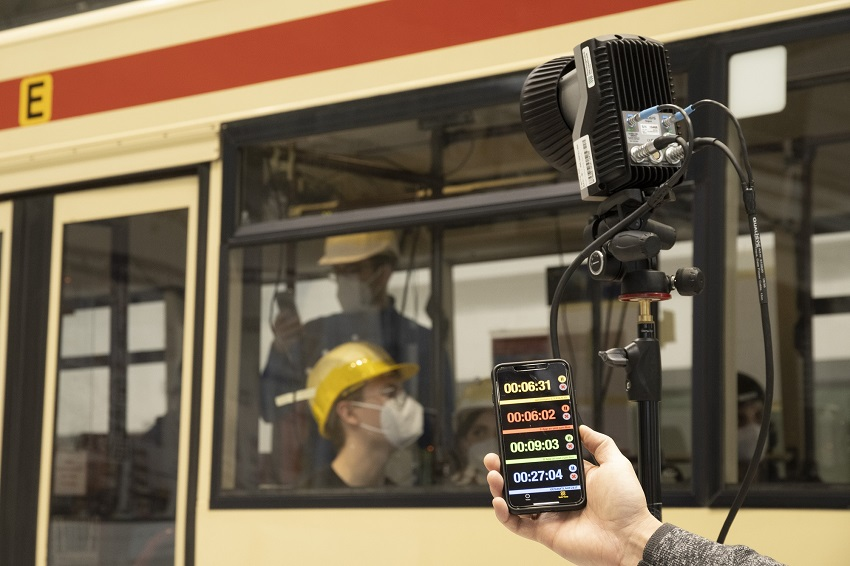

The project team continuously tests the Corona-Warn-App's performance to configure it optimally - especially in respect to the Corona situation in Germany with increasing case numbers and higher infectivity due to the mutated virus variants. In recent weeks, the Fraunhofer Institute for Integrated Circuits (IIS) and the Robert Koch Institute **tested and evaluated the app's measurement accuracy** (using version 2 of the Google-Apple exposure notification framework).

<!-- overview -->
 
For this purpose, the team tested the app in realistic scenarios in different settings and evaluated the results using complex optimization methods. More than 1,000 test hours in test landscapes with dummy bodies and a programmable crane in the Fraunhofer test hall as well as measurements with test persons in real environments (for example, in buses and trains) provide measurement data that are taken into account in the app's risk calculation. Based on these findings, the project team made adjustments to the previous risk model, in particular to take into account a higher infectivity due to the **mutated virus variants**.

  

 

Image: Fraunhofer Institut

  

  

 

Image: Fraunhofer Institut

  

Thus, **short contact times** with individuals who later test positive will no longer be filtered out, but will be assessed individually and summed over the day. Beyond the close range of up to 1.5 meters, contact times at a distance **up to 2.5 meters** are also included in the calculation of the corresponding Bluetooth signal attenuation limits, but only at 50%, since the risk of infection via droplets (unlike aerosols) decreases rapidly with increasing distance. 

In addition, the experts adjusted the configuration of the optimization procedure: the correct detection of actually exposed persons (true positives) is given a higher priority than the correct exclusion of actually non-exposed persons (true negatives). This will moderately increase both red warnings (high-risk encounters) and green warnings (low-risk encounters).

The project participants (Robert Koch Institute, Deutsche Telekom, SAP, Fraunhofer Institute for Integrated Circuits (IIS)) are continuously working on improving the measurements and the resulting configuration parameters.
