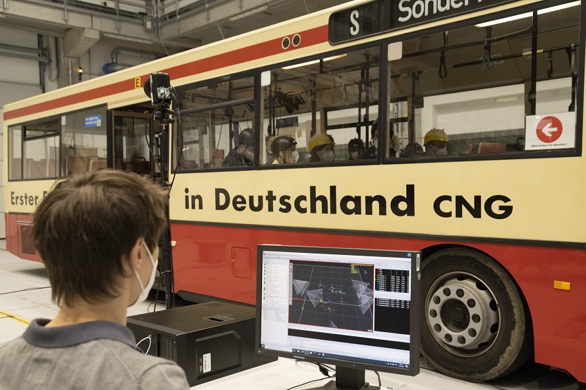

 
Die Projektbeteiligten verfolgen kontinuierlich das Ziel, die Leistung der Corona-Warn-App zu prüfen und sie optimal zu konfigurieren – insbesondere mit Blick auf die neue Corona-Lage in Deutschland mit steigenden Fallzahlen und einer höheren Infektiosität durch die mutierten Virusvarianten. In den vergangenen Wochen haben das Fraunhofer-Institut für Integrierte Schaltungen (IIS) und das Robert Koch-Institut **Tests der Messgenauigkeit** der Corona-Warn-App (mit der Version 2 des Google-Apple-Exposure-Notification-Frameworks) durchgeführt und ausgewertet.

<!-- overview -->
 
Dafür haben die Expert\*innen die App in realitätsnahen Szenarien in verschiedenen Settings getestet und die Ergebnisse mit komplexen Optimierungsverfahren ausgewertet. Mehr als 1.000 Teststunden in Testlandschaften mit Körperattrappen und einem programmierbaren Kran in der Fraunhofer Testhalle sowie Messungen mit Probanden in realen Umgebungen (zum Beispiel in Bussen und Bahnen) liefern Messdaten, die in der Risikoberechnung der CWA berücksichtigt werden. Auf Basis dieser Erkenntnisse werden Anpassungen des bisherigen Risikomodells vorgenommen, insbesondere auch um eine höhere Infektiosität durch die **mutierten Virusvarianten** zu berücksichtigen.

  

 

Foto: Fraunhofer Institut

  

  

 

Foto: Fraunhofer Institut

  

So werden **kurze Kontaktzeiten** mit später positiv getesteten Personen nicht mehr ausgefiltert, sondern individuell bewertet und über den Tag summiert. Jenseits des Nahbereichs bis 1,5 Meter fließen auch Kontaktzeiten in einem Abstand **bis 2,5 Meter** in die Berechnung der entsprechenden Bluetooth-Signaldämpfungsgrenzwerte ein, allerdings nur mit 50%, da das Infektionsrisiko über Tröpfchen (anders als bei Aerosolen) mit zunehmendem Abstand rasch abnimmt. 

Zusätzlich haben die Expert\*innen die Konfiguration des Optimierungsverfahren angepasst: Der korrekten Erkennung tatsächlich exponierter Personen (true positives) wird eine höhere Priorität eingeräumt als dem korrekten Ausschluss von tatsächlich nicht exponierten Personen (true negatives). **Das bedeutet**: Aller Voraussicht nach erhöhen sich dadurch moderat sowohl die roten Warnungen (Risikobegegnungen) als auch die grünen Warnungen (Begegnungen mit niedrigem Risiko).

Die Projektbeteiligten (Robert Koch-Institut, Deutsche Telekom, SAP, Fraunhofer-Institut für Integrierte Schaltungen (IIS)) arbeiten kontinuierlich an einer Verbesserung der Messungen und der daraus resultierenden Konfigurationsparameter.

