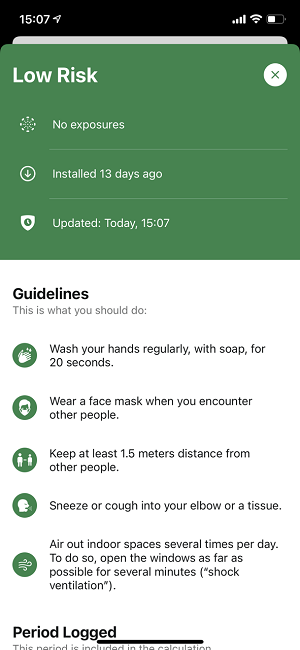

 
A new version of the Corona-Warn-App will be available for users within the next 48 hours. In **version 1.15**, Deutsche Telekom and SAP’s project team have expanded the transnational exposure logging to include Switzerland, and made changes to the risk card.

<!-- overview -->

With version 1.15, the risk card without exposures no longer shows how long exposure logging was active. Instead, for the first 14 days after installation, the app shows the number of days since installation. After that, the line on the risk card will be removed. Of course, risk exposure is still active unless users turn their smartphone or Bluetooth off.

  

 

  

Furthermore, Corona-Warn-App users can now exchange encrypted random IDs with people who use the **official warning app of Switzerland**, *SwissCovid*. This means that the Corona-Warn-App can send warnings to SwissCovid users as well as receive warnings from them.  

  

 
 
  

Since Switzerland isn’t a member of the European Union, it is not covered by the EU eHealth Network agreement. To enable interoperability between Germany and Switzerland, government representatives on both sides had to work out a bilateral solution on a sound legal basis. 

In addition to the Swiss app, the Corona-Warn-App is currently interoperable with 16 other apps from EU member states, including Austria, Italy, and Spain. A current list of all countries can be found in the Corona-Warn-App's settings under *Exposure Logging*, as well as [here](/en/faq/#interoperability_countries).
