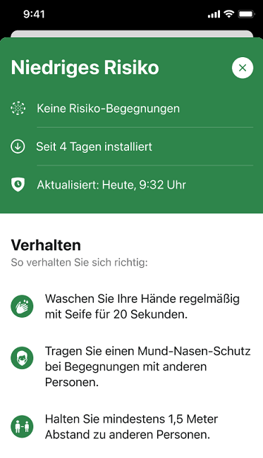
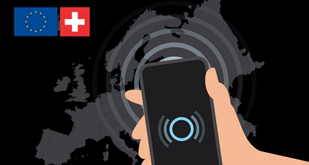
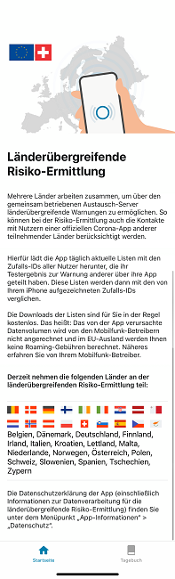

 
Eine neue Version der Corona-Warn-App steht Nutzer*innen innerhalb der nächsten 48 Stunden zum Download bereit. In **Version 1.15** hat das Projektteam der Deutschen Telekom und SAP die länderübergreifende Risiko-Ermittlung um die Schweiz erweitert und die Risikokarte verändert.

<!-- overview -->

Mit Version 1.15 zeigt die Risikokarte ohne Risikobegegnungen nicht mehr an, wie lange die Risikoermittlung aktiv war. Stattdessen zeigt die App in den ersten 14 Tagen nach der Installation die Anzahl der Tage seit Installation an. Danach entfällt die Zeile auf der Risikokarte. Die Risikoermittlung ist natürlich weiterhin aktiv, sofern die Nutzer*innen sowohl ihr Smartphone als auch Bluetooth eingeschaltet lassen.

  

 

  

Außerdem können Nutzer\*innen der Corona-Warn-App nun verschlüsselte Zufalls-IDs mit Personen austauschen, die die **offizielle Warn-App der Schweiz**, *SwissCovid*, nutzen. Das bedeutet, dass die Corona-Warn-App sowohl Warnungen an SwissCovid-Nutzer\*innen schicken, als auch welche von ihnen empfangen kann. 

  

 
 
  

Da die Schweiz kein Mitglied der Europäischen Union ist, fällt sie nicht unter das Rahmenabkommen des EU eHealth-Network. Um die Interoperabilität zwischen Deutschland und der Schweiz zu ermöglichen, mussten Regierungsvertreter auf beiden Seiten eine bilaterale Lösung mit einer Rechtsgrundlage erarbeiten. Damit der Austausch mit der Schweiz funktioniert, müssen Nutzer\*innen nichts tun, außer ihre Corona-Warn-App auf Version 1.15 zu aktualisieren.   

Neben der Schweizer App ist die Corona-Warn-App derzeit mit 16 weiteren Apps von EU-Mitgliedsstaaten interoperabel, darunter Österreich, Italien und Spanien. Eine aktuelle Liste aller Länder finden Sie in den Einstellungen der Corona-Warn-App unter *Risiko-Ermittlung*, sowie [hier](/de/faq/#interoperability_countries).

  

 

  
