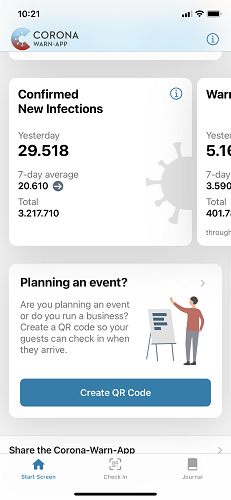
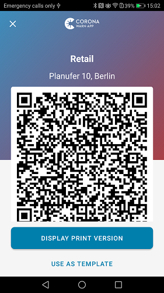
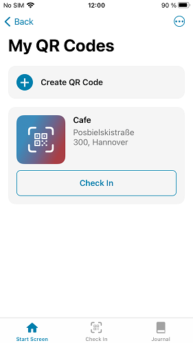
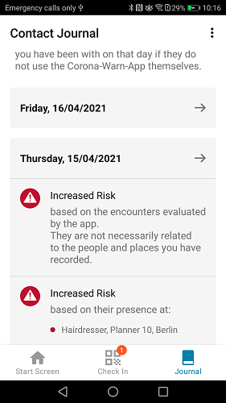

 
Deutsche Telekom and SAP’s project team have released **version 2.0 of the Corona-Warn-App**, which will be available to users within the next 48 hours. The update adds the **event registration feature** to the app, allowing users to check in via a QR code at retail stores, events or private meetings. Corona-Warn-App 2.0 has benefitted from discussions with Dr. Wouter Lueks and Prof. Carmela Troncoso from EPFL (École polytechnique fédérale de Lausanne) on how to adapt their decentralized, privacy-preserving protocol [CrowdNotifier](https://github.com/CrowdNotifier/documents), to support automatic notifications.

<!-- overview -->

With the event registration, organizers and retailers can use the Corona-Warn-App to **create a QR code** in which all necessary data about the event is encoded. This includes, for example, the event location and type, the date, and, if applicable, the beginning and ending. Visitors and guests can then **check in for the event by scanning the QR code**. The check-in is stored locally on their smartphones and will be deleted automatically after two weeks. 

  

      

  

Visitors who later test positive for COVID-19 can **share their check-ins** along with the **diagnostic keys** via the app and thus upload them to the Corona-Warn-App’s server. The server then publishes the corresponding check-ins as alerts. These alerts are downloaded regularly to the users smartphones where they are automatically matched with the local check-ins. Other guests who were at the same event or location then receive a red or green warning. 

This allows potential clusters to be identified and infection chains to be broken efficiently.
 

### Users can receive a red or green warning

Whether users receive a green or red warning depends on whether their stay overlaps with that of an infected person. If they were on site for **less than 10 minutes**, they will receive a warning about an exposure with low risk on one day (green tile). If their stay overlapped with the person who later tested positive for COVID-19 by **10 minutes or more**, users will receive a warning about an exposure with an increased risk (red tile). 

In the contact diary, users can see whether a low-risk or high-risk exposure refers to an event-based warning.

  

 

  

### How to check in to and out from an event or location

In version 2.0 of the Corona-Warn-App, users will find a new tab named Check-In at the bottom of the app’s home screen. 

This takes them to their check-ins, where they can find an overview of existing entries. There, they can also check in to or out from an event or location. To check in, users can **scan the corresponding QR code**. On iOS, this works via the camera; on Android devices, it depends on the respective manufacturer whether the smartphone camera can read QR codes. All check-ins can be automatically transferred to the contact diary. Users can also check themselves out in this area by clicking on Check out now under the event.  

Alternatively, event organizers and operators can also set an automatic check-out after a predefined time. The app notifies users that they’ve been checked out. Users can manually adjust the time afterwards in their Check In area.

Have a look at the **video walkthrough** to see how to check in or out (iOS example): {{/assets/video/check-in-en}}

### How to create a QR code

Event organizers and retailers can use the new section on the Corona-Warn-App’s home screen to create a QR code that their visitors or guests can scan.  

To do this, they simply choose Create QR Code. Then, they can enter information about the event: After selecting the category (e.g., retail or private party), they can specify an event description, the location, and start and end dates. The Corona-Warn-App uses this information to create a QR code that can be displayed on a smartphone or printed out and posted on site. 

Have a look at the **video walkthrough** to see how to create a QR Code (iOS example): {{/assets/video/create-qr-code-en}}

### Two different event types

There are two different scenarios in which organizers, retailers, and private individuals can use the new event registration feature.

**Scenario 1: event**

An event can be created at short notice and has a defined start and end time. This includes, for example, private meetings, celebrations or smaller events. 

**Scenario 2: place**

In contrast to events, places do not have a fixed start and end time. In this case, a QR code is typically made available in a room for a longer period of time. Guests re-scan this QR code each time they visit. Examples of a permanent location are hairdressers or restaurants.

If you are interested in the **event registration's technical specification**, you can find more information here: [https://github.com/corona-warn-app/cwa-documentation/blob/master/event_registration.md](https://github.com/corona-warn-app/cwa-documentation/blob/master/event_registration.md)

  

**Please note: attendees or guests who didn't install the Corona-Warn-App**

iOS users who scan a QR code but didn't install the Corona-Warn-App will automatically be directed to Apple's App Store. There, they can download the app and then check in. Android users are directed to a website that takes them to the Google Play Store, where they can also download the Corona-Warn-App.

 
