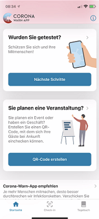
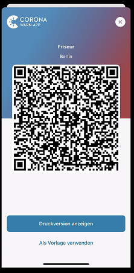
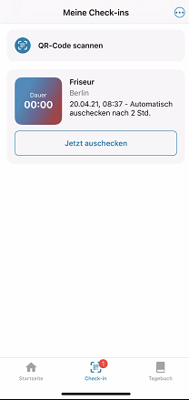
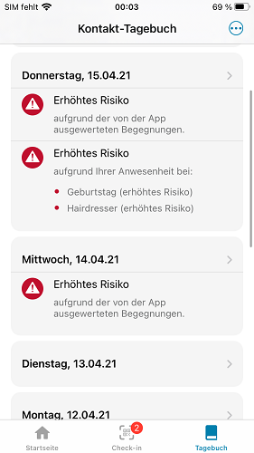

Das Projektteam der Deutschen Telekom und SAP hat **Corona-Warn-App Version 2.0** veröffentlicht, die Nutzer\*innen innerhalb der nächsten 48 Stunden zur Verfügung steht. Mit dem Update erhält die Corona-Warn-App eine Funktionalität zur **Eventregistrierung**, mit der Nutzer\*innen im Einzelhandel, bei Veranstaltungen  oder privaten Treffen per QR-Code einchecken können. Während der Entwicklungsphase hat das Projektteam von Gesprächen mit Dr. Wouter Lueks und Prof. Carmela Troncoso von der EPFL (École polytechnique fédérale de Lausanne) profitiert, die ihre Einschätzungen dazu gegeben haben, wie ihr dezentrales, die Privatsphäre wahrendes Protokoll [CrowdNotifier](https://github.com/CrowdNotifier/documents) angepasst werden kann, um automatische Benachrichtigungen zu unterstützen.

<!-- overview -->

Mit der Eventregistrierung können Veranstalter\*innen und Einzelhändler\*innen mit Hilfe der Corona-Warn-App einen **QR-Code erstellen**, in dem alle notwendigen Daten über die Veranstaltung kodiert werden. Dazu zählen beispielsweise Ort der Veranstaltung, Datum, Art der Veranstaltung und gegebenenfalls Beginn und Ende der Veranstaltung. Besucher\*innen und Gäste können sich für die Veranstaltung **einchecken**, indem sie den QR-Code scannen. Der Check-In wird lokal auf ihrem Smartphone gespeichert und nach zwei Wochen automatisch gelöscht. 

  

    

  

Besucher\*innen, die später positiv auf COVID-19 getestet werden, können ihre **Check-Ins** gemeinsam mit den **Diagnoseschlüsseln** über die App teilen und so auf den Server der Corona-Warn-App hochladen. Der Server veröffentlicht die entsprechenden Check-Ins dann als Warnungen. Diese Warnungen werden regelmäßig heruntergeladen und automatisch mit den lokalen Check-Ins auf den Smartphones der Nutzer*innen abgeglichen. Andere Gäste des selben Events erhalten dann eine rote oder grüne Warnung. 

So können mögliche Cluster erkannt und Infektionsketten zielgerichtet unterbrochen werden.

Im **Video-Walkthrough** (iOS-Beispiel) können Sie sehen, wie Sie Informationen teilen können, um andere zu warnen: 
{{/assets/video/03qrcode-warnen}}

### Nutzer\*innen können eine rote oder grüne Warnung erhalten

Ob Nutzer\*innen eine grüne oder rote Warnung erhalten, hängt davon ab, ob sich ihr Aufenthalt mit dem einer infizierten Person überschneidet. Waren sie **weniger als 10 Minuten** vor Ort, erhalten sie eine Warnung über eine Begegnung mit geringem Risiko (grüne Kachel). Hat sich der Aufenthalt mit der später positiv auf COVID-19 getesteten Person um **10 Minuten oder länger** überschnitten, erhalten Nutzer\*innen eine Warnung über eine Begegnung mit erhöhtem Risiko (rote Kachel). 

Im **Kontakt-Tagebuch** können Nutzer\*innen sehen, ob es sich bei einer Begegnung mit niedrigem oder erhöhtem Risiko um eine eventbasierte Warnung handelt.

  

  

  

### So funktionieren Check-In und Check-Out 

In Version 2.0 der Corona-Warn-App finden Nutzer\*innen den **Reiter Check-In** in der Registerkarte der Corona-Warn-App. 

Darüber gelangen sie zu ihren Check-Ins, wo sie eine Übersicht über bereits vorhandene Einträge finden oder sich für eine Veranstaltung ein- beziehungsweise auschecken können. Um einzuchecken, können Nutzer\*innen den entsprechenden **QR-Code scannen**. Unter iOS funktioniert das über die Kamera, bei Android-Geräten hängt es vom jeweiligen Hersteller ab, ob die Smartphone-Kamera QR-Codes einlesen kann. Alle Check-Ins können automatisch ins Kontakt-Tagebuch übertragen werden. Auschecken können Nutzer\*innen sich in diesem Bereich ebenfalls, indem sie unter dem Event auf *Jetzt auschecken* klicken. 

Alternativ können Veranstalter\*innen und Betreiber\*innen auch einen automatischen Check-Out nach einer zuvor festgelegten Zeit einstellen. Nutzer\*innen erhalten dann eine Benachrichtigung, dass sie ausgecheckt wurden, können die Zeit aber im Nachhinein über die Registerkarte unter Check-In manuell anpassen.

**Video-Walkthrough**: So können Sie ein- oder auschecken (iOS-Beispiel):
{{/assets/video/02qrcode-scannen}}

### So kann ein QR-Code erstellt werden

Nutzer\*innen können über den neuen Bereich auf dem Startbildschirm der Corona-Warn-App einen QR-Code erstellen, den Gäste scannen können. 

Dazu klicken sie einfach auf *QR-Code erstellen*. Anschließend können sie **Informationen zu der Veranstaltung** angeben: Nach der Auswahl der Kategorie  (z.B. Einzelhandel oder private Feier), können sie eine Beschreibung der Veranstaltung, den Ort und Start- und Enddatum festlegen. Die Corona-Warn-App erstellt anhand dieser Informationen einen QR-Code, der sich auf dem Smartphone darstellen lässt oder ausgedruckt und vor Ort aufgehängt werden kann. 

**Video-Walkthrough**: So können Sie einen QR-Code erstellen (iOS-Beispiel):
{{/assets/video/01qrcode-erstellen}}

### Zwei verschiedene Event-Typen

Es gibt **zwei verschiedenen Szenarien**, in denen Veranstalter\*innen, Einzelhändler\*innen und Privatpersonen die neue Funktion der Eventregistrierung nutzen können. 

**Szenario 1: Event**

Ein Event kann kurzfristig von Organisator\*innen angelegt werden und hat einen definierten Anfangs- und Endzeitpunkt. Dazu zählen beispielsweise private Treffen, Feiern oder kleinere Veranstaltungen. 

**Szenario 2: Ort**

Orte haben im Gegensatz zu Events keinen festen Anfangs- und Endzeitpunkt. In diesem Fall wird ein QR-Code typischerweise für einen längeren Zeitraum in einem Raum zur Verfügung gestellt. Besucher\*innen scannen diesen QR-Code bei jedem Besuch neu. Beispiele für eine ständige Lokation sind Friseure oder Restaurants.

Wer an der **technischen Spezifikation der Event-Registrierung** interessiert ist, findet hier weitere Infos: [https://github.com/corona-warn-app/cwa-documentation/blob/main/event_registration.md](https://github.com/corona-warn-app/cwa-documentation/blob/main/event_registration.md)

  

**Hinweis für Eventteilnehmer\*innen oder Gäste, die die Corona-Warn-App nicht installiert haben**

iOS-Nutzer\*innen, die einen QR-Code scannen, die Corona-Warn-App aber nicht installiert haben, werden automatisch in Apples App Store geleitet. Dort können sie die App herunterladen, um sich anschließend einzuchecken. Android-Nutzer\*innen werden auf eine Website geleitet, über die sie in den Google Play Store gelangen, wo sie die Corona-Warn-App dann ebenfalls herunterladen können.
