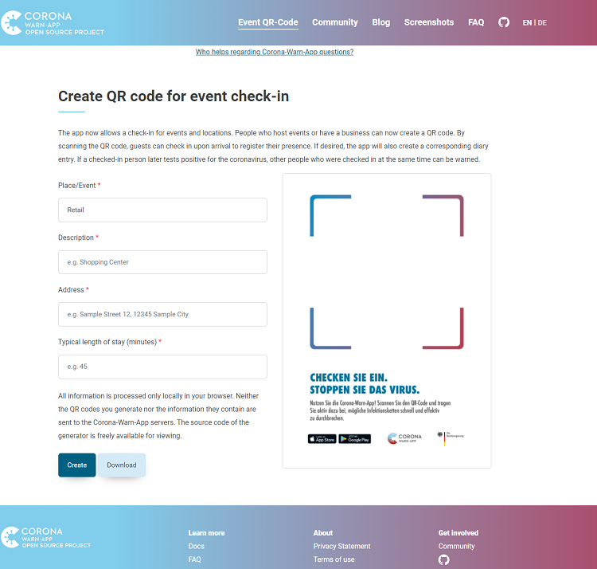

The Corona-Warn-App community has developed a QR code generator for the app's website, which is now available at [https://coronawarn.app/en/eventregistration/](/en/eventregistration/). Event organizers, retailers and private individuals have the opportunity to generate QR codes independently of the Corona-Warn-App. In addition, the project team has published a Node.js-based command-line interface on GitHub, allowing larger organizations to build their own customized solutions.

<!-- overview -->

The Corona-Warn-App community provided the QR code generator to the project team on GitHub. The development team then reviewed the community's contribution and released the QR code generator in a customized form. We would like to take this opportunity to thank in particular @bastianjoel and all the community members involved for contributing to this new feature. This example shows again very well how useful the open source approach and the publication of the source code of the Corona-Warn-App is.

  

 

  

In addition, the project team has published a Node.js-based command-line interface on [GitHub](https://github.com/corona-warn-app/cwa-event-qr-code). This gives larger companies the opportunity to build solutions tailored to their own needs. For example, they can automatically create a large number of QR codes for different stores. Instructions for using the tool can be found at: https://github.com/corona-warn-app/cwa-event-qr-code/blob/main/README.md. 

More information on event registration and QR code creation can be found here: https://github.com/corona-warn-app/cwa-documentation/blob/main/event_registration.md
