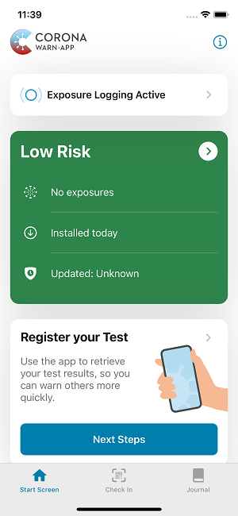
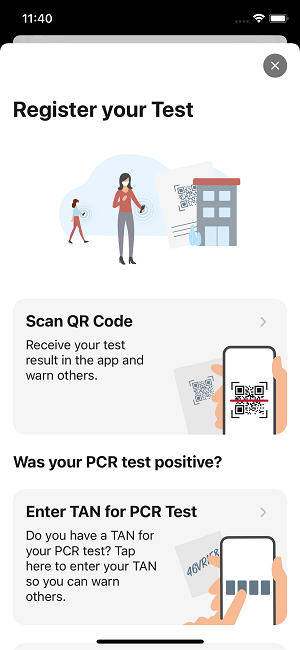
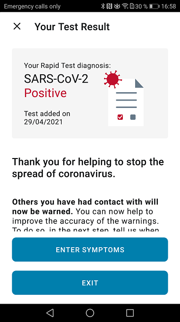

### Eight partners participate from the beginning

Deutsche Telekom and SAP’s project team have integrated the [announced rapid COVID-19 tests](/en/blog/2021-03-31-corona-warn-app-test-integration/) in the Corona-Warn-App’s latest version (2.1) launching today. Users can now break infection chains and warn their fellow citizens even faster. The update will be available to all users within the next 48 hours.

<!-- overview -->

Eight partners are participating in the launch of the rapid test integration, including **the Bavarian Red Cross, dm-drogerie markt, Doctorbox, EcoCare the healthcare brand of Ecolog Deutschland GmbH (with Lidl among others), Huber Health Care, and testbuchen.de/No-Q**. In addition, the **German Federal Chancellery**, which tests its employees, and the **Ministry of Education and Culture Saarland**, which provides rapid tests to teachers, are taking part. 

Since the announcement of the rapid test integration at the end of March, the project team has received **125 requests** from test centers and the retail sector, among others, that are interested in participating in the integration. Companies that are interested in participating can contact SAP and Telekom via [registrierung.labore.pandemietest@t-systems.com](mailto:registrierung.labore.pandemietest@t-systems.com).

### Users can warn their fellow citizens even faster

Users will have the opportunity to be tested for COVID-19 by trained and authorized staff at participating partners and receive the result of the rapid test via QR code. They can make an appointment via the partners' websites:

- dm drogerie-märkte: [Schnelltest INOPAI (dm.de)](https://corona-schnelltest-zentren.dm.de/o/dm/login)

- EcoCare (Lidl and Kaufland): [EcoCare - Bürgertest: EcoCare - Bürgertest](https://buergertest.ecocare.center/#c734)

- testbuchen.de/No-Q (participating pharmacies, general practitioners and other test centers): [Finde deinen Testtermin (testbuchen.de)](https://testbuchen.de/#/?zoom=0&lat=47.71401323721353&lng=8.66960999999999)

- Bavarian Red Cross: [Mein Corona-Test | BRK](https://meintest.brk.de/)

In the first days after the start of the integration, a few partners may still experience minor complications. Overall, however, the integration is running satisfactorily and users already seem to be using the option.

After the test, a negative result will be displayed in the Corona-Warn-App for **48 hours**. A positive test results will be displayed in the app until the user has shared his or her result. 

  

  

  

The app treats the rapid tests equally to the PCR tests. Users can warn their contacts in case of a **positive rapid test result** by sharing it via the app. Contacts will then receive a warning by their Corona-Warn-App about an exposure on one day with low risk (green card) or increased risk (red card). The app doesn’t show whether the warning was based on a rapid test or a PCR test.

Although users' personal data is stored at the test sites so that staff can pass it on to the health department in case of a positive test, the Corona-Warn-App doesn’t save personal data in accordance with the decentralized approach.

In case of a positive rapid test result, users should share their test result and take a PCR test to confirm or refute the result. In case of a positive PCR test, users should share this test result too. This will allow them to warn users they may have met after having shared the rapid test result but before they’ve gotten their PCR test result. However, if the **PCR test is negative**, they do not have the option to withdraw their positive rapid test and warning.

  

 

  

Users who tested positive for COVID-19 and previously checked in to an event or at a location through the [**event registration feature**](/en/blog/2021-04-21-corona-warn-app-version-2-0/) can share their check-ins along with the positive rapid test and/or PCR test result.

A **negative test result** in the app may serve users as evidence that they’ve obtained a negative rapid test result, if specified by law. However, the recognition of test evidence may vary from state to state. Users should therefore inform themselves about the respective criteria in their federal state.

To get the result in the app as quickly as possible, users should open the app timely after they’ve taken the test so that it updates and shows the test result. Although the Corona-Warn-App retrieves test results automatically in the background, this can take a little longer depending on the operating system.

### Users can now reach hotlines from abroad

Users can now reach the **Corona-Warn-App’s technical support and TAN hotline** from abroad. Previously, both hotlines had a number that only worked in Germany. Users who are abroad can now call +49 30 498 75401 to reach the technical support and +49 30 498 75402 for the TAN hotline.

Version 2.1 - like previous versions - will be delivered in a controlled rollout and is made available for users in waves. While users can manually trigger an update in Apple’s App Store, this option is not available in the Google Play Store. There, the Corona-Warn-App’s new version can be available up to 48 hours later.
