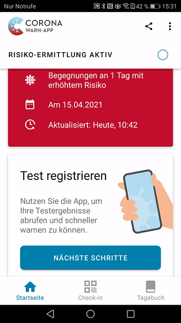
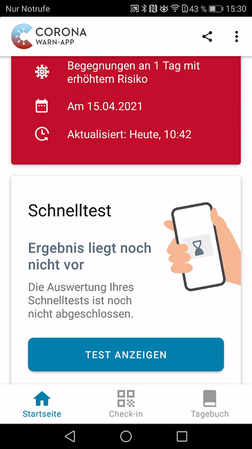

### Acht Partner sind zum Start dabei

In der neuesten Version der Corona-Warn-App (2.1) hat das Projektteam aus Deutscher Telekom und SAP die [angekündigten Schnelltests](/de/blog/2021-03-31-corona-warn-app-test-integration/) integriert, sodass Nutzer\*innen ihre Mitmenschen nun noch schneller warnen und Infektionsketten noch schneller unterbrechen können. Das Update steht allen Nutzer\*innen innerhalb der nächsten 48 Stunden zur Verfügung.

<!-- overview -->

Zum Start der Schnelltestintegration beteiligen sich acht Partner, darunter das das **Bayerische Rote Kreuz, dm-drogerie markt, Doctorbox, EcoCare, die Healthcare Marke von Ecolog Deutschland GmbH (mit unter anderem Lidl), Huber Health Care und  testbuchen.de/No-Q**. Außerdem sind das **Bundeskanzleramt**, das seine Mitarbeiter\*innen testet, und das **Ministerium für Bildung und Kultur Saarland**, das den Lehrer\*innen Schnelltests ermöglicht, zum Start dabei.

Seit Ankündigung der Integration Ende März sind außerdem **125 Anfragen** von Schnelltest-Betreibern aus unter anderem Testzentren und dem Einzelhandel eingegangen, die sich an der Integration beteiligen möchten. Interessierte Unternehmen können SAP und Telekom über [registrierung.labore.pandemietest@t-systems.com](mailto:registrierung.labore.pandemietest@t-systems.com) kontaktieren.

### Nutzer\*innen können ihre Mitmenschen noch schneller warnen

Nutzer\*innen haben damit die Möglichkeit, sich bei vielen der beteiligten Partner von geschulten und autorisierten Mitarbeiter\*innen auf COVID-19 testen zu lassen und das Ergebnis des Schnelltests per QR-Code zu erhalten. **Schnelltest-Termine** können sie vorab buchen:

- dm drogerie-märkte: [Schnelltest INOPAI (dm.de)](https://corona-schnelltest-zentren.dm.de/o/dm/login)

- EcoCare (Lidl und Kaufland): ~~EcoCare - Bürgertest: EcoCare - Bürgertest~~ *Aktualisierung 6. März 2023: die Webseite `https://buergertest.ecocare.center` zu "EcoCare - Bürgertest" ist nicht mehr im Betrieb.*

- testbuchen.de/No-Q (teilnehmende Apotheken, Hausärzte und weitere Testzentren): [Finde deinen Testtermin (testbuchen.de)](https://testbuchen.de/#/?zoom=0&lat=47.71401323721353&lng=8.66960999999999)

- Bayerisches Rotes Kreuz: [Mein Corona-Test | BRK](https://meintest.brk.de/)

In den ersten Tagen nach Start der Integration kann es bei wenigen Partnern noch zu kleineren technischen Schluckaufs kommen. Insgesamt läuft die Integration aber zufriedenstellend und die Nutzer\*innen scheinen die Option bereits sehr gut anzunehmen.

Nach dem Test kann ein negatives Testergebnis für **48 Stunden** in der App angezeigt werden. Ein positives Testergebnis wird in der App angezeigt, bis der oder die Nutzer\*in es teilen. So soll sichergestellt werden, dass Nutzer\*innen andere so schnell wie möglich warnen, um eine mögliche Infektionskette schnell zu unterbrechen.

  

 

  

Der Schnelltest wird von der Corona-Warn-App **gleichberechtigt zum PCR-Test** behandelt. Nutzer*innen können ihre Kontakte im Falle eines positiven Schnelltest-Ergebnisses direkt warnen, indem sie ihr Testergebnis teilen. Kontaktpersonen erhalten in ihrer Corona-Warn-App entsprechend eine Warnung über eine Begegnung an einem Tag mit niedrigem (grüne Karte) oder erhöhtem Risiko (rote Karte). Ob die Warnung aufgrund eines Schnelltests oder aufgrund eines PCR-Tests erfolgte, ist in der App nicht ersichtlich.

Zwar werden die persönliche Daten der Nutzer\*innen an den Teststellen gespeichert, damit Mitarbeiter*innen sie im Falle eines positiven Tests an das Gesundheitsamt weitergeben können, in der Infrastruktur der Corona-Warn-App sind, im Sinne des dezentralen Ansatzes, aber nur kryptische Tokens vorhanden.

In Fall eines **positiven Schnelltest-Ergebnisses** sollten Nutzer\*innen außerdem umgehend einen PCR-Test machen, um das Ergebnis zu bestätigen oder zu widerlegen. Bei einem positiven PCR-Test, sollten Nutzer*innen auch dieses Testergebnis teilen. So können sie Kontaktpersonen warnen, denen sie möglicherweise seit Teilen des Schnelltest-Ergebnisses bis zum Teilen des PCR-Test-Ergebnisses begegnet sind. Sollte der PCR-Test negativ sein, haben sie aber nicht die Möglichkeit, ihren positiven Schnelltest und die Warnung zurückzuziehen.

Positiv auf COVID-19 getestete Nutzer\*innen, die zuvor über die [**Funktion der Eventregistrierung**](/de/blog/2021-04-21-corona-warn-app-version-2-0/) bei einem Event oder an einem Ort eingecheckt waren, können ihre  Check-ins gemeinsam mit dem positiven Schnelltest- und/oder PCR-Testergebnis teilen.

Ein **negatives Testergebnis** in der App kann Nutzer\*innen, falls gesetzlich festgelegt, als **Nachweis** für das Vorliegen eines negativen Schnelltest-Ergebnisses dienen. Die Anerkennung von Test-Nachweisen kann allerdings von Bundesland zu Bundesland variieren. Nutzer*innen sollten sich deshalb über die jeweiligen Kriterien in ihrem Bundesland informieren.

Um das Ergebnis möglichst schnell in der App zu erhalten, sollten Nutzer\*innen die App zeitnah nach dem Test öffnen, sodass sie sich aktualisiert und das Testergebnis schnell vorliegt. Zwar ruft die Corona-Warn-App Testergebnisse auch automatisch im Hintergrund ab, je nach Betriebssystem kann das aber etwas länger dauern.

Im Video-Walkthrough können Sie sehen, wie das neue Feature funktioniert (iOS-Beispiele):

- Negatives Schnelltest-Ergebnis {{/assets/video/schnelltest-negativ}}
- Positives Schnelltest-Ergebnis {{/assets/video/schnelltest-positiv}}

### Hotlines sind nun auch aus dem Ausland erreichbar

Nutzer\*innen können den **technischen Supports und die TAN-Hotline** der Corona-Warn-App nun auch **aus dem Ausland** erreichen. Bisher hatten beide Hotlines eine Nummer, die nur in Deutschland funktionierte. Nutzer*innen, die sich im Ausland befinden, können nun die +49 30 498 75401 anrufen, um den technischen Support zu erreichen und die +49 30 498 75402 für die TAN-Hotline.

Version 2.1 wird, wie vorherige Versionen auch, schrittweise über zwei Tage an alle Nutzer\*innen ausgerollt. iOS-Nutzer\*innen können sich die aktuelle App-Version ab sofort aus dem Store von Apple manuell herunterladen. Der Google Play Store bietet keine Möglichkeit, ein manuelles Update anzustoßen. Hier steht Nutzer*innen die neue Version der Corona-Warn-App über die nächsten 48 Stunden zur Verfügung.
