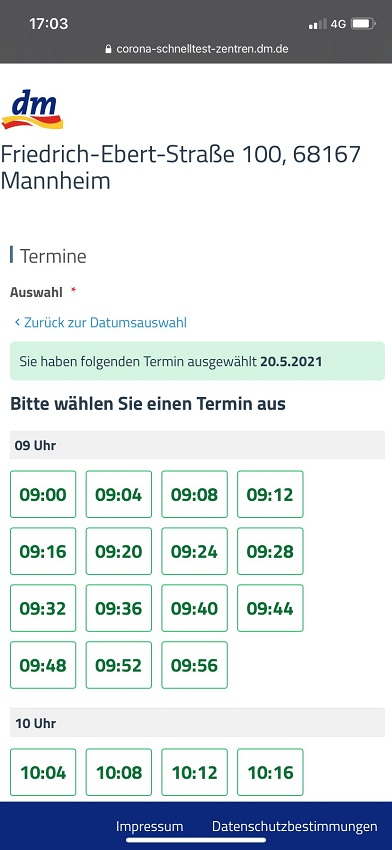
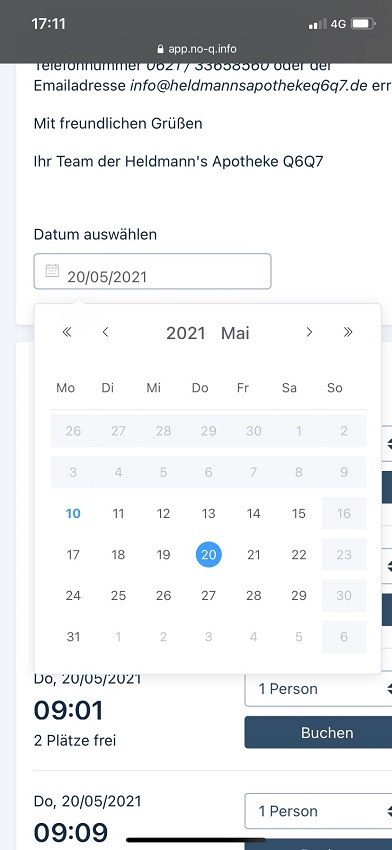

Seit der Anfang Mai veröffentlichten Version 2.1 der Corona-Warn-App haben Nutzer\*innen die Möglichkeit, Schnelltests, die sie bei teilnehmenden Partnern durchführen, in die Corona-Warn-App zu integrieren. Für die Partner **dm drogerie-märkte, testbuchen.de/No-Q (Apotheken)** und **EcoCare (Lidl)**, erklären wir an dieser Stelle, wie die Registrierung genau abläuft.

Unternehmen, die interessiert sind, ebenfalls als Partner Schnelltest-Ergebnisse in die Corona-Warn-App zu integrieren, können sich bei der Telekom und SAP per [E-Mail](mailto:registrierung.labore.pandemietest@t-systems.com) melden.

<!-- overview -->

## Ablauf dm drogerie-markt

#### Schritt 1: Termin buchen

- Finden Sie ein dm-Corona-Schnelltestzentrum in Ihrer Nähe unter [Mein dm-Corona-Schnelltest-Zentrum](https://corona-schnelltest-zentren.dm.de/o/dm/login)
- Wählen Sie einen dm-Markt aus und tippen Sie auf Termin vereinbaren

  

 

  

- Wählen Sie zunächst ein Datum aus, danach eine Uhrzeit und geben Sie im Anschluss Ihre persönlichen Daten an. Die Mitarbeiter*innen brauchen diese Daten, um sie im Falle eines positiven Tests an das Gesundheitsamt weiterzuleiten. 

  

   

  

- In diesem Schritt können Sie außerdem auswählen, ob Sie Ihr **Ergebnis an die Corona-Warn-App** übertragen wollen, in dem sie unter „Möchten Sie Ihr Ergebnis an die Corona-Warn-App übertragen?“ *Ja* auswählen.

  

 

  

- Sie können dann auswählen, ob sie einen namentlichen Testnachweis oder eine nicht-namentliche Anzeige in ihrer Corona-Warn-App erhalten möchten (Falls Ihnen der Test als Nachweis dienen kann, sollten Sie die namentliche Anzeige auswählen)

#### Schritt 2: Test in der Corona-Warn-App registrieren

- Sobald Sie das Formular abgeschickt haben, werden Sie auf eine neue Seite geleitet. Dort können Sie den Test in ihrer Corona-Warn-App registrieren, indem Sie auf den **Link Zur Corona-Warn-App** tippen. Sie werden automatisch in die App weitergeleitet, wo Sie die Einverständniserklärung akzeptieren müssen. Danach ist der Test in der App registriert.

  

 

  

- Wenn Sie die Registrierung an einem anderen Gerät als ihrem Smartphone durchführen, können Sie den Test auch über den **QR-Code** registrieren, indem Sie in Ihrer Corona-Warn-App unter „Test registrieren“ auf dem Startbildschirm Nächste Schritte auswählen und dann das Feld QR-Code scannen.

  

   

  

- Nachdem Sie den Test über den Link oder den QR-Code registriert haben, wird Ihnen auf der Startseite der App der **Bereich „Schnelltest“** angezeigt. Unter Test anzeigen gelangen Sie zu Ihrem registrierten Test. Solange Sie den Test noch nicht gemacht haben, steht dort, dass das Ergebnis noch nicht vorliegt. Nach der Durchführung des Schnelltests können Sie Ihren Test an dieser Stelle aktualisieren, sodass Ihnen das Ergebnis angezeigt wird. 

  

 

  

## Ablauf testbuchen.de / No-Q (teilnehmende Apotheken)

#### Schritt 1: Termin buchen

- Finden Sie einen Testort in Ihrer Nähe unter: [Finde deinen Testtermin (testbuchen.de)](https://testbuchen.de/#/?zoom=0&lat=47.71401323721353&lng=8.66960999999999)
- Nachdem Sie einen Testort ausgewählt haben, können Sie Ihr Wunschdatum eingeben und einen freien Termin auswählen. Tippen Sie anschließend auf *Buchen*

  

   

  

- Füllen Sie das Anmeldeformular mit Ihren persönlichen Daten aus und tippen Sie auf *Weiter*

#### Schritt 2: Test in Corona-Warn-App registrieren

- Nun wird Ihnen ein **Link** angezeigt, über den Sie den Test in Ihrer Corona-Warn-App registrieren können. Gehen Sie dafür auf den Link und wählen Sie anschließend aus, ob Sie das Testergebnis personalisiert (namentliche Anzeige) oder pseudonymisiert (nicht-namentlich) übermitteln möchten. Danach gehen Sie auf *Speichern*

  

   

  

- Stimmen Sie den Datenschutzbestimmungen und der Einverständniserklärung zu und gehen Sie auf *Buchen* 
- Nach der Durchführung des Tests erhalten Sie eine E-Mail mit einem Link zur Seite mit Ihrem Testergebnis.
- Auf dieser Seite befindet sich der QR-Code, den Sie nun mit der Corona-Warn-App einscannen können, indem Sie auf der Startseite in Ihrer Corona-Warn-App unter "Test registrieren" auf *Nächste Schritte* gehen und anschließend auf *QR-Code scannen*.
- Ihr Test ist dann registriert und das Testergebnis wird in der Corona-Warn-App bereitgestellt

Vereinzelt gibt es Apotheken, die noch **technische Umstellungsmaßnahmen** durchführen müssen, um den hohen Sicherheitsstandards zu genügen, die für die Einbindung in das Corona-Warn-App-System einzuhalten sind. Der Plattform Anbieter No-Q hat dazu die entsprechende technische Unterstützung seitens des Projektteams, um das in den nächsten Tagen abzuschließen. Sollte Ihnen der oben beschriebene Link also nicht angezeigt werden, gehört Ihre ausgewählte Teststelle zu denen, die noch nicht umgestellt haben. 

## Ablauf über EcoCare (Lidl)

#### Schritt 1: Einloggen, beziehungsweise Registrieren

- Finden Sie ein Testzentrum in Ihrer Nähe unter: [EcoCare - Bürgertest: EcoCare - Bürgertest](https://buergertest.ecocare.center/#c734)
- Wählen Sie ein Testzentrum aus
- Wenn Sie zum ersten Mal einen Termin über EcoCare buchen, können Sie zunächst ein Profil erstellen. Wählen Sie *Registrieren* und geben Sie Ihre persönlichen Daten ein. Danach wählen Sie *Weiter* und, nachdem Sie Ihre Daten noch einmal überprüft haben, *Registrieren*
- Sie erhalten eine E-Mail mit einem Bestätigungslink. Klicken Sie auf den Link und legen Sie Ihr Passwort fest.
- Wenn Sie sich bereits registriert haben, loggen Sie sich einfach mit Ihrer E-Mail Adresse und Ihrem Passwort sein.

#### Schritt 2: Termin buchen

- Wählen Sie *Test bestellen* im Menü in der linken oberen Ecke aus und geben Sie anschließend den Ort ein, an dem Sie den Schnelltest durchführen möchten

  

 

  

- Wählen Sie den Ort aus und gehen Sie anschließend auf *Termin vereinbaren*
- Danach können Sie ein Datum und eine Uhrzeit auswählen und auf *Wähle dein Testkit* gehen 

  

 

  

- Dort wählen Sie *Antigen-Schnelltest 15 Min* aus und gehen anschließend auf *Bestelle jetzt*. Setzen Sie den Haken bei „Nein, die Ausweisnummer wird nicht benötigt“, wenn Sie nicht als Reisender in Deutschland sind und gehen Sie anschließend auf *Bestätigen*.

  

   

  

#### Schritt 3: Test in Corona-Warn-App registrieren

- Nach kurzer Zeit erscheint ein **Pop-Up-Fenster**, in dem Sie einwilligen können, das Testergebnis in die Corona-Warn-App zu übertragen. Setzen Sie dazu beide Haken und gehen Sie auf *Bestätigen*

  

 

  

- Sie werden daraufhin automatisch in die **Corona-Warn-App** weitergeleitet. Dort können Sie Ihr Einverständnis geben, dass der Test übertragen werden soll. Im Anschluss ist der Test in der App registriert. 

  

     

  

- Auf der **Startseite der App** wird Ihnen nun der Bereich „Schnelltest“ angezeigt. Über *Test anzeigen* gelangen Sie zu Ihrem registrierten Test. Solange Sie den Test noch nicht gemacht haben, steht dort, dass das Ergebnis noch nicht vorliegt. Nach der Durchführung des Schnelltests können Sie Ihren Test an dieser Stelle aktualisieren, sodass Ihnen das Ergebnis angezeigt wird. 

## Stornierung eines Termins und Löschen des Tests

Können Sie einen Termin nicht wahrnehmen, sollten Sie ihn stornieren. Für die dm drogerie-märkte und testbuchen.de/No-Q geht das über einen **Link in Ihrer Bestätigungs-E-Mail**. Bei EcoCare loggen Sie sich ein, gehen über das Menü in der oberen linken Ecke auf *Dashboard* und wählen den Test, den Sie entfernen möchten. Dann wählen Sie *Bestellung stornieren*. In der Corona-Warn-App können Sie den Test entfernen, indem Sie unter "Schnelltest" *Test anzeigen* auswählen und dann *Test entfernen*.

## Registrierung über das Smartphone: Empfohlene Browser und Einstellungen

Damit die Übertragung des Testergebnisses in die Corona-Warn-App über die jeweiligen Links der Partner einwandfrei ablaufen kann, empfehlen wir die folgenden Browser und Einstellungen, wenn Sie Ihr Smartphone nutzen, um einen Termin zu buchen:

Unter Android:
- Chrome mit der vom Hersteller voreingestellten Konfiguration (default) 
- Samsung Internet mit Anpassung: Nutzer\*innen sollten *Links in anderen Apps öffnen* in den Einstellungen auswählen
- Firefox mit Anpassung: Nutzer\*innen sollten *Links in Apps öffnen* in den Einstellungen auswählen
- Edge mit der vom Hersteller voreingestellten Konfiguration (default) 
- Opera sollte nicht verwendet werden

Unter iOS:
- Safari mit Anpassung: Nutzer\*innen sollten in den Smartphone-Einstellungen unter “Safari” und "Links öffnen" *Im neuen Tab* auswählen
- Chrome mit der vom Hersteller voreingestellten Konfiguration (default)
- Firefox mit der vom Hersteller voreingestellten Konfiguration (default)
- Opera mit der vom Hersteller voreingestellten Konfiguration (default)
- Edge mit der vom Hersteller voreingestellten Konfiguration (default)
