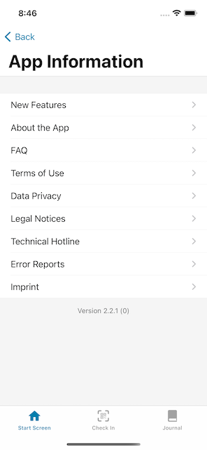
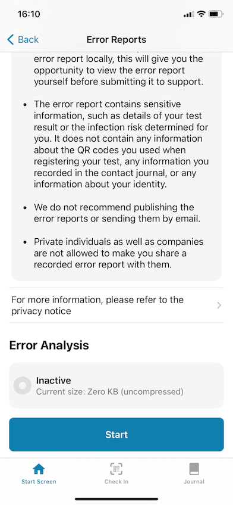

Deutsche Telekom and SAP’s project team have released a new version of the Corona-Warn-App, which will be available to users within the next 48 hours. In version 2.2, users will be able to create a **rapid test profile** and an **error report**.

<!-- overview -->

With Corona-Warn-App version 2.2, the project team expands the (rapid) test section. Users can create a rapid test profile with their personal data in the form of a **QR code**. At test sites of participating partners that do not have their own booking system and where users do not need to make an appointment in advance, they can simply show the QR code in the app to speed up on-site registration. 

The participating partners where users can currently take a rapid test have their own booking systems. In the future, however, the rapid test profile can be used at smaller partners that won’t have their own system.

The employees at the test sites need the personal data in order to forward it to the health department in case of a positive test result. For this reason, a comparison with the identity card is always necessary on site.

### Creating a rapid test profile

To create a rapid test profile, users can go to **"Next Steps"** under **"Register your Test"** on their Corona-Warn-App’s home screen. There, they will find the section Create **"Rapid Test Profile"**. 

  

   

  

After tapping on *Continue* to agree to the data protection and security, they can enter their personal data, such as name, address, and phone number. When everything is entered, they can save the data. The Corona-Warn-App then creates a QR code based on the data, which users can present at testing points. 

  

     

  

Once created, the profile remains and can be shown again whenever it’s needed. iOS users can remove it by going to their rapid test profile in the Corona-Warn-App’s rapid test section and choosing *Remove Rapid Test Profile*. Android users can remove a rapid test profile by going to their rapid test profile in the rapid test area of the Corona-Warn-App and selecting **"Remove"** in the 3-dot-icon.

### Users can create error reports in the Corona-Warn-App

Furthermore, users can now create an **error analysis** in the Corona-Warn-App if they notice an error and technical support requests a detailed report. This way, the individual technical steps and events during your usage of the app can be recorded in detail and sent to the technical support of the Robert Koch Institute (RKI). With this function, the analysis of possible errors can be facilitated, and users can quickly assist in troubleshooting. 

**Reporting an error**

If users notice an error, they should **first contact the technical support** via the hotline ([0800 7540001](tel:08007540001) or [+49 30 498 75401](tel:+493049875401) from abroad). Technically experienced users can also contact the technical support via GitHub (for iOS problems via https://github.com/corona-warn-app/cwa-app-ios/issues and for Android problems via: https://github.com/corona-warn-app/cwa-app-android/issues). 

The technical support will check if there is already a solution for the problem. If this is not the case, they can **request the error report**. The team only analyzes reports that have been requested by the support. Users should not send them proactively without request. 

To file an error report, users can scroll down in their Corona-Warn-App and go to *App Information*. As of version 2.2, they will find ***Error reports*** in the list. 

  

 

  

There, they can start the error analysis. Once it started, they have to **reproduce the error**. As soon as the error occurs during the running error analysis, they can send the report to the RKI.

  

   

  

During the analysis, information that is **particularly worthy of protection**, such as entries from the contact journal or check-ins from the event registration, is recorded anonymously. This means that names of people in the contact journal, for example, are not recorded in plain text. The error report also does not contain any information about the identity of the user. 

After users have sent the error analysis, they receive a **report ID** that they can use if they need to provide the technical support with further information. This allows the error report to be associated with the previous request via the hotline, e-mail or GitHub.  

Version 2.2 - like previous versions - will be delivered in a controlled rollout and is made available for users in waves. While users can manually trigger an update in Apple’s App Store, this option is not available in the Google Play Store. There, the Corona-Warn-App’s new version can be available up to 48 hours later.
