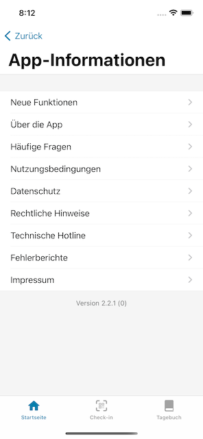

Das Projektteam der Deutschen Telekom und SAP hat eine neue Version der Corona-Warn-App veröffentlicht, die Nutzer\*innen innerhalb der nächsten 48 Stunden zur Verfügung stehen wird. In Version 2.2 haben Nutzer*innen die Möglichkeit, ein **Schnelltest-Profil** anzulegen und einen **Fehlerbericht** zu erstellen, falls ihnen Fehler in der Corona-Warn-App auffallen. 

<!-- overview -->

Mit Corona-Warn-App Version 2.2 erweitert das Projektteam den Schnelltest-Bereich. Nutzer\*innen können ein Schnelltest-Profil mit ihren persönlichen Daten in Form eines QR-Codes anlegen. An Teststellen teilnehmender Partner, die **kein eigenes Terminbuchungssystem** haben und an denen Nutzer*innen keinen Termin vorab vereinbaren müssen, wird dann lediglich der QR-Code in der App gescannt. So kann die **Registrierung vor Ort** beschleunigt werden.

Die teilnehmenden Partner, bei denen Nutzer\*innen derzeit einen Schnelltest machen können, haben eigene Buchungssysteme. In Zukunft kann das Schnelltest-Profil aber insbesondere bei kleineren Partnern, die kein eigenes Buchungssystem haben werden, genutzt werden.

Die Mitarbeiter\*innen an den Teststellen  benötigen die persönlichen Daten, um sie im Falle eines positiven Testergebnisses an das Gesundheitsamt weiterzuleiten. Aus diesem Grund ist vor Ort immer auch ein Abgleich mit dem Personalausweis nötig.

### Schnelltest-Profil anlegen - so gehts: 

Um ein Schnelltest-Profil anzulegen, können Nutzer\*innen auf der Startseite ihrer Corona-Warn-App unter „Test registrieren“ auf *Nächste Schritte* gehen. Dort finden Sie den **Bereich „Schnelltest-Profil anlegen“**. 

  

   

  

Dort können sie ihre persönlichen Daten, wie Name, Adresse und Telefonnummer, eintragen. Wenn alles eingetragen ist, können sie die Daten speichern. Die Corona-Warn-App erstellt daraufhin einen **QR-Code** aus den Daten, den Nutzer\*innen an den Teststellen vorzeigen können. 

  

     

  

Einmal angelegt, bleibt das Profil bestehen und kann bei jedem Test wieder vorgezeigt werden. Das Profil ist nur auf dem jeweils eigenen Smartphone in der Corona-Warn-App abgespeichert! Nutzer\*innen können es wieder entfernen, indem sie unter iOS im Schnelltest-Bereich der Corona-Warn-App auf ihr Schnelltest-Profil gehen und dort **„Schnelltest-Profil entfernen“** auswählen. Android-Nutzer\*innen können das Profil entfernen, indem sie im Schnelltest-Bereich der Corona-Warn-App auf ihr Schnelltest-Profil gehen und dort im 3-Punkte-Menü **"Entfernen"** auswählen.

### Nutzer\*innen können einen Fehlerbericht in der Corona-Warn-App erstellen

Des Weiteren können Nutzer\*innen in der Corona-Warn-App nun ein **Fehlerprotokoll erstellen**, falls ihnen ein Fehler auffällt und der technische Support einen detaillierten Fehlerbericht anfordert. So können die einzelnen technischen Schritte und Ereignisse im Ablauf der App detailliert aufgezeichnet werden und an den technischen Support des Robert Koch-Instituts (RKI) gesendet werden. Mit dieser Funktion kann die Analyse von möglichen Fehlern erleichtert werden und Nutzer\*innen können schnell bei der Fehlerbehebung helfen.

Falls ihnen ein Fehler auffällt sollten sie **zuerst den technischen Support** über die Hotline ([0800 7540001](tel:08007540001) oder [+49 30 498 75401](tel:+493049875401) aus dem Ausland) kontaktieren. Technisch versierte Nutzer\*innen können sich auch über GitHub mit dem technischen Support in Verbindung setzen (bei iOS-Problemen über https://github.com/corona-warn-app/cwa-app-ios/issues und bei Android-Problemen über https://github.com/corona-warn-app/cwa-app-android/issues). 

Der technische Support prüft, ob es bereits eine Lösung für das Problem gibt. Sollte das nicht der Fall sein, kann er einen **Fehlerbericht anfordern**. Grundsätzlich werden nur Fehlerberichte analysiert, die durch den Support angefordert wurden. Nutzer*innen sollten sie **nicht pro-aktiv** ohne Aufforderung senden. 

Um einen Fehlerbericht zu erstellen, können Nutzer\*innen in ihrer Corona-Warn-App nach unten scrollen und auf **„App-Informationen“** gehen. Ab Version 2.2 finden sie dort den Punkt **„Fehlerberichte“**. 

  

 

  

Dort können Sie die **Fehleranalyse starten**. Anschließend müssen sie den **Fehler reproduzieren**. Erst, wenn der Fehler während der laufenden Fehleranalyse auftritt, können Sie die Analyse an das RKI senden.

  

   

  

Während der Analyse werden besonders **schützenswerte Informationen**, wie Einträge aus dem Kontakt-Tagebuch oder Check-ins aus der Event-Registrierung anonymisiert erfasst. Das heißt Namen von Personen, die im Kontakt-Tagebuch stehen, werden beispielsweise nicht im Klartext erfasst. Der Fehlerbericht enthält außerdem keine Hinweise auf die Identität des Nutzers oder der Nutzerin. 

Nachdem Nutzer\*innen die Fehleranalyse versendet haben, erhalten sie eine **Fehlerbericht-ID**, die sie angeben können, wenn sie dem technischen Support gegebenenfalls weitere Informationen zukommen lassen müssen. So kann der Fehlerbericht der ursprünglichen Anfrage zugeordnet werden.  

  

 

  

Version 2.2 wird, wie vorherige Versionen auch, schrittweise über zwei Tage an alle Nutzer\*innen ausgerollt. iOS-Nutzer\*innen können sich die aktuelle App-Version ab sofort aus dem Store von Apple manuell herunterladen. Der Google Play Store bietet keine Möglichkeit, ein manuelles Update anzustoßen. Hier steht Nutzer*innen die neue Version der Corona-Warn-App über die nächsten 48 Stunden zur Verfügung.
