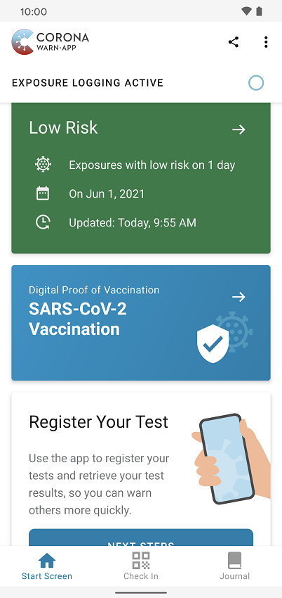

Deutsche Telekom and SAP’s project team have released Corona-Warn-App version 2.3, in which users can add their **SARS-CoV-2 vaccination certificates**. After the addition of the check-in function and the possibility to document the infection status with a (negative) rapid test, users can now also prove their personal vaccination status with the help of the Corona-Warn-App.

<!-- overview -->

With version 2.3 of the Corona-Warn-App, users will be able to add their digital proof of vaccination to the app and **show their vaccination status** via QR code. The vaccination certificate's validity must be checked by scanning the QR code with the CovPass check app in combination with the validation of the ID card whenever users show their vaccination status. The app displays their full vaccination coverage 14 days after the last required vaccination. With that, users can manage information and features related to the Corona virus in one place: the Corona-Warn-App.

The digital vaccination certificate is an **electronic certificate** that can digitally document Corona vaccinations, for example on a smartphone. It can be generated in the doctor's office or at a vaccination center: After entering or accepting the data, a QR code is generated. Users can scan the code either with the CovPass-App or the Corona-Warn-App (version 2.3) to integrate the proof of vaccination in the app. However, users can also use the familiar yellow vaccination certificate to prove their immunization status.

  

 

  

### Adding the vaccination certificates - Here's how:

As of version 2.3, users will find the **"Add Vaccination Certificate"** section on their app’s home screen. By tapping *Add*, they can scan the QR code they’ve received at the vaccination site to add the vaccination status to the Corona-Warn-App. The app will read the information from the QR code and display the appropriate vaccination status. 

For many vaccines, users need two vaccinations to achieve full vaccination protection. In this case, after the first vaccination, the app initially displays **"Vaccination incomplete"** on the home screen under the risk display. 

Users can **"Register another vaccination"** in the vaccination certificate section of the app once they’ve received a second vaccination for full vaccination protection. For vaccination protection to be complete, 14 days must pass after the last required vaccination. Only then will the Corona-Warn-App show a status of "Complete Vaccination Protection." To see more information about each vaccination, such as the date or vaccine, users can tap on the vaccination ("Vaccination 1 of 2" or "Vaccination 2 of 2").

Users can scan the QR code after the first vaccination to integrate the vaccination status in the app, but they don’t have to do so. They can also wait until they have received all required vaccinations and then transfer the status to the Corona-Warn-App.

**Please note**: In the Corona-Warn-App, users can only **scan and add vaccination certificates from one person**. It is not possible to add their own and, for example, their partner's vaccination certificate. 

All information and data remain on the user's smartphone. Transfer to third parties only takes place when users show the vaccination certificate in the form of the QR code for verification. Information from vaccination certificates also doesn’t appear in the error report that users have been able to create and send to the Robert Koch Institute since version 2.2 of the app. 

