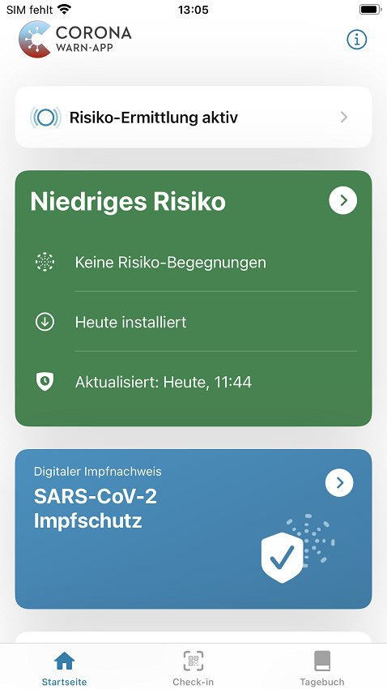
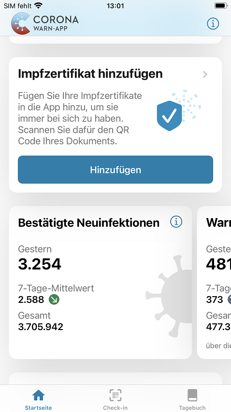
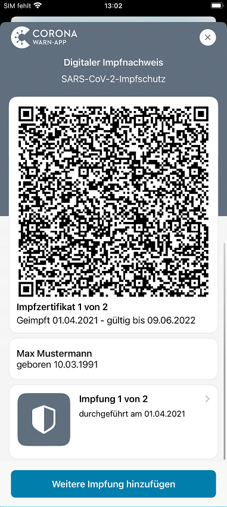
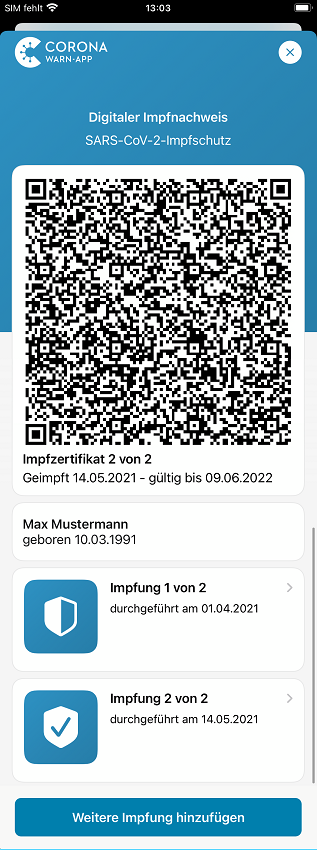
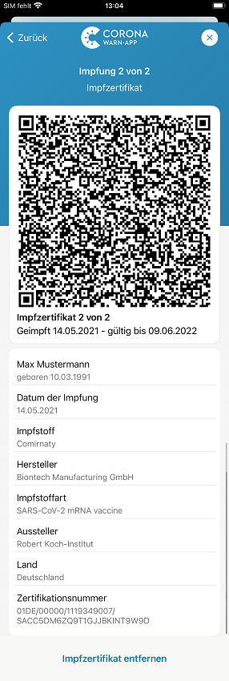
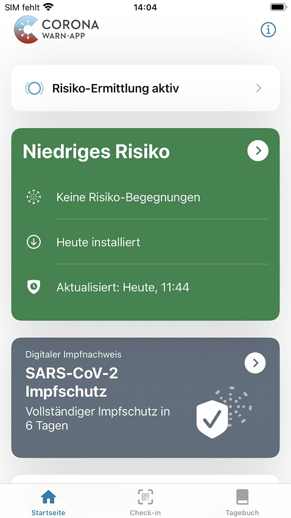

Das Projektteam aus Deutscher Telekom und SAP hat Corona-Warn-App Version 2.3 veröffentlicht, in der Nutzer\*innen ihre **SARS-CoV-2-Impfzertifikate** hinzufügen können. Nach der Check-in-Funktion und der Möglichkeit, den Infektionsstatus durch einen (negativen) Schnelltest nachzuweisen, können Nutzer\*innen damit auch ihren **persönlichen Impfstatus** mit Hilfe der Corona-Warn-App nachweisen. 

<!-- overview -->

Ab Version 2.3 der Corona-Warn-App können Nutzer\*innen ihren digitalen Impfnachweis in der App hinzufügen und so per QR-Code ihren Impfstatus vorweisen. Die App zeigt den vollständigen Impfschutz 14 Tage nach der letzten benötigten Impfung an. Damit können Nutzer\*innen Informationen und Funktionen rund um das Corona-Virus **an einem Ort verwalten: der Corona-Warn-App.**

Der digitale Impfnachweis ist ein **elektronisches Zertifikat**, das Corona-Impfungen digital dokumentieren kann, beispielsweise auf dem Smartphone. Er kann in der Arztpraxis oder in einem Impfzentrum generiert werden: Nach Eingabe oder Übernahme der Daten wird ein QR-Code erstellt. Den können Nutzer\*innen dann entweder mit der [CovPass-App](https://digitaler-impfnachweis-app.de/) oder der Corona-Warn-App scannen, um den **Impfnachweis in die App zu integrieren**. Natürlich kann aber auch der gelbe Impfausweis weiterhin als Nachweis des Impfstatus verwendet werden.

Die **Gültigkeit** des digitalen Impfnachweises muss durch die **CovPass-Check-App** in Kombination mit einem Personalausweis überprüft werden.

  

 

  

### Impfzertifikate hinzufügen – So geht’s:

Ab Version 2.3 der Corona-Warn-App finden Nutzer\*innen den Bereich **„Impfzertifikat hinzufügen“** auf dem Home-Bildschirm ihrer App. Mit dem Tippen auf *Hinzufügen*, können sie den QR-Code scannen, den sie bei der Impfung vor Ort erhalten, um den Impfstatus in die Corona-Warn-App zu integrieren. Die App liest die Informationen aus dem QR-Code aus und zeigt den entsprechenden Impfstatus an. 

  

  

  

Bei vielen Impfstoffen benötigen die Nutzer\*innen zwei Impfungen, um einen vollständigen Impfschutz zu erlangen. In diesem Fall zeigt die App nach der ersten Impfung auf dem Startbildschirm unter der Risikoanzeige zunächst einen unvollständigen Impfschutz an. 

  

 

  

Nutzer\*innen können  im Impfzertifikats-Bereich der App eine **„Weitere Impfung registrieren“**, sobald sie eine zweite Impfung für den vollständigen Impfschutz erhalten haben. Damit der Impfschutz vollständig vorhanden ist, müssen 14 Tage nach der letzten benötigten Impfung vergehen. Erst dann zeigt die Corona-Warn-App den Status „Vollständiger Impfschutz“. Um weitere Informationen zur jeweiligen Impfung anzuzeigen, beispielsweise das Datum oder den Impfstoff, können Nutzer*innen auf die jeweilige Impfung ( „Impfung 1 von 2“ oder „Impfung 2 von 2“) tippen.

  

  

  

  

 

  

Nutzer\*innen können den QR-Code bereits nach der ersten Impfung scannen und so den Impfstatus in die App übertragen, müssen das aber nicht tun. Sie können auch abwarten, bis sie alle benötigten Impfungen erhalten haben und den Status erst dann in die Corona-Warn-App übertragen.

**Wichtig**: Nutzer\*innen können nur **Impfnachweise von einer Person scannen und der Corona-Warn-App hinzufügen**. Es ist nicht möglich, den eigenen und beispielsweise den des Partners oder der Partnerin hinzuzufügen.

Alle Informationen und Daten bleiben auf dem jeweiligen Smartphone des Nutzers oder der Nutzerin. Eine Übertragung an andere Personen findet nur statt, wenn Nutzer\*innen das Impfzertifikat in Form des QR-Codes zur Überprüfung vorzeigen. Informationen aus Impfzertifikaten tauchen auch nicht im Fehlerbericht auf, den Nutzer*innen seit Version 2.2 nach Aufforderung in der App erstellen und an das Robert Koch-Institut senden können. 
