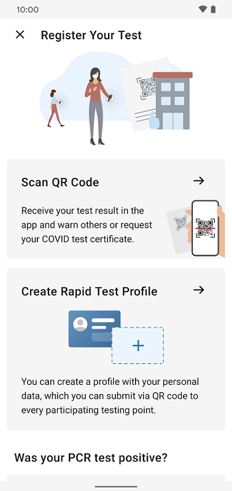
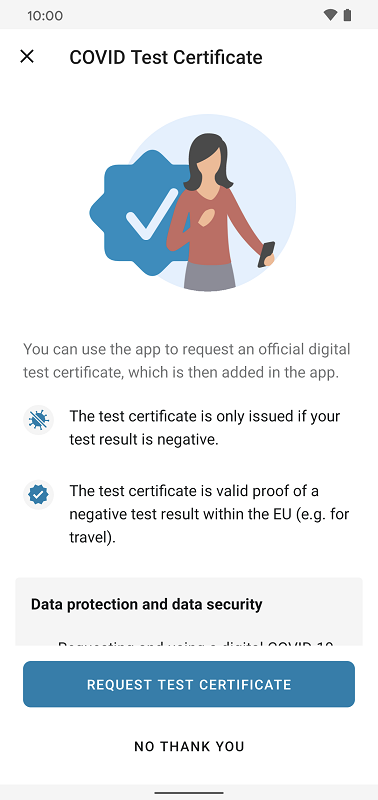
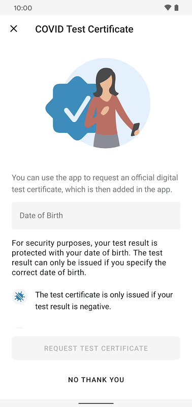
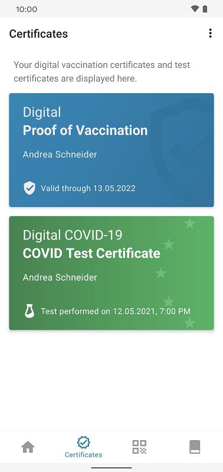
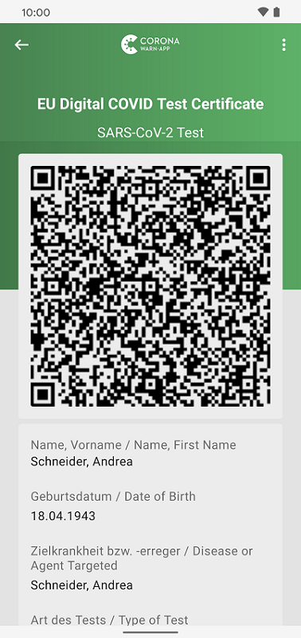
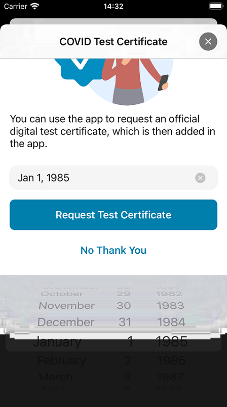
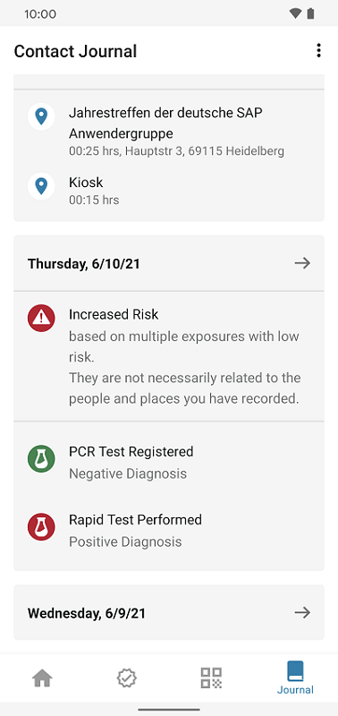

## The new feature serves as proof of an official negative test result

Deutsche Telekom and SAP’s project team have released version 2.4 of the Corona-Warn-App, in which users can request a digital test certificate for PCR and rapid tests, which will be issued if the test result is negative. Within the EU, Iceland, Norway, Switzerland, and Liechtenstein they can use the certificate as proof of an official negative test result. 

In addition, users can now find test providers who support the submission of test results to the Corona-Warn-App via an [online rapid test partner search](https://map.schnelltestportal.de/).

<!-- overview -->

The new feature enables users to have their negative test result confirmed by an official digital COVID test certificate that contains their corona test data in the form of a QR code. Within the EU, it serves as valid proof of a negative test result, which users can use, for example, to travel or to visit a restaurant that requires proof. 

At the appropriate location (e.g. in a restaurant or at the airport), those responsible must verify the certificate's validity by scanning the QR code with the CovPass Check app and checking the ID card.

### How users can request certificates for rapid tests and PCR tests:

Users can request a certificate for both PCR and rapid tests by registering a test in the Corona-Warn-App: To do so, they can tap "Register a Test" on the home screen of their app and then tap "Scan QR Code." After they have scanned the QR code for test registration, the COVID test certificate window will open automatically. There they can "Request Test Certificate" (or decline if they don't want to get one.) 

  

     

  

In case of a negative test result users receive their test certificate in the app shortly after the test result is available in the app - if they have requested it beforehand and if the respective rapid test center supports the creation of a certificate. 

Users can then view the certificate via the "Certificates" tab in their tab bar. If they tap on the COVID test certificate, they can see the QR code that is used for verification, as well as other information such as the type of test, the date and time it was performed, and the test result. 

  

   

  

Not every rapid test center supports the digital certificate. In this case, users won’t be redirected to request the certificate after scanning the QR code. They will then be informed that a test certificate cannot be requested because the testing center does not support test certificates. 

Users requesting a test certificate for a PCR test must provide their date of birth when making the request. It is important that the date of birth is the same as the date of birth used for the PCR swab test. If the dates don’t match, for example due to a typing error, the user will neither receive the test result nor the certificate via the app. Also, users cannot change the date of birth that they enter in the app later. Therefore, they should check whether the date is correct before completing the request for a certificate.

  

 

  

**Please note**: To create the test certificate, the data is encrypted end-to-end and transmitted from the lab or the rapid test site to the Corona-Warn-App. For this purpose, the encrypted data is transmitted to the Robert Koch Institute (RKI) in order to digitally sign it and thus confirm the certificate’s validity. The RKI cannot decrypt the data, which will be deleted after the certificate has been delivered.

Test certificates are stored in the app for an unlimited period. However, users can delete them by going to the "Certificates" tab, selecting the respective test certificate, and then selecting "Remove test certificate" at the bottom. How long the certificate can serve as proof of a negative test result depends on the regulations of the respective state or municipality.  
  

### Contact journal and data donation enhancements
In addition to the new test certificate feature, the project team has enhanced the contact journal and data donation features in version 2.4. 

Once the test result is available, it is now automatically added to the **contact journal**. Rapid tests are entered under the date they were performed, PCR tests on the date they were registered in the Corona-Warn-App.

  

 

  

The **voluntary data donation** now also includes alerts that users share due to a positive rapid test. For PCR tests, this is already possible since [version 1.13](/en/blog/2021-03-04-corona-warn-app-version-1-13/) of the Corona-Warn-App. Furthermore, the data donation captures data points on warnings from the event registration feature (similar to the capturing of warnings that users receive based on the distance measurement via Bluetooth). The project team also records whether users share their event check-ins. A prerequisite for the recording is that users have activated the voluntary donation of data.

### Rapid test partner search allows users to quickly find test providers that support the CWA

In addition, the project team has published a rapid test partner search. At [https://map.schnelltestportal.de/](https://map.schnelltestportal.de/), users can find rapid test providers in their area who submit the test result to the Corona-Warn-App. By setting filters, such as test type or opening hours, they can quickly find the desired provider and, in some cases, book an appointment directly via the link provided. 

Interested parties who also want to become rapid test partners for the transmission of test results into the Corona-Warn-App can get more information [here](https://github.com/corona-warn-app/cwa-quicktest-onboarding/wiki). 
