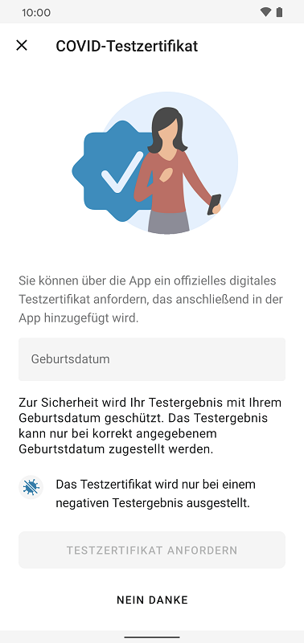

## Die neue Funktion dient als offizieller Nachweis für ein negatives Testergebnis

Das Projektteam aus Deutscher Telekom und SAP hat Version 2.4 der Corona-Warn-App veröffentlicht, in der Nutzer\*innen ein digitales Testzertifikat für PCR- und Schnelltests anfordern können, das im Falle eines negativen Testergebnisses ausgestellt wird. Sie können es in Ländern der Europäischen Union, sowie Island, Norwegen, Liechtenstein und der Schweiz  dafür verwenden, um ein negatives Testergebnis offiziell nachzuweisen. 

Außerdem können Nutzer\*innen ab sofort über eine [Online-Schnelltestpartnersuche](https://map.schnelltestportal.de/) Testanbieter finden, die die Übermittlung von Schnelltest-Ergebnissen an die Corona-Warn-App unterstützen.

<!-- overview -->

Durch die neue Funktion in Version 2.4 der CWA haben Nutzer\*innen die Möglichkeit, ihr negatives Testergebnis durch ein **offizielles, digitales COVID-Testzertifikat** in Form eines QR-Codes in der App bestätigen zu lassen. Das Testzertifikat enthält die Daten über den Corona-Test des Nutzers oder der Nutzerin. Innerhalb der EU kann es als offiziell gültiger Nachweis eines negativen Testergebnisses dienen, den Nutzer\*innen beispielsweise für Reisen nutzen können oder in anderen gesetzlich vorgeschriebenen Fällen, wie einem Restaurantbesuch. Nutzer\*innen können dann den QR-Code in der Corona-Warn-App vorzeigen. Die Gültigkeit des Zertifikats muss an der entsprechenden Stelle (z.B. im Restaurant oder am Flughafen) durch das Scannen des QR-Codes mit der CovPass Check-App und der Kontrolle des Personalausweises überprüft werden.   

### Testzertifikate für Schnelltests und PCR-Test in der App anfordern – So geht’s: 

Nutzer\*innen können sowohl für PCR- als auch für Schnelltests ein Zertifikat anfordern, indem sie einen **Test in der Corona-Warn-App registrieren**: Dazu können sie auf dem Startbildschirm ihrer Corona-Warn-App auf „Test registrieren“ tippen und dann auf „QR-Code scannen“. Nachdem sie den QR-Code zur Test-Registrierung gescannt haben, öffnet sich automatisch das Fenster, in dem sie das Testzertifikat anfordern oder ablehnen können. 

  

     

  

Ist das Testergebnis negativ, erhalten Nutzer\*innen das Zertifikat in der App sobald auch das Testergebnis in der App vorliegt - vorausgesetzt,  sie haben das Zertifikat vorher angefordert und die jeweilige Schnellteststelle unterstützt die Erstellung eines Zertifikats. Sie können es dann über den Reiter „Zertifikate“ in ihrer Registerkarte einsehen. Tippen sie auf das COVID-Testzertifikat, wird ihnen der QR-Code angezeigt, sowie weitere Informationen, wie Art des Tests, Datum und Uhrzeit der Durchführung und Testergebnis. 

  

   

  

Nicht alle **Schnelltestzentren** unterstützen das digitale Testzertifikat. In diesem Fall werden Nutzer\*innen während der Registrierung eines Tests nicht zum Beantragen des Zertifikats weitergeleitet. Sie erhalten im Anschluss die Information, dass ein Testzertifikat nicht angefordert werden kann, da die Teststelle die Ausstellung von Testzertifikaten nicht unterstützt. 

  

 

  

Nutzer\*innen, die ein **Testzertifikat für einen PCR-Test** anfordern, müssen bei der Anforderung ihr Geburtsdatum angeben. Dabei ist wichtig, dass das Geburtsdatum mit dem übereinstimmt, das auch beim Abstrich für den PCR-Test angegeben wurde. Sollten die Geburtsdaten nicht übereinstimmen, beispielsweise aufgrund eines Tippfehlers, bekommt der Nutzer oder die Nutzerin weder das Testergebnis noch das Zertifikat über die App. Nachträglich lässt sich das Geburtsdatum nicht mehr ändern. Nach der Eingabe des Datums sollten Nutzer*innen es also noch einmal überprüfen.

  

 

  

**Wichtig**: Zur Erstellung des Testzertifikats werden die Daten Ende-zu-Ende verschlüsselt und vom Labor, beziehungsweise der Schnellteststelle an die Corona-Warn-App übermittelt. Dafür werden die verschlüsselten Daten an das Robert Koch-Institut (RKI) übermittelt, um sie digital zu signieren und so die Gültigkeit des Zertifikats zu bestätigen. Die Daten können vom RKI nicht entschlüsselt werden und werden nach Zustellung des Zertifikats gelöscht.

Testzertifikate werden unbefristet in der App gespeichert. Nutzer\*innen können sie manuell löschen, indem sie auf den **Reiter „Zertifikate“** gehen, das jeweilige Testzertifikat auswählen und dann „Testzertifikat entfernen“ auswählen. Wie lange das Zertifikat als Nachweis anerkannt wird, hängt von den Bestimmungen des jeweiligen Bundeslandes oder der Kommune ab.  
  

### Erweiterung des Kontakt-Tagebuchs und der Datenspende

Zusätzlich zur neuen Funktion der Testzertifikate hat das Projektteam in Version 2.4 das Kontakt-Tagebuch und die Funktion der Datenspende erweitert. 

Das Testergebnis wird nun automatisch dem **Kontakt-Tagebuch** hinzugefügt, sobald es vorliegt. Schnelltests werden unter dem Datum eingetragen, an dem sie durchgeführt wurden, PCR-Tests an dem Tag, an dem sie in der Corona-Warn-App registriert wurden.

  

 

  

In die **freiwillige Datenspende** fließen nun auch Warnungen ein, die Nutzer\*innen aufgrund eines positiven Schnelltests teilen, wie es seit [Version 1.13](/de/blog/2021-03-04-corona-warn-app-version-1-13/) schon für PCR-Tests möglich ist. Des Weiteren erfasst die Datenspende Datenpunkte zu Warnungen, die auf die Funktion der Event-Registrierung zurückzuführen sind - analog dazu, wie bereits erfasst wird, dass Nutzer\*innen auf Basis der Abstandsmessung durch Bluetooth eine Warnung erhalten. Das Projektteam erfasst außerdem, ob Nutzer\*innen ihre Event-Check-Ins mit freigeben. Voraussetzung für die Erfassung ist, dass Nutzer\*innen die freiwillige Datenspende aktiviert haben.

### Schnelltestpartnersuche online ermöglicht Nutzer*innen Testanbieter zu finden, die die CWA unterstützen

Zusätzlich hat das Projektteam eine **Schnelltestpartnersuche** veröffentlicht. Unter [https://map.schnelltestportal.de/](https://map.schnelltestportal.de/) können Nutzer\*innen ab sofort Schnelltestanbieter in ihrer Nähe finden, die die Übermittlung des Testergebnisses in die Corona-Warn-App anbieten. Durch das Setzen von Filtern, wie beispielsweise Testart oder Öffnungszeiten, können sie den gewünschten Anbieter schnell finden und teilweise über den angegebenen Link direkt einen Termin buchen. 

Interessierte, die ebenfalls Schnelltestpartner für die Übermittlung der Testergebnisse in die Corona-Warn-App werden wollen, erhalten [hier](https://github.com/corona-warn-app/cwa-quicktest-onboarding/wiki) weitere Informationen. 

Version 2.4 wird, wie vorherige Versionen auch, schrittweise über zwei Tage an alle Nutzer\*innen ausgerollt. iOS-Nutzer\*innen können sich die aktuelle App-Version ab sofort aus dem Store von Apple manuell herunterladen. Der Google Play Store bietet keine Möglichkeit, ein manuelles Update anzustoßen. Hier steht Nutzer\*innen die neue Version der Corona-Warn-App über die nächsten 48 Stunden zur Verfügung.
