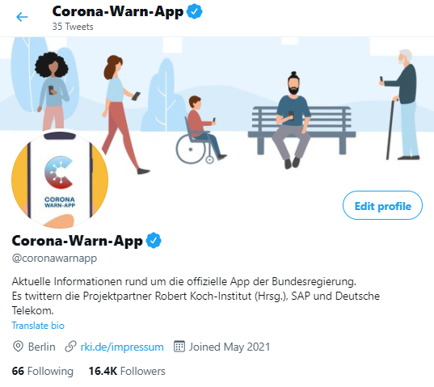

Wer sich noch schneller und ausführlicher über die Corona-Warn-App informieren möchte, kann das jetzt auch auf Twitter tun. Die Projektpartner Robert Koch-Institut, SAP und Deutsche Telekom haben einen eigenen Account für die CWA eingerichtet.

<!-- overview -->

Unter [https://twitter.com/coronawarnapp](https://twitter.com/coronawarnapp) posten die Kolleg*innen des RKI, von SAP und der Deutschen Telekom zu den aktuellen Entwicklungen rund um die App. 

Neue Versionen und Funktionen, Kennzahlen, Daten und Fakten zur Wirksamkeit, die wichtigsten Fragen und Antworten aus der Community - das Wichtigste gibt es jetzt auf Twitter. Wir freuen uns auf Diskussionen, Verbesserungsvorschläge und Erfahrungen im Umgang mit der CWA. 

Anmelden, folgen, mitdiskutieren: Twitter [@coronawarnapp](https://twitter.com/coronawarnapp)

  

  

  
