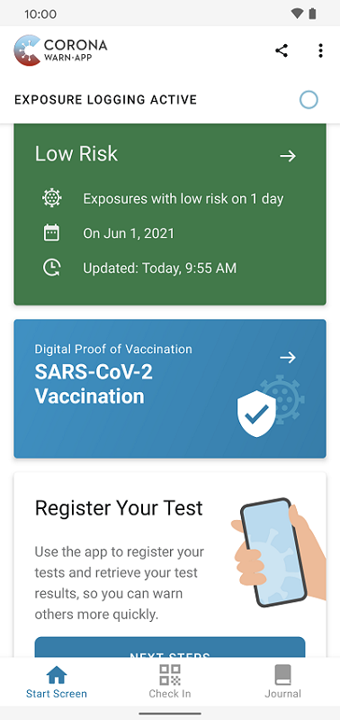
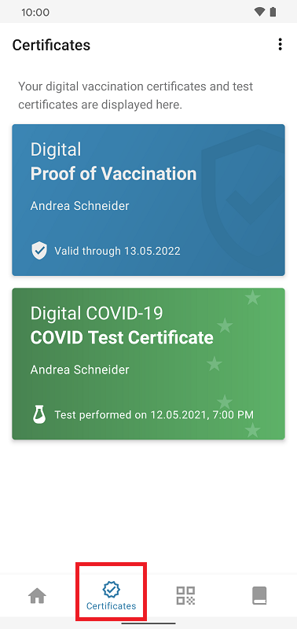

With the update to version 2.4 of the Corona-Warn-App, the project team introduced a **"Certificates" section** that users can find in the tab bar at the bottom of their app. By selecting the section, they can now see all their digital certificates and add new ones, including the **digital vaccination certificate** and test certificates. All certificates, including those previously found on the main screen when opening the Corona-Warn-App, are now located in this central area.

  

    

        

            <figure>
                
                <figcaption aria-hidden="true">
                    <em>Before (version 2.3)</em>
                </figcaption>
            </figure>
        

        

            <figure>
                
                <figcaption aria-hidden="true">
                    <em>Currently (as of version 2.4)</em>
                </figcaption>
            </figure>
        

    

  

In the future, the certificate area will be expanded to serve users as a **central management location** for all official COVID digital certificates.  

<!-- overview -->
