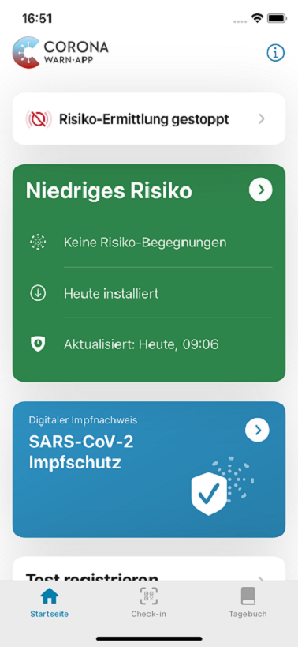
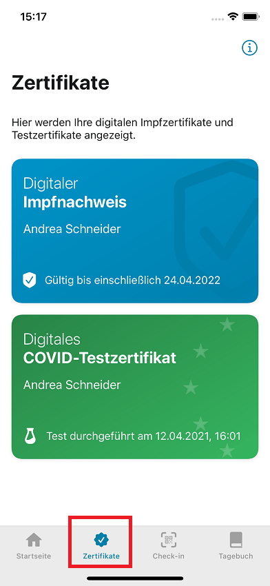

Seit dem Update auf Version 2.4 der Corona-Warn-App gibt es den neuen **Bereich „Zertifikate“**, den Nutzer*innen in der Registerkarte am unteren Rand ihrer App finden. Mit der Auswahl des Reiters können sie ab sofort alle digitalen Zertifikate, wie den **digitalen Impfnachweis** und digitale Testzertifikate, sehen und neue Zertifikate hinzufügen. Alle Zertifikate, auch jene, die bisher auf dem Hauptbildschirm beim Öffnen der Corona-Warn-App zu finden waren, befinden sich nun in diesem zentralen Bereich. 

  

 
 

Vorher (Version 2.3)
 
   

Aktuell (ab Version 2.4)

  

In Zukunft wird dieser Zertifikatsbereich als **zentraler Verwaltungsort** für alle offiziellen digitalen COVID-Zertifikate erweitert.  

<!-- overview -->