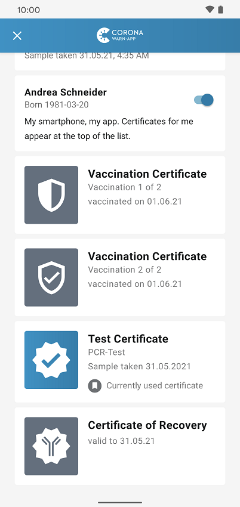
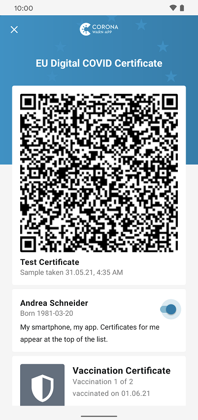
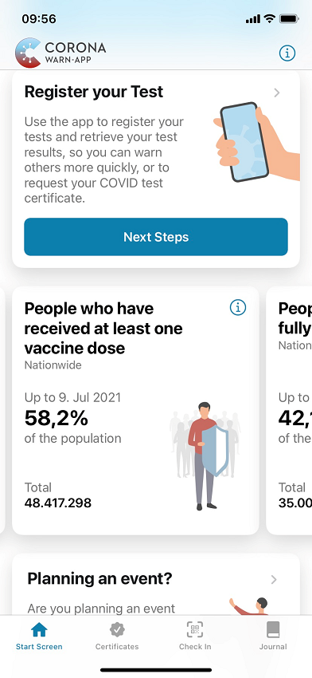

Deutsche Telekom and SAP’s project team have released version 2.5 of the Corona-Warn-App, in which users who have recovered from COVID-19 can integrate a digital certificate that serves as official proof for their recovery. **Whether vaccinated, recovered, or tested**, users can now manage all types of certificates in one place in their Corona-Warn-App. Users can manage certificates both for themselves and for others, such as children.

In addition, the section with statistics now contains **key figures on the vaccination status** in Germany.

<!-- overview -->

With version 2.5, users can add **certificates of recovery** to their Corona-Warn-App by going to the "Certificates" tab in the tab bar and selecting "Add Certificate." They can then scan the QR code they received from their family physician. For more information on adding vaccination certificates, click [here](/en/blog/2021-06-10-cwa-version-2-3/). 

Certificates of recovery are stored indefinitely in the app. However, it depends on federal regulations for how long they serve as official proof of recovery.  

  

  

  

### Certificate area turns into a useful wallet

In addition, the project team turns the app’s certificate section into a wallet, where tested, vaccinated, and recovered users can **manage their digital certificates** in the form of QR codes. They can also add certificates of recovery, vaccination certificates, as well as test and recovery certificates for other people, such as family members.

<ins>At the corresponding checkpoints, such as airports, authorities verify the validity of the respective certificate by scanning the QR code with the CovPass check app and checking the ID card.</ins>

Under the **"Certificates" tab**, all existing certificates are grouped by person. By selecting a person, users can see all certificates available for them in the app. 

  

   

  

At this point, they can also activate a slider under their own name to indicate that they are the owner, so that they always appear at the top of the list of people.  

  

 

  

Users cannot define the QR code that is displayed first in the overview of the certificate wallet. If multiple certificates are available, test certificates automatically appear before vaccination certificates or certificates of recovery, as long as they are not older than 48 (PCR test) or 24 hours (rapid test).

Users can add **digital test certificates for PCR and rapid tests** by registering a test in the Corona-Warn-App and requesting the test certificate during the registration process, just like it has been possible since version 2.4 of the CWA. If the test result is negative, the digital certificate will appear in the wallet under the individual's name. More detailed information on requesting digital test certificates can be found [here](/en/blog/2021-06-24-cwa-version-2-4/). 

As of version 2.5, they can also add test certificates to the app that they did not receive through the CWA by tapping "Add Certificate" under "Certificates" and scanning the QR code they received at the testing site. This may be the case, for example, for **test results from other countries** within the EU, as well as Iceland, Norway, Liechtenstein, and Switzerland.  

Following the same procedure, users can add all three certificate types for other people, such as children or partners.

### Key figures section includes vaccination statistics 

Under the key figures section in their Corona-Warn-App, users can now see how many people have been vaccinated at least once or completely nationwide, what proportion of the total population this represents in each case and how many vaccination doses have been administered in Germany.

  

   

  

Version 2.5 - like previous versions - will be delivered in a staged rollout and is made available for users in waves. While users can manually trigger an update in Apple’s App Store, this option is not available in the Google Play Store. There, the delivery of the Corona-Warn-App’s new version can take up to 48 hours.
