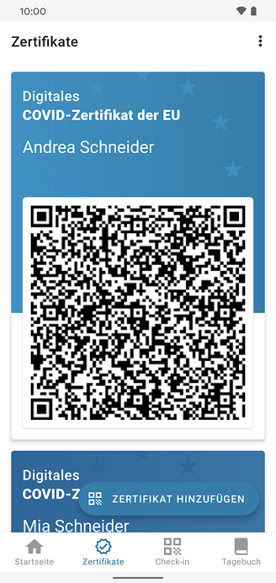
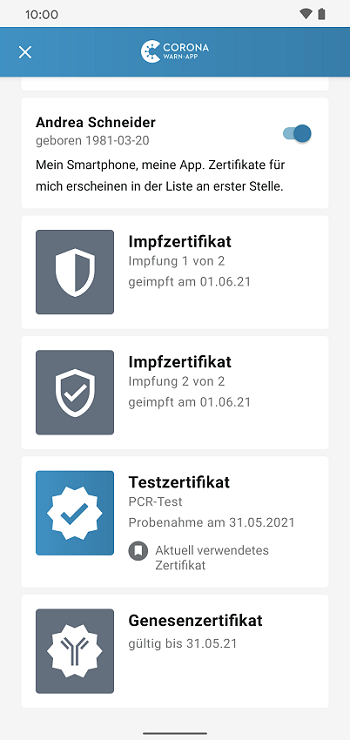
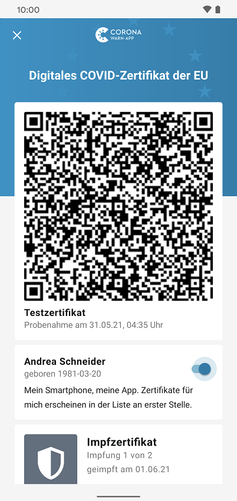

Das Projektteam aus Deutscher Telekom und SAP hat Version 2.5 der Corona-Warn-App veröffentlicht, in der genesene Nutzer\*innen ein digitales Zertifikat integrieren können, das ihnen als offizieller Nachweis dient. **Ob geimpft, genesen oder getestet** – ab sofort können Nutzer*innen damit alle digitalen Nachweise an einem Ort in ihrer Corona-Warn-App verwalten, sowohl für sich selber als auch für andere Personen, wie **Familienmitglieder**. 

Außerdem werden in den Statistiken nun zusätzlich **Kennzahlen über den Fortschritt der Impfungen** in Deutschland angezeigt. 

<!-- overview -->

Mit Version 2.5 können Nutzer\*innen **Genesenenzertifikate** in die Corona-Warn-App integrieren, indem sie, genau wie bei Impfzertifikaten, in der Registerkarte auf den Reiter „Zertifikate“ gehen und dort „Zertifikat hinzufügen“ auswählen. Anschließend können sie den QR-Code, den sie von ihrem Hausarzt/ihrer Hausärztin erhalten haben, scannen. Weitere Informationen zum Hinzufügen von Impfzertifikaten finden Sie [hier](/de/blog/2021-06-10-cwa-version-2-3/). 

  

   

  

Genesenenzertifikate werden unbefristet in der Corona-Warn-App gespeichert. Wie lange sie als offizieller Nachweis dienen, hängt von den Bestimmungen des Bundes ab. 

### Zertifikats-Bereich wird zum nützlichen Wallet

Zudem macht das Projektteam mit Version 2.5 den Zertifikats-Bereich in der Corona-Warn-App zum Zertifikats-Wallet, in dem getestete, geimpfte und genesene Nutzer\*innen digitale Zertifikate in Form von QR-Codes integrieren können. Außerdem können sie die **drei Zertifikatstypen** auch für weitere Personen, wie Kinder oder Partner\*innen, in ihrer App hinzufügen. 

<ins>An den entsprechenden Kontrollstellen, zum Beispiel am Flughafen, muss die Gültigkeit des jeweiligen Zertifikats durch das Scannen des QR-Codes mit der CovPass Check-App, beziehungsweise der Check-App des jeweiligen Landes, und der Kontrolle des Personalausweises überprüft werden.</ins>

Unter dem **Reiter „Zertifikate“** werden alle vorhandenen Zertifikate nach Personen gruppiert. Durch Auswahl der Person können Nutzer\*innen alle Zertifikate sehen, die für diese Person in der App vorhanden sind.

  

    

  

An dieser Stelle können Nutzer\*innen unter ihrem eigenen Namen einen Schieberegler aktivieren, mit dem sie der App signalisieren, dass sie der/die Inhaber\*in sind, sodass sie oben in der Liste der Personen erscheinen. 

  

  

  

In der Übersicht des Zertifikats-Wallets wird pro Person das **relevanteste Zertifikat zuerst** angezeigt. Beispielsweise wird das Testzertifikat eines aktuellen PCR- oder Schnelltests angezeigt, selbst, wenn der oder die Nutzer\*in ein Impfzertifikat mit vollständigem Schutz hat. Sobald der Test nicht mehr aktuell ist (nach 24 beziehungsweise 48 Stunden), wird automatisch das Impfzertifikat an erster Stelle angezeigt.

Wie schon in CWA-Version 2.4 möglich, können Nutzer\*innen **digitale Testzertifikate für PCR- und Schnelltests** hinzufügen, indem sie einen Test in der Corona-Warn-App registrieren und somit das Testzertifikat anfordern. Ist das Testergebnis negativ, erscheint das digitale Zertifikat im Wallet unter dem Namen der jeweiligen Person. Genauere Informationen zur Anforderung digitaler Testzertifikate finden Sie [hier](/de/blog/2021-06-24-cwa-version-2-4/), Information zum Buchen und Integrieren von Schnelltests [hier](/de/blog/2021-05-11-how-to-rapid-test-integration/). 

Ab Version 2.5 können Nutzer\*innen außerdem Testzertifikate in die App integrieren, die sie nicht über die Corona-Warn-App erhalten haben, indem sie unter „Zertifikate“ auf „Zertifikat hinzufügen“ tippen und den QR-Code scannen, den sie an der Teststelle erhalten haben. Das kann zum Beispiel bei **Testergebnissen aus anderen Ländern** innerhalb der EU sowie Island, Norwegen, Liechtenstein und der Schweiz der Fall sein. 

Nach der gleichen Vorgehensweise können Nutzer\*innen alle drei Zertifikatstypen auch für andere Personen, wie Kinder oder Partner\*innen, hinzufügen. 

### Kennzahlen um Impfstatistiken erweitert 

Unter den Kennzahlen in ihrer Corona-Warn-App können Nutzer\*innen ab Version 2.5 sehen, wie viele Personen bundesweit mindestens einmal beziehungsweise vollständig geimpft sind, welchen Anteil der Gesamtbevölkerung das jeweils ausmacht und wie viele Impfdosen in Deutschland verabreicht wurden.

  

  

  

Version 2.5 wird, wie vorherige Versionen auch, schrittweise über 48 Stunden an alle Nutzer\*innen ausgerollt. iOS-Nutzer\*innen können sich die aktuelle App-Version ab sofort aus dem Store von Apple manuell herunterladen. Der Google Play Store bietet keine Möglichkeit, ein manuelles Update anzustoßen. Hier steht Nutzer*innen die neue Version der Corona-Warn-App über die nächsten 48 Stunden zur Verfügung.
