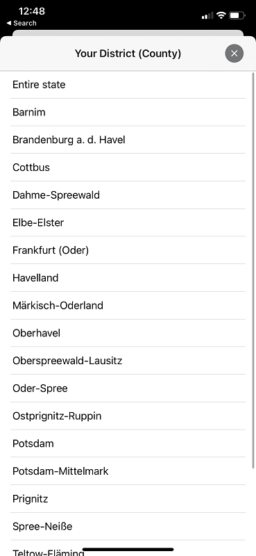
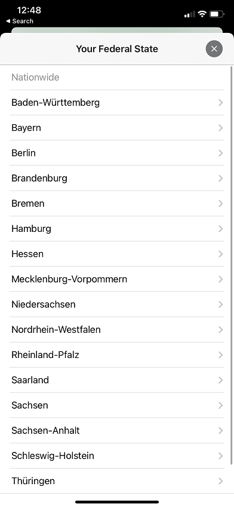
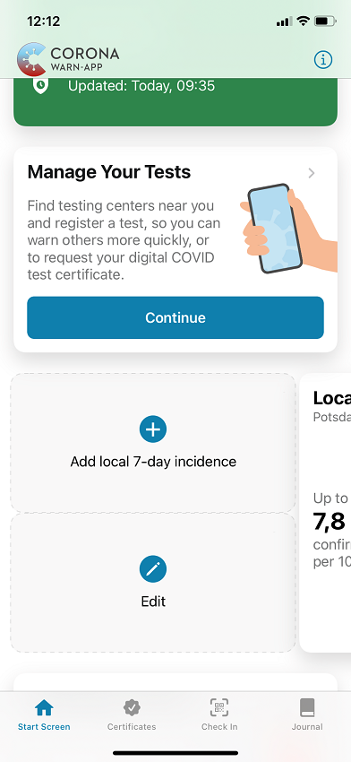
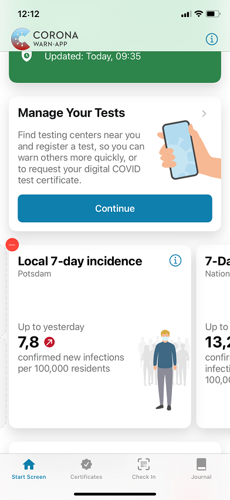
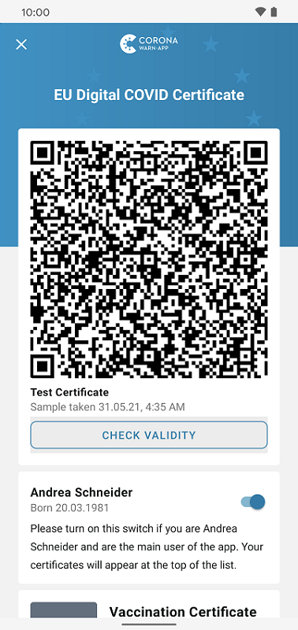
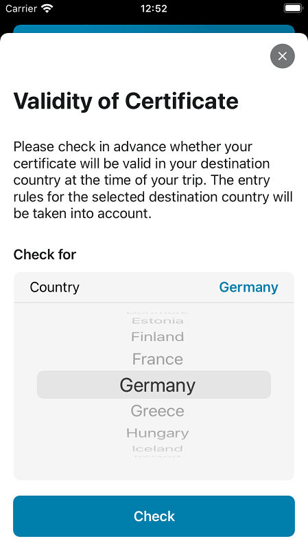
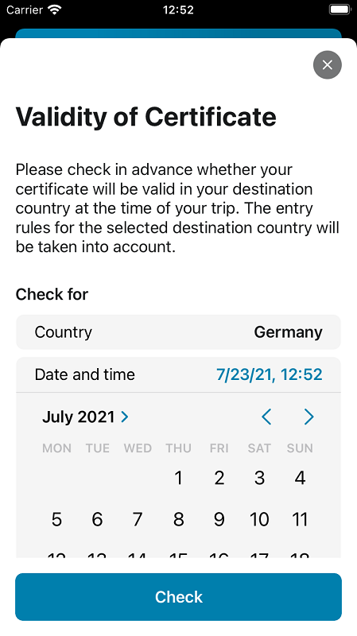
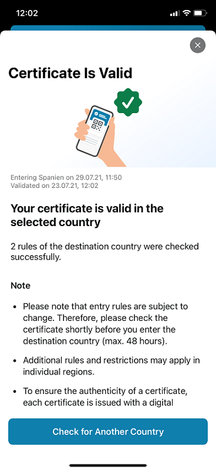

## Project team releases version 2.6 of the Corona-Warn-App

Deutsche Telekom and SAP’s project team have released version 2.6 of the Corona-Warn-App. Users can add **local 7-day incidences** and use the EU certificate check to find out if their certificates are valid before traveling. In addition users can edit a **rapid test profile that has already been created**.The new version will be available to users within the next 48 hours.

<!-- overview -->

Starting with version 2.6, users can add local 7-day incidences for up to **five counties or districts of their choice** in their app’s statistics section. There, they can swipe to the right to reveal the "Add local 7-day incidence" tile. Then they can select their state followed by a county, district, or city. 

  

    

  

To **remove a local incidence** from the overview, users can swipe to the right again, select "Edit" and delete the corresponding tile by tapping the red circle in the upper left corner.

  

   

  

**Important note**: The Corona-Warn-App displays local 7-day incidences based on the county/district selection only. It does not work with GPS location. The data is also only stored on the user's own smartphone.

## Is my certificate valid in the country I am traveling to?

Users can now check before traveling whether their certificates (certificate of recovery, test, and/or vaccination certificate) are valid in a selected country at the time of their trip. For this purpose, the Corona-Warn-App considers the **applicable entry rules of the selected destination country** and matches them with various parameters of the certificate, such as date and type of test, test center or date of a vaccination. 

Each European country that supports the EU's COVID digital certificate has the option to upload rules that the Corona-Warn-App can match for verification. At the launch of the new feature, **Germany, Spain, the Netherlands, Ireland, Luxembourg, Slovenia and Lithuania** have provided rules, with more countries to follow in the coming weeks. 

### Checking the validity - here's how:

As entry rules can change, users should check their certificate’s validity shortly before travel (we recommend **at maximum 48 hours before**). They can check all certificates both for themselves and for family members.

To start the check, they can go to the **"Certificates" tab** and select the certificate they want to check. After tapping on **"Check Validity"**, they can specify the country they are traveling to and the entry date and local time. 

  

    

  

When **entering the country by train or car**, users must specify the date on which they cross the border and the local time, taking into account any time difference (for example, if they cross the border from Germany into Portugal at 4 p.m. German time, they must specify 3 p.m., the local time in Portugal). When **entering the country by plane**, users must indicate the date and time of departure. 

To have a certificate checked for validity, users must be connected to the Internet, as this is the only way the Corona-Warn-App can always access the current rules of the countries.
 

**The EU certificate check can output four different results..** 

**Result 1: Certificate is valid and rules are available for the selected country**

  

  

  

**Result 2: Certificate is valid, but no rules are available for the selected country**

Since rules become valid at the earliest 48 hours after the country has uploaded them and not every European country is (yet) connected to the gateway, it’s possible that the certificate is valid but could not be matched with any rules. If, after checking, the app shows that there are **no entry rules available**, <u>users must go to [https://reopen.europa.eu](https://reopen.europa.eu/en) to find out about the rules</u>. On the website, they can select the country they are traveling to under "Choose a country." The rules indicated under the symbol with the suitcase are valid and are constantly updated, but are not yet available for the Corona-Warn-App in this case.

**Result 3: Certificate not verifiable**

It may happen that a country has defined various rules that cannot be checked for **technical reasons**. If this is the case, the Corona-Warn-App displays the rules that it could not check automatically, so that users can check manually at [https://reopen.europa.eu](https://reopen.europa.eu/en) whether their certificate complies with the rules in terms of content.   

**Result 4: Certificate is not valid**

A certificate may also be invalid for various reasons. One reason may be that **rules of the destination country have not been followed**, for example if a test certificate has expired or if it is older than 48 hours at the time of entry. However, the **rules of the country that has issued the certificate may also fail**. This could be the case, for example, due to errors that happened in the test center while issuing the certificate. Lastly, a certificate may also **fail the technical verification**, for example, if the certificate’s technical expiration date has passed at the selected travel time. 

## Other new features

From version 2.6 onwards, users can manage all important functions related to their tests via **"Manage Your Tests”** on their app’s home screen. In that section, they can now find a **test center in their vicinity** that is connected to the app’s infrastructure by tapping "Find Testing Center". They will be redirected to the rapid test center search on the CWA website. 

Additionally, users can now **edit their rapid test profile** in that section to change their specified data. You can find more information about the rapid test profile [here](/en/blog/2021-05-12-corona-warn-app-version-2-2/).

Version 2.6 - like previous versions - will be delivered in a staged rollout and is made available for users in waves. While users can manually trigger an update in Apple’s App Store, this option is not available in the Google Play Store. There, the delivery of the Corona-Warn-App’s new version can take up to 48 hours.
