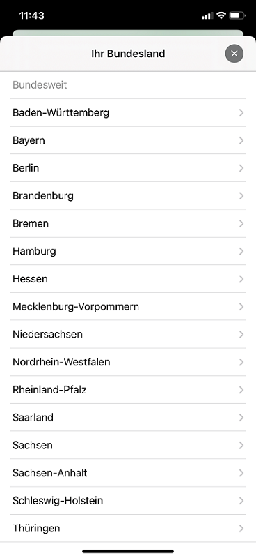
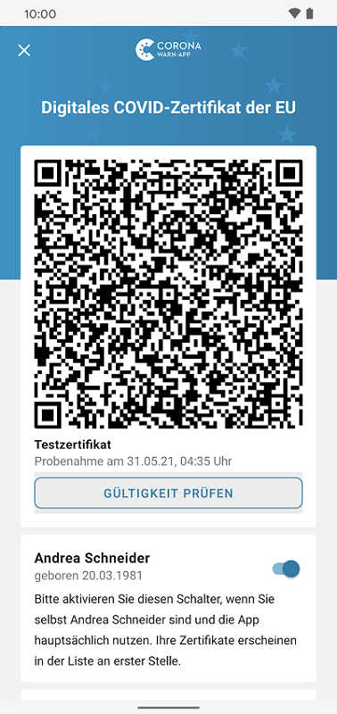

## Projektteam veröffentlicht Corona-Warn-App Version 2.6

Das Projektteam aus Deutscher Telekom und SAP hat Version 2.6 der Corona-Warn-App veröffentlicht. Darin können Nutzer\*innen **lokale 7-Tage-Inzidenzen** hinzufügen  und mit der **EU-Zertifikatsprüfung** vor einer Reise prüfen, ob ihre Zertifikate gültig sind. Außerdem ist es ab Version 2.6 möglich, ein bereits angelegtes **Schnelltest-Profil zu bearbeiten**. Die neue Version steht Nutzer\*innen innerhalb der nächsten 48 Stunden zur Verfügung.

<!-- overview -->

Ab Version 2.6 können Nutzer\*innen im Statistik-Bereich ihrer App **lokale 7-Tage-Inzidenzen für bis zu fünf Kreise oder Bezirke** ihrer Wahl hinzufügen. Dafür wischen sie im Statistik-Bereich nach rechts, sodass die Kachel „Lokale 7-Tage-Inzidenz hinzufügen“ erscheint. Dann können sie erst ihr Bundesland und anschließend einen Kreis, Bezirk oder eine Stadt auswählen. 

  

    

  

Um eine lokale Inzidenz **aus der Übersicht zu entfernen**, können sie wieder nach rechts wischen, „Bearbeiten“ auswählen und die entsprechende Kachel über den roten Kreis in der linken oberen Ecke löschen.  

  

   

  

**Wichtig:** Die Corona-Warn-App zeigt die lokalen 7-Tage-Inzidenzen ausschließlich auf Basis der eigenständigen Auswahl des Kreises/Bezirks oder der Stadt an. Sie arbeitet nicht über GPS-Ortung. Die Daten werden außerdem nur auf dem eigenen Smartphone des Nutzers/der Nutzerin gespeichert. 

## Ist mein Zertifikat in dem Land gültig, in das ich reise? 

Nutzer\*innen können nun vor einer Reise prüfen, ob ihre Zertifikate (Test-, Genesenen-, und/oder Impfzertifikat) in einem ausgewählten Land zum Zeitpunkt ihrer Reise gültig sind. Die Corona-Warn-App berücksichtigt dafür die **geltenden Einreiseregeln des ausgewählten Reiselandes** und gleicht sie mit verschiedenen Parametern des Zertifikats ab, wie Datum und Art des Tests, Testzentrum oder Datum einer Impfung. 

Jedes europäische Land, das digitale COVID-Zertifikate der EU unterstützt, hat die Möglichkeit, Regeln hochzuladen, die die Corona-Warn-App zur Überprüfung abgleichen kann. Zum Start der neuen Funktion haben **Deutschland, Spanien, die Niederlande, Irland, Luxemburg, Slowenien und Litauen** Regeln hinterlegt, weitere Länder folgen in den kommenden Wochen. 

### Zertifikat prüfen – so geht’s:

Da sich die Einreiseregeln ändern können, sollten Nutzer\*innen ihr Zertifikat erst kurz vor der Reise prüfen (**Empfehlung: maximal 48 Stunden vorher**). Sie können nacheinander alle Zertifikate sowohl für sich selber als auch für Familienmitglieder prüfen.

Um die Überprüfung zu starten, können sie in der Registerkarte ihrer Corona-Warn-App auf „Zertifikate“ gehen und dort das Zertifikat auswählen, das sie prüfen möchten. Nachdem sie auf **„Gültigkeit prüfen“** getippt haben, können sie das Land, in das sie reisen, das Einreisedatum und die lokale Uhrzeit angeben. 

  

    

  

Bei der **Einreise mit dem Zug oder Auto**, müssen Nutzer\*innen das Datum, an dem sie die Grenze überfahren und die lokale Uhrzeit unter Berücksichtigung einer möglichen Zeitverschiebung angeben (überfahren sie die Grenze nach Portugal beispielsweise um 16 Uhr deutscher Zeit, müssen sie 15 Uhr angeben, die lokale Uhrzeit in Portugal). Bei der **Einreise mit dem Flugzeug** müssen Nutzer\*innen das Datum und die Uhrzeit des Abflugs angeben. 

Um ein Zertifikat prüfen zu lassen, müssen Nutzer\*innen mit dem Internet verbunden sein, da die Corona-Warn-App nur dann immer auf die aktuellen Regeln der Länder zugreifen kann. Da die Länder dafür zuständig sind (siehe oben), diese Regeln zu hinterlegen, werden sie frühestens 48 Stunden nach dem Upload gültig. 

**Die EU-Zertifikatsprüfung kann vier verschiedenen Ergebnisse haben.** 

**Ergebnis 1: Zertifikat ist gültig und Regeln sind vorhanden für das ausgewählte Land**

  

  

  

**Ergebnis 2: Zertifikat ist gültig, aber es liegen keine Regeln für das ausgewählte Land vor**

  

  

  

Da die Regeln frühestens 48 Stunden, nachdem das Land sie hochgeladen hat, gültig werden und (noch) nicht jedes europäische Land technisch angebunden ist, kann es sein, dass das Zertifikat zwar gültig ist, aber nicht mit den Einreiseregeln abgeglichen werden konnte. Zeigt die App nach der Prüfung an, dass **keine Einreiseregeln vorhanden sind**, <u>müssen Nutzer\*innen sich unter [https://reopen.europa.eu/de](https://reopen.europa.eu/de) noch einmal über die Regeln informieren</u>. Auf der Webseite können sie unter „Wählen Sie ein Land“ ihr Reiseland auswählen. Die Regeln, die dort unter dem Symbol mit dem Koffer angegeben werden, sind gültig und werden ständig aktualisiert, sind jedoch in diesem Fall noch nicht für die Corona-Warn-App verfügbar.

**Ergebnis 3: Zertifikat nicht prüfbar**

  

  

  

Es kann vorkommen, dass ein Land verschiedene Regeln definiert hat, die aus **technischen Gründen** nicht überprüft werden können. Ist das der Fall, zeigt die Corona-Warn-App die Regeln, die sie nicht automatisch überprüfen konnte, an, sodass Nutzer\*innen manuell unter [https://reopen.europa.eu/de](https://reopen.europa.eu/de) prüfen können, ob ihr Zertifikat inhaltlich den Regeln entspricht.  

**Ergebnis 4: Zertifikat ist nicht gültig**

  

  

  

Ein Zertifikat kann aber auch aus verschiedenen Gründen ungültig sein. Zum Beispiel: Eine oder mehrere **Regeln des Ziellandes sind nicht eingehalten**. Das kann vorkommmen, wenn ein Testzertifikat abgelaufen oder es zum Einreisezeitpunkt älter als 48 Stunden ist. Es können aber auch die **Regeln des Ausstellerlandes fehlschlagen**. Das könnte der Fall sein, wenn Testzertifikate eines bestimmten Testzentrums ungültig sind, weil es Fehler beim Ausstellen gemacht hat. Zuletzt kann ein Zertifikat auf Basis der **technischen Prüfung** ungültig sein, beispielsweise wenn das technische Ablaufdatum zum gewählten Reisezeitpunkt überschritten ist. 

## Weitere neue Funktionen

Ab Version 2.6 können Nutzer\*innen über die Kachel **„Sie lassen sich testen?“** auf der Startseite ihrer App alle wichtigen Funktionen rund um ihre Tests verwalten. In der **Testverwaltung** haben sie ab dieser Version die Möglichkeit, eine **Teststelle in ihrer Nähe** zu finden, die an die Infrastruktur der Corona-Warn-App angebunden ist: Gehen die Nutzer\*innen auf „Testmöglichkeit finden“, werden sie zur Schnellteststellensuche auf der Website der Corona-Warn-App weitergeleitet. 

Außerdem können sie in der Testverwaltung nun auch ein bereits angelegtes **Schnelltest-Profil bearbeiten**, um ihre angegebenen Daten zu ändern. Mehr Informationen zum Schnelltest-Profil finden Sie [hier](/de/blog/2021-05-12-corona-warn-app-version-2-2/).

Version 2.6 wird, wie vorherige Versionen auch, schrittweise über 48 Stunden an alle Nutzer*innen ausgerollt. iOS-Nutzer\*innen können sich die aktuelle App-Version ab sofort aus dem Store von Apple manuell herunterladen. Der Google Play Store bietet keine Möglichkeit, ein manuelles Update anzustoßen. Hier steht Nutzer\*innen die neue Version der Corona-Warn-App innerhalb der nächsten 48 Stunden zur Verfügung.
