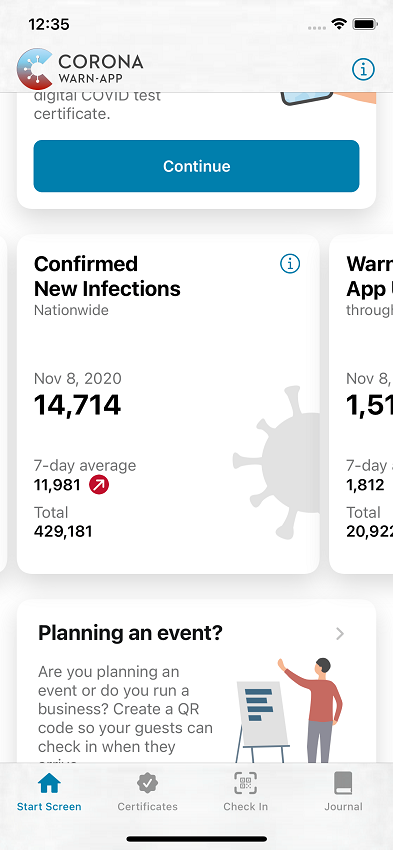

Using the statistic tiles, you are now able to get a quick overview of the confirmed new infections, the warnings by app users, the 7-Day Incidence and the 7-Day R Value. In this blog post, these numbers are explained in more detail.

<!-- overview -->

1. ["Confirmed New Infections"](#tile-confirmed-new-infections)
1. ["Warnings by App Users"](#tile-warnings-by-app-users)
1. ["7-Day Incidence"](#tile-7-day-incidence)
1. ["7-Day R Value"](#tile-7-day-r-value)

## Tile "Confirmed New Infections"

<figure>
    
</figure>

**Confirmed New Infections**

This number reflects the new infections across Germany reported to the Robert Koch Institute (RKI) on the given day.

This tile presents three metrics:

**1. Yesterday** (or **date**)

'Yesterday' means the value includes all reported data from the previous day until 11:59 p.m. (The numbers of the current day cannot be displayed, as they are not yet completely known.) As long as the data could not be updated, the date shows the day to which the metrics refer.

After adjustment and corrections from the health offices, this figure is equal to the difference from the new infections known to the RKI from the day before yesterday. The displayed numbers are identical to those published by RKI. [1]

**2. 7-Day Average**

Here, the app displays the rolling arithmetic mean (average) of the values calculated from the exposed values of the last 7 days, including the value displayed today.

The <i>**trend indicator**</i> shows with an arrow whether the 7-Day Average of the current day has changed by **5**% or more compared to the displayed value <u>a week ago</u> - upwards (red) or downwards (green) respectively, or a change smaller than 5% with "steady" (grey). By comparing with the value of a week ago, daily slight fluctuations are compensated.

**3. Total**

This number indicates the total number of confirmed infections registered with the Robert Koch Institute from early 2020 to date.

**Comments:**

- The figures are based on new infections issued to the Robert Koch Institute by midnight. Reports received later are not taken into account until the next day's accounting run.

- The number of new infections is based on the <u>reporting date to the Robert Koch Institute</u>, i.e. the date on which the Robert Koch Institute becomes aware of the infection. Since the local health offices report their numbers to the Robert Koch Institute according to different schedules, transmission delays may occur.

- This metric as a nationwide sum for Germany is an absolute value. It is neither related to the local distribution of the population nor to the number of residents of a region.

- The "7-Day Average" is a linear average value. In opposition to that value, the "7-Day Incidence" cannot be considered a linear average of local incidences because the incidence is locally. [2] These two metrics are based on different baseline data, collected in different ways. Thus, both metrics cannot be derived directly from each other and, in rare cases, the two trend indicators may differ on a given day. [3]

**References:**

[[1] RKI - Case Numbers](https://www.rki.de/DE/Content/InfAZ/N/Neuartiges_Coronavirus/Fallzahlen.html)

[[2] RKI - COVID-19-Dashboard](https://experience.arcgis.com/experience/478220a4c454480e823b17327b2bf1d4/page/page_1/) 

[[3] Explanation Tile "7-Day Incidence“](#tile-7-day-incidence)

## Tile "Warnings by App Users"

<figure>
    
</figure>

**Warnings by App Users**

This metric describes the number of App users across Germany (or anywhere else) who have shared their positive test score through the Corona-Warn-App to warn other users about a potential infection, either directly in the app after they received the positive test result or with a teleTAN issued by the verification hotline.

This tile presents three metrics:

**1. Yesterday** (or **date**)

'Yesterday' means that the value includes all sharing app users from the previous day until 11:59 p.m. since the entire numbers for the current day are not yet known. As long as the data could not be updated, the number refers to the day described by the date.

**2. 7-Day Average**

Here, the app represents the rolling arithmetic mean (average) of the values calculated from the exposed values of the last 7 days, including the value displayed today.

To compensate for daily slight fluctuations, the <i>**trend indicator**</i> with an arrow shows whether the 7-Day Average changed by 5% or more from the displayed value <u>a week ago</u> - upward or downward respectively, or a change smaller than 5% with "steady"

Since no positive or negative judgment can be deduced solely from the change in the number of warnings, the arrow will always be greyed and will only show the direction of the change.

**3. Total**

This number indicates how many positive test scores have been shared by users so far, since the CWA was launched in June 2020.

**Comments:**

- The number of new infections as a nationwide sum across Germany is an absolute value, determined at the end of a day in the Corona-Warn-App backend infrastructure.

## Tile "7-Day Incidence"

<figure>
    
</figure>

**7-Day Incidence**

This is the sum of the new infections of the last 7 days adjusted (in proportion) to 100,000 citizens over the whole of Germany.

**Up to yesterday** (or **date**)

'Up to yesterday' means the value includes all notified data from the previous day until 11:59 p.m. As long as the data could not be updated, the number refers to the day described by the date. The displayed number is identical to the one published by RKI. [1]

The <i>**trend indicator**</i> shows with an arrow whether the 7-Day Incidence of the current day has changed by **1%** or more compared to the indicated value <u>of the previous day</u> - upward (red) or downward (green) respectively, or a change smaller than 1% with "steady" (grey).

**Comments:**

- The 7-Day Incidence is based on the <u>notification date</u>. This is the date on which an infection was first recorded at the local health office. Only those cases known to the RKI with a notification date in the last 7 days are counted. Since the local health offices report their figures to the Robert Koch Institute according to different schedules, reporting delays may occur. Those late incoming reports regularly lead to an underestimation of the incidence with this approach. [3]

- In the Corona-Warn-App the nationwide 7-Day Incidence is shown with reference to the total German population.

- Unlike the 7-Day Average of New Infections, the 7-Day Incidence value <u>**is not**</u> a linear average, but locally weighted (the nationwide incidence <u>**is not**</u> the linear average of all regional incidences).[2], [4] Both metrics are based on different underlying data, collected in different ways. Thus, both metrics cannot be derived directly from each other and their trend indicators may differ from each other in rare cases for a short time period.

- The local incidence value depends on the distribution of the population. Different regions have dissimilar population.[2] Therefore, for easier comparison and for discussion of appropriate measures, the count of new infections gets "normalized" to 100,000 inhabitants. [2], [3]

**References:**

[[1] RKI - Case Numbers](https://www.rki.de/DE/Content/InfAZ/N/Neuartiges_Coronavirus/Fallzahlen.html)

[[2] RKI - COVID-19-Dashboard](https://experience.arcgis.com/experience/478220a4c454480e823b17327b2bf1d4/page/page_1/) 

[[3] Spiegelarticle "Corona Zahlen"](https://www.spiegel.de/wissenschaft/medizin/corona-zahlen-welche-landkreise-ueber-dem-grenzwert-der-sieben-tage-inzidenz-liegen-a-e48c758d-d52a-4389-b881-f3ed78a4dab9)

[[4] Explanation Tile "Confirmed New Cases](#tile-confirmed-new-infections)

## Tile "7-Day R Value"

<figure>
    
</figure>

**7-Day R Value**

This measure describes the time-varying reproduction number in the current pandemic situation, i.e. how many more people an infected person has infected on average.

The calculated value represents an estimate based on observed infection data in the past and various parameters (including delays between diagnosis, notification, and reporting of infections) leveraging a mathematical model. [2], [3]

The <i>**trend indicator**</i> shows with an arrow whether the 7-Day R Value of the current day has changed by **1%** or more compared to the shown value <u>of the previous day</u> - upward (red) or downward (green) respectively, or a change smaller than 1% with "steady" (grey).

**Comments:**

- The R value is a measure of the pathogen's transferability and of the dynamics of the outbreak .

- Usually, in the course of a pandemic, the R Value will initially rise to levels well-above 1. The main **objective** is to stabilize a downward trend by means of appropriate measures and by adaption of personal behavior, i.e. to bring the **R Value permanently below 1**.

- The real-time calculation is made more difficult by the delays between infection, diagnosis and notification to the local health authorities. [4] In addition, the health offices report their data at different times to the Robert Koch Institute. [5]

- For the most accurate estimate of the distribution of these delays, the historical case numbers and epidemiological experience are processed in a mathematical model (called "nowcasting"). [1] To compensate the daily reporting volatility and to have a sufficient number of reported cases for accurate calculation, the method uses a 7-day window and sets it in relation to a previous 7-day window with a 4-day offset (average COVID-19 generation time).

- The currently displayed 7-Day R Value continuously changes according to the current infection situation. [6] New figures are incorporated into the calculation as well as new insights, reports, and subsequently gained knowledge. Only after a considerable time period the prediction corridor becomes sufficiently narrow; and the reproduction number attains a fix value. [7]

**References:**

[[1] RKI - article "Schätzung der aktuellen Entwicklung der SARS-CoV-2-Epidemie in Deutschland - Nowcasting"](https://edoc.rki.de/handle/176904/6650.4)

[[2] Emergent Alliance: "Calculation of the effective reproduction number - Germany"](https://emergentalliance.org/calculation-of-the-effective-reproduction-number-germany/)

[[3] RKI - Explanation of the R value (German language only)](https://www.rki.de/DE/Content/InfAZ/N/Neuartiges_Coronavirus/Projekte_RKI/R-Wert-Erlaeuterung.html)

[[4] J.F. Lawless "Adjustments for reporting delays and the prediction of occurred but not reported events" (1994)](https://onlinelibrary.wiley.com/doi/abs/10.2307/3315826.n1)

[[5] Verril/Wütherich "Understanding Reporting Delay"](https://people.math.ethz.ch/~wueth/Papers/2016_reporting_delay.pdf)

[[6] RKI - latest Nowcasting numbers](https://www.rki.de/DE/Content/InfAZ/N/Neuartiges_Coronavirus/Projekte_RKI/Nowcasting_Zahlen.xlsx?__blob=publicationFile)

[[7] Nowcasting by Bayesian Smoothing: A flexible, generalizable model for real-time epidemic tracking](https://journals.plos.org/ploscompbiol/article?id=10.1371/journal.pcbi.1007735)
