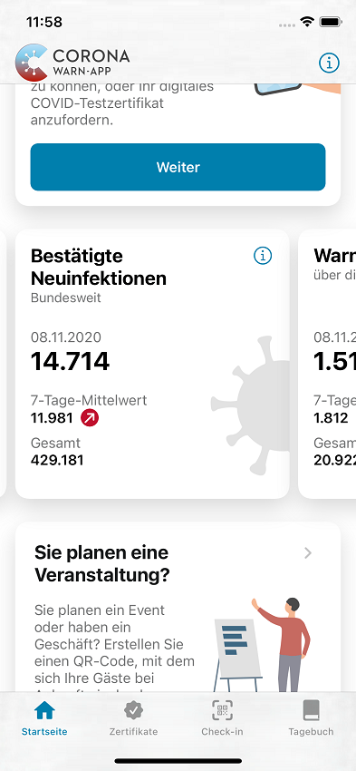

Mithilfe der Statistikkacheln haben Sie innerhalb der App unter anderem eine Übersicht über die bestätigten Neuinfektionen, warnende Personen, die 7-Tage-Inzidenz und den 7-Tage-R-Wert. In diesem Blog-Beitrag werden diese Zahlen etwas näher erläutert.

<!-- overview -->

1. ["Bestätigte Neuinfektionen"](#kachel-bestätigte-neuinfektionen)
1. ["Warnende Personen"](#kachel-warnende-personen)
1. ["7-Tage-Inzidenz"](#kachel-7-tage-inzidenz)
1. ["7-Tage-R-Wert"](#kachel-7-tage-r-wert)

## Kachel "Bestätigte Neuinfektionen"

<figure>
    
</figure>

**Bestätigte Neuinfektionen**

Dies ist die Anzahl der Neuinfektionen über ganz Deutschland, die dem Robert Koch-Institut (RKI) am angegebenen Tag bekannt gegeben wurden.

Auf dieser Kachel finden Sie 3 Kennzahlen:

**1. Gestern** (oder **Datum**)

'Gestern' bedeutet, dass in dem Wert alle Übermittlungen vom Vortag bis 23:59 Uhr berücksichtigt wurden. (Da die vollständigen Zahlen des aktuellen Tages noch nicht bekannt sind, kann der Wert von heute auch noch nicht angezeigt werden.) Konnten die Daten noch nicht zeitnah aktualisiert werden, zeigt das Datum den Tag an, auf den sich die Kennzahlen beziehen.

Nach Bereinigung und Korrekturen durch die Gesundheitsämter spiegelt diese Zahl die Differenz zu den dem RKI am vorhergehenden Tag bekannten SARS-CoV-2-Infektionen wider. Die angezeigten Zahlen sind identisch mit den vom RKI veröffentlichen Zahlen. [1]

**2. 7-Tage-Mittelwert**

Hier stellt die App das gleitende arithmetische Mittel (Durchschnitt) der Werte dar, das sich aus den angezeigten Werten der letzten 7 Tage, inkl. des heute angezeigten Wertes, berechnet.

Als <i>**Trendindikator**</i> zeigt ein Pfeil an, ob sich der 7-Tage-Mittelwert des aktuellen Tages gegenüber dem <u>vor einer Woche</u> angezeigten Wert um **5%** oder mehr verändert hat - jeweils nach oben (rot) oder nach unten (grün), bei einer Veränderung kleiner als 5% waagerecht (grau). Durch den Vergleich mit der Vorwoche (statt mit dem Vortag) fallen tägliche leichte Schwankungen nicht ins Gewicht.

**3. Gesamt**

Diese Zahl gibt an, wie viele bestätigte Infektionen dem RKI insgesamt, d.&nbsp;h. seit Beginn der Pandemie Anfang 2020, bekannt geworden sind

**Kommentare:**

- Die Zahlen basieren auf den jeweils bis Mitternacht an das Robert Koch-Institut (RKI) übermittelten Neuinfektionen. Später eintreffende Nachübermittlungen werden erst im Rechnungslauf am nächsten Tag berücksichtigt.

- Für die Anzahl der Neuinfektionen wird das <u>Datum der Bekanntgabe an das RKI</u> zugrunde gelegt, d.&nbsp;h. das Datum, an dem das Robert Koch-Institut von der Infektion erfährt. Da die Gesundheitsämter ihre Zahlen nach unterschiedlichen Zeitplänen an das RKI übermitteln, entstehen ggf. Verzögerungen.

- Diese Kennzahl als Summe über ganz Deutschland ist ein absoluter Wert. Sie ist unabhängig von der Einwohnerzahl einer bestimmten Region.

- Der 7-Tage-Mittelwert ist ein linearer Durchschnittswert. Dagegen ist die 7-Tage-Inzidenz kein linearer Durchschnittswert, sondern lokal gewichtet. [2] Diesen beiden Metriken liegen unterschiedliche Definitionen und Basisdaten zugrunde, die auf verschiedene Weise erhoben wurden. Daher können beide Kennzahlen nicht direkt voneinander abgeleitet werden und deren Trendindikatoren in seltenen Fällen für kurze Zeit voneinander abweichen. [3]

**Referenzen:**

[[1] RKI - Aktuelle Fallzahlen](https://www.rki.de/DE/Content/InfAZ/N/Neuartiges_Coronavirus/Fallzahlen.html)

[[2] RKI - COVID-19-Dashboard](https://experience.arcgis.com/experience/478220a4c454480e823b17327b2bf1d4/page/page_1/) 

[[3] Erläuterung zur Kachel „7-Tage-Inzidenz“](#kachel-7-tage-inzidenz)

## Kachel "Warnende Personen"

<figure>
    
</figure>

**Warnende Personen**

Dieser Wert beschreibt die Anzahl der Personen in ganz Deutschland (oder auch außerhalb), die über die Corona-Warn-App ihr positives Testergebnis eines PCR-Tests geteilt haben, um damit andere Anwender bzgl. einer potentiellen Infektion zu warnen, entweder direkt nach Anzeige des positiven Testergebnisses in der App oder mit einer sogenannten teleTAN, die von der dafür eingerichteten Verification-Hotline ausgegeben wurde.

Auf dieser Kachel finden Sie 3 Kennzahlen:

**1. Gestern** (oder **Datum**)

'Gestern' bedeutet, dass in dem Wert alle Meldungen vom Vortag bis 23:59 Uhr berücksichtigt wurden. Konnten die Daten noch nicht zeitnah aktualisiert werden, zeigt das Datum den Tag an, auf den sich die Kennzahlen beziehen.

**2. 7-Tage-Mittelwert**

Hier stellt die App das gleitende arithmetische Mittel (Durchschnitt) der Werte dar, das sich aus den angezeigten Werten der letzten 7 Tage, inkl. des heute angezeigten Wertes, berechnet.

Um tägliche leichte Schwankungen auszugleichen, zeigt der <i>**Trendindikator**</i> mit einem Pfeil, ob sich der 7-Tage-Mittelwert gegenüber dem <u>vor einer Woche</u> angezeigten Wert um 5% oder mehr verändert hat - jeweils nach oben oder nach unten, bei einer Veränderung kleiner als 5% waagerecht.

Da allein aus der Veränderung der Anzahl der Warnungen nicht eindeutig eine positive oder negative Bewertung abgeleitet werden kann, wird der Pfeil immer grau gefärbt und zeigt nur die Richtung der Änderung an.

**3. Gesamt**

Diese Zahl gibt an, wie viele positive PCR-Testergebnisse bisher insgesamt, d.&nbsp;h. seit dem Start der CWA im Juni 2020, von den Anwendern geteilt wurden.

**Kommentare:**

- Die Anzahl der warnenden Personen als Summe über ganz Deutschland ist ein absoluter Wert, der am Ende eines Tages in der CWA-Infrastruktur ermittelt wird.

## Kachel "7-Tage-Inzidenz"

<figure>
    
</figure>

**7-Tage-Inzidenz**

Dies ist die Summe der Neuinfektionen der letzten 7 Tage normiert auf 100.000 Einwohner über ganz Deutschland.

**Bis gestern** (oder Datum)

‘Bis gestern‘ bedeutet, dass in dem Wert alle dem Robert Koch-Institut (RKI) bis 23:59 Uhr des Vortags übermittelten Neuinfektionen berücksichtigt wurden. Falls die Daten noch nicht zeitnah aktualisiert werden konnten, zeigt das Datum den Tag an, auf den sich die Kennzahlen beziehen. 
Diese Zahl ist identisch mit der von RKI veröffentlichen Zahl.[1]

Der <i>**Trendindikator**</i> zeigt mit einem Pfeil an, ob sich die 7-Tage-Inzidenz gegenüber dem angezeigten Wert <u>vom</u> Vortag um **1**% oder mehr verändert hat - jeweils nach oben (rot) oder nach unten (grün), bei einer Veränderung kleiner als 1% waagerecht (grau).

**Kommentare:**

- Für die 7-Tage-Inzidenz wird das <u>Meldedatum</u> zugrunde gelegt. Das ist das Datum, an dem ein Fall neu im lokal zuständigen Gesundheitsamt erfasst wurde. Es werden nur die dem RKI bekannten Fälle mit einem Meldedatum in den letzten 7 Tagen gezählt. Da die Gesundheitsämter ihre Zahlen nach unterschiedlichen Zeitplänen an das RKI übermitteln, entstehen ggf. Verzögerungen. Diese Verzögerungen durch die Gesundheitsämter führen daher systematisch zu einer Unterbewertung der Inzidenz. [3]

- In der Corona-Warn-App wird die bundesweite 7-Tage-Inzidenz mit Bezug zur Gesamtbevölkerung dargestellt.

- Die 7-Tage-Inzidenz ist im Gegensatz zum 7-Tage-Mittelwert der Neuinfektionen <u>kein</u> linearer Durchschnittswert, sondern lokal gewichtet (die bundesweite Inzidenz ist <u>nicht</u> der lineare Durchschnitt aller regionalen Inzidenzen). [2], [4] Diesen beiden Metriken liegen unterschiedliche Basisdaten zugrunde, die auf verschiedene Weise erhoben wurden. Daher können beide Kennzahlen nicht direkt voneinander abgeleitet werden und deren Trendindikatoren in seltenen Fällen für kurze Zeit voneinander abweichen.

- Der lokale Inzidenz-Wert ist abhängig von der Verteilung der Bevölkerung. Unterschiedliche Regionen haben unterschiedliche Bevölkerungszahlen. Daher wird die Inzidenz zum Vergleich und für die Diskussion erforderlicher Maßnahmen auf 100.000 Einwohner normiert. [2], [3]

**Referenzen:**

[[1] RKI - Fallzahlen](https://www.rki.de/DE/Content/InfAZ/N/Neuartiges_Coronavirus/Fallzahlen.html)

[[2] RKI - COVID-19-Dashboard](https://experience.arcgis.com/experience/478220a4c454480e823b17327b2bf1d4/page/page_1/)

[[3] Spiegel-Artikel "Corona Zahlen"](https://www.spiegel.de/wissenschaft/medizin/corona-zahlen-welche-landkreise-ueber-dem-grenzwert-der-sieben-tage-inzidenz-liegen-a-e48c758d-d52a-4389-b881-f3ed78a4dab9)

[[4] Link zur Erklärung der Kachel „Bestätigte Neuinfektionen“](#kachel-bestätigte-neuinfektionen)

## Kachel "7-Tage-R-Wert"

<figure>
    
</figure>

**7-Tage-R-Wert**

Diese Kennzahl beschreibt die zeitlich variierende Reproduktionszahl im aktuellen Pandemie-Geschehen, d.&nbsp;h. wie viele weitere Menschen eine infizierte Person durchschnittlich infiziert hat.

Der berechnete Wert stellt mit einem mathematischen Modell eine Schätzung dar, die auf den beobachteten Infektionsdaten in der Vergangenheit und verschiedenen Parametern (inkl. Verzögerungen zwischen Diagnose, Meldung und Übermittlung der Infektionen) basiert. [2], [3]

Der <i>**Trendindikator**</i> zeigt mit einem Pfeil an, ob sich der 7-Tage-R-Wert gegenüber dem angezeigten Wert <u>vom Vortag</u> um **1%** oder mehr verändert hat - jeweils nach oben (rot) oder nach unten (green), bei einer Veränderung kleiner als 1% waagerecht (grau).

**Kommentare:**

- Der R-Wert ist ein Maß für die Übertragbarkeit des Erregers und für die Dynamik des Ausbruchgeschehens.

- Im Verlauf einer Pandemie wird der R-Wert zunächst auf Werte über 1 ansteigen. **Ziel** ist es, durch geeignete Maßnahmen und Anpassung des persönlichen Verhaltens einen sinkenden Trend zu stabilisieren, d.&nbsp;h. **den R-Wert dauerhaft unter den Wert 1** zu bringen.

- Die Berechnung des Echtzeit-Wertes wird durch zeitlichen Verzug zwischen der Infektion, der Diagnose und der Meldung an die Gesundheitsbehörden erschwert. [4] Dazu kommen die unterschiedlichen Zeitpunkte der Datenübermittlung durch die Gesundheitsämter an das Robert Koch-Institut. [5]

- Für eine möglichst genaue Abschätzung der Verteilung dieser zeitlichen Verzüge werden die Fallzahlen aus der Vergangenheit und die epidemiologischen Erfahrungen in einem mathematischen Modell ("Nowcasting") verarbeitet. [1] Um tägliche Meldeschwankungen im Wochenverlauf auszugleichen und um eine hinreichende Anzahl von übermittelten Fällen für eine genaue Berechnung zu haben, nutzt das Verfahren ein 7-Tage-Fenster und setzt die Schätzzahl dieses Zeitraums ins Verhältnis zu der eines um 4 Tage (durchschnittliche COVID-19-Generationszeit) versetzten früheren 7-Tage-Fensters.

- Der R-Wert verändert sich entsprechend dem aktuellen Infektionsgeschehen. [6] In die Berechnung für den aktuell angezeigten 7-Tage-R-Wert gehen dabei neue Zahlen ein als auch nachträglich gewonnene Erkenntnisse und Meldungen. Erst nach einem längeren Zeitraum ist der Prädiktionskorridor ausreichend eng und die Reproduktionszahl nimmt einen festen Wert an. [7]

**Referenzen:**

[[1] RKI - Artikel "Schätzung der aktuellen Entwicklung der SARS-CoV-2-Epidemie in Deutschland - Nowcasting"](https://edoc.rki.de/handle/176904/6650.4)

[[2] Emergent Alliance: "Calculation of the effective reproduction number - Germany"](https://emergentalliance.org/calculation-of-the-effective-reproduction-number-germany/)

[[3] RKI - Erläuterung zum R-Wert](https://www.rki.de/DE/Content/InfAZ/N/Neuartiges_Coronavirus/Projekte_RKI/R-Wert-Erlaeuterung.html)

[[4] J.F. Lawless "Adjustments for reporting delays and the prediction of occurred but not reported events" (1994)](https://onlinelibrary.wiley.com/doi/abs/10.2307/3315826.n1)

[[5] Verril/Wütherich "Understanding Reporting Delay"](https://people.math.ethz.ch/~wueth/Papers/2016_reporting_delay.pdf)

[[6] RKI - aktuelle Nowcasting Zahlen](https://www.rki.de/DE/Content/InfAZ/N/Neuartiges_Coronavirus/Projekte_RKI/Nowcasting_Zahlen.xlsx?__blob=publicationFile)

[[7] Nowcasting by Bayesian Smoothing: A flexible, generalizable model for real-time epidemic tracking](https://journals.plos.org/ploscompbiol/article?id=10.1371/journal.pcbi.1007735)
