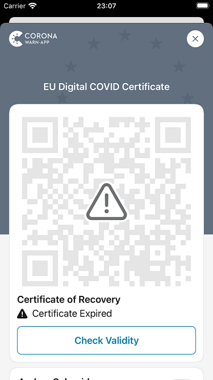
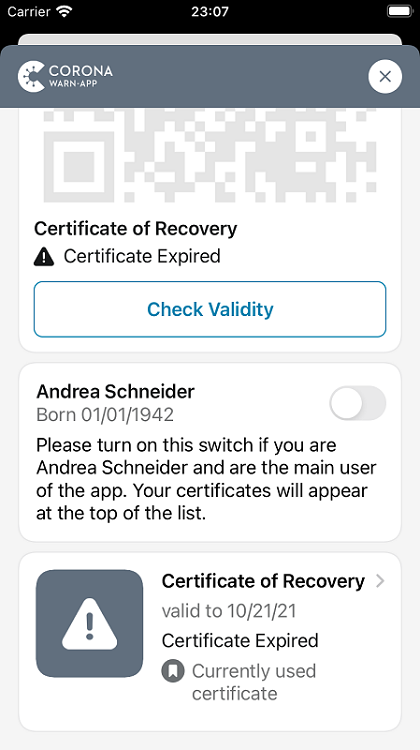
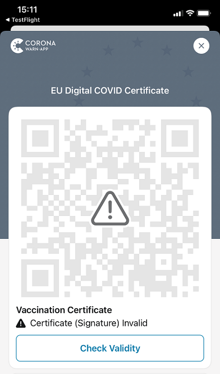

Deutsche Telekom and SAP’s project team have released Corona-Warn-App version 2.7. The app now **checks the certificates’ signatures for authenticity**. It also displays the certificates’ **technical expiration dates** and notifies users before their expiration. 

The new version will become available to users over the next 48 hours. 

<!-- overview -->

As of version 2.7, users can see the technical expiration date of their vaccination and test certificates as well as their certificate of recovery in the overview of their digital COVID certificates. 

Technically expired certificates can no longer be used as valid proof for trips within the EU. However, it does not mean that users no longer have sufficient vaccination protection. All they need is a **new <u>digital</u> proof** of their vaccination or recovery.   
 
  

  

  

The Corona-Warn-App **notifies users** 28 days before the technical expiration date, both under the certificate in the app and with a push message. Once the certificate has expired, it notifies the user again. There is no notification for expired test certificates since users can only use them as valid proof for a few days anyway.

In addition, the Corona-Warn-App now checks the signature of certificates for authenticity. This means that only certificates that were issued by an authorized body can be imported into the Corona-Warn-App. Users don’t have to do anything. The app **checks the signatures automatically**, both for certificates that are imported into the Corona-Warn-App for the first time as of version 2.7 and for certificates that already exist in the app.   

  

 

  

Version 2.7 - like previous versions - will be delivered in a staged rollout and is made available for users in waves. While users can manually trigger an update in Apple’s App Store, this option is not available in the Google Play Store. There, the delivery of the Corona-Warn-App’s new version can take up to 48 hours.
