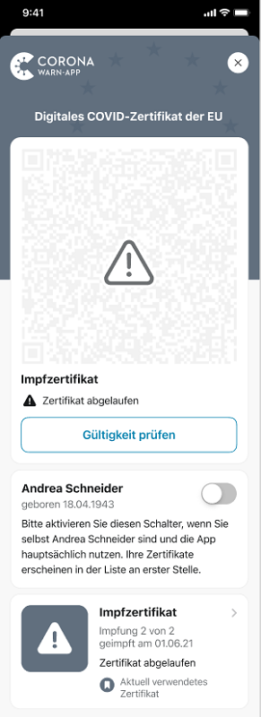
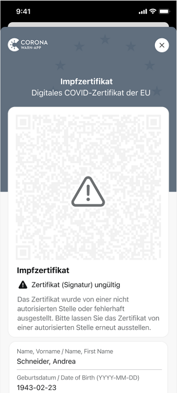

Das Projektteam aus Deutscher Telekom und SAP hat Version 2.7 der Corona-Warn-App veröffentlicht. Mit der neuen Version **prüft die App nun die Signatur von Impf-, Genesenen- und Testzertifikaten auf Echtheit**. Außerdem zeigt sie das **technische Ablaufdatum** der Zertifikate an und benachrichtigt Nutzer\*innen vor dem Ablauf von Impf- und Genesenenzertifikaten. 

Die neue Version steht Nutzer\*innen innerhalb der nächsten 48 Stunden zur Verfügung.

<!-- overview -->

Ab Version 2.7 können Nutzer\*innen in der Übersicht ihrer digitalen COVID-Zertifikate das technische Ablaufdatum ihrer Impf-, Test- und Genesenenzertifikate sehen. 

Ein technisch abgelaufenes Zertifikat können Nutzer\*innen nicht mehr als gültigen Nachweis für Reisen innerhalb der EU benutzen. Es bedeutet aber nicht zwangsläufig, dass sie keinen ausreichenden Impfschutz mehr haben. Sie brauchen dann lediglich einen **neuen <u>digitalen</u> Nachweis** über ihre Impfung beziehungsweise Genesung.  
 
  

  

  

Die Corona-Warn-App weist Nutzer\*innen 28 Tage vor dem technischen Ablauf sowohl unter dem Zertifikat in der App als auch mit einer **Push-Nachricht** darauf hin. Sobald das Zertifikat abgelaufen ist, benachrichtigt sie den oder die Nutzer\*in noch einmal. Bei abgelaufenen Testzertifikaten gibt es keine Benachrichtigung, da Nutzer\*innen sie je nach Testart ohnehin nur ein paar Tage als Nachweis nutzen können. 

Des Weiteren prüft die Corona-Warn-App nun die **Signatur von Zertifikaten auf Echtheit**. Damit können nur Zertifikate in die Corona-Warn-App importiert werden, die von einer autorisierten Stelle ausgestellt wurden. Nutzer\*innen müssen dafür nichts weiter tun. Die **Überprüfung erfolgt automatisch** sowohl für Zertifikate, die ab Version 2.7 zum ersten Mal in die Corona-Warn-App importiert werden als auch für Zertifikate, die schon in der App vorhanden sind.  

  

  

  

Version 2.7 wird, wie vorherige Versionen auch, schrittweise über 48 Stunden an alle Nutzer\*innen ausgerollt. iOS-Nutzer\*innen können sich die aktuelle App-Version ab sofort aus dem Store von Apple manuell herunterladen. Der Google Play Store bietet keine Möglichkeit, ein manuelles Update anzustoßen. Hier steht Nutzer*innen die neue Version der Corona-Warn-App innerhalb der nächsten 48 Stunden zur Verfügung.
