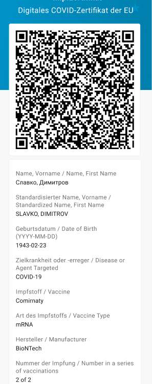
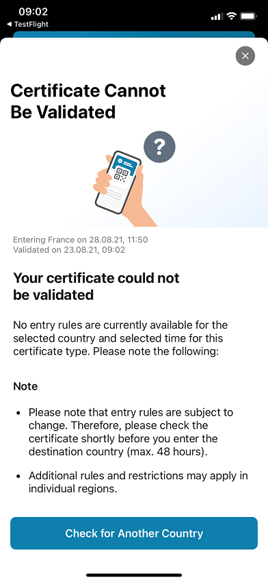
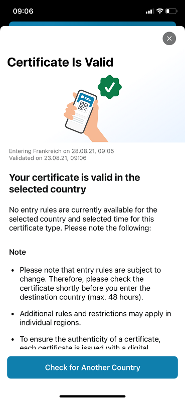

Deutsche Telekom and SAP’s project team have **published version 2.8 of the Corona-Warn-App**. The new update brings minor improvements and adjustments for users. Each certificate now displays the user’s name in standardized Latin characters. The project team has also adapted the EU certificate check.

The update will be available to users over the next 48 hours.

<!-- overview -->

Certificates now display names in standardized Latin characters in addition to the country-specific spelling so that everybody can read them. 

  

 

  

In addition, the project team has adapted the **EU certificate check**. If a country has not provided any entry rules that the Corona-Warn-App can use for checking, the certificate check will state that the **certificate cannot be validated**. The countries that are listed under the certificate check in the Corona-Warn-App generally recognize the certificates. However, depending on the country and the applicable rules, the relevant certificate (on its own) may not authorize entry.

Previously, the app indicated in this case that the certificate is valid in the selected country. In the text below, however, it was pointed out that there are currently no entry rules available for the selected country. With version 2.8, users can clearly see that the certificate's validity could not be checked because the relevant country has not defined any entry rules. 

Since [version 2.6](/en/blog/2021-07-28-cwa-version-2-6/) of the Corona-Warn-App, users can check whether their certificates are valid in their destination country before travelling.  

  

 

  

 Currently 

  

 

  

 Before 

  

Generally, every European country that supports EU digital COVID certificates has the option to store rules on the corresponding EU server that the Corona-Warn-App can compare for verification.

Version 2.8 - like previous versions - will be delivered in a staged rollout and is made available for users in waves. While users can manually trigger an update in Apple’s App Store, this option is not available in the Google Play Store. There, the delivery of the Corona-Warn-App’s new version can take up to 48 hours.
