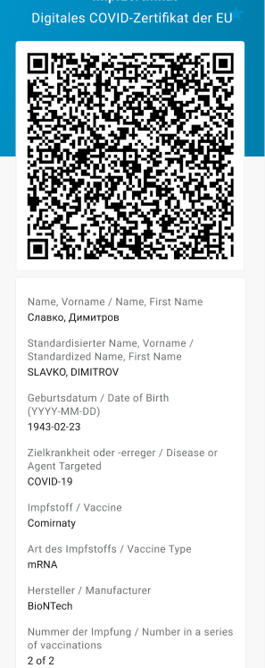

Das Projektteam aus Deutscher Telekom und SAP hat **Version 2.8 der Corona-Warn-App veröffentlicht**. Das Update bringt kleinere Verbesserungen und Anpassungen für Nutzer\*innen. Namen in Zertifikaten werden nun auch in standardisierter Schreibweise angezeigt. Außerdem hat das Projektteam die EU-Zertifikatsprüfung angepasst. 

Das Update steht Nutzer\*innen über die nächsten 48 Stunden zur Verfügung.

<!-- overview -->

Mit Version 2.8 der Corona-Warn-App werden Namen in Zertifikaten (Impf-, Genesenen- und Testzertifikaten) zusätzlich zur länderspezifischen Schreibweise auch in standardisierter, lateinischer Schreibweise angezeigt. So können sie überall gelesen werden. 

  

  

  

Des Weiteren hat das Projektteam die **EU-Zertifikatsprüfung** angepasst. Hat ein Land **keine Einreiseregeln** zur Verfügung gestellt, die die Corona-Warn-App zur Überprüfung heranziehen kann, heißt es in der Zertifikatsprüfung nun **„Zertifikat nicht prüfbar“**. 

Die Länder, die unter der Zertifikatsprüfung in der Corona-Warn-App aufgelistet werden, erkennen die Zertifikate zwar grundsätzlich an. Je nach Land und geltenden Regeln kann es aber sein, dass das entsprechende Zertifikat (allein) nicht zur Einreise berechtigt.

Zuvor hat die App in diesem Fall angezeigt, dass das Zertifikat im gewählten Land gültig sei. Im Text darunter wies sie aber darauf hin, dass für das Zertifikat derzeit keine Einreiseregeln für das gewählte Land vorhanden sind. Mit Version 2.8 wird für die Nutzer\*innen klar erkennbar, dass die Gültigkeit nicht überprüft werden konnte, da das entsprechende Land keine Einreiseregeln hinterlegt hat. 

Nutzer\*innen können mit der Zertifikatsprüfung seit [Version 2.6](/de/blog/2021-07-28-cwa-version-2-6/) vor einer Reise prüfen, ob ihre Zertifikate in dem Land, in das sie reisen, gültig sind. 

  

 

  

 Aktuell 

  

 

  

 Vorher 

  

Jedes europäische Land, das digitale COVID-Zertifikate der EU unterstützt, hat die Möglichkeit, Regeln auf dem entsprechenden EU-Server zu hinterlegen, die die Corona-Warn-App zur Überprüfung abgleichen kann.

Version 2.8 wird, wie vorherige Versionen auch, schrittweise über 48 Stunden an alle Nutzer\*innen ausgerollt. iOS-Nutzer\*innen können sich die aktuelle App-Version ab sofort aus dem Store von Apple manuell herunterladen. Der Google Play Store bietet keine Möglichkeit, ein manuelles Update anzustoßen. Hier steht Nutzer\*innen die neue Version der Corona-Warn-App innerhalb der nächsten 48 Stunden zur Verfügung.
