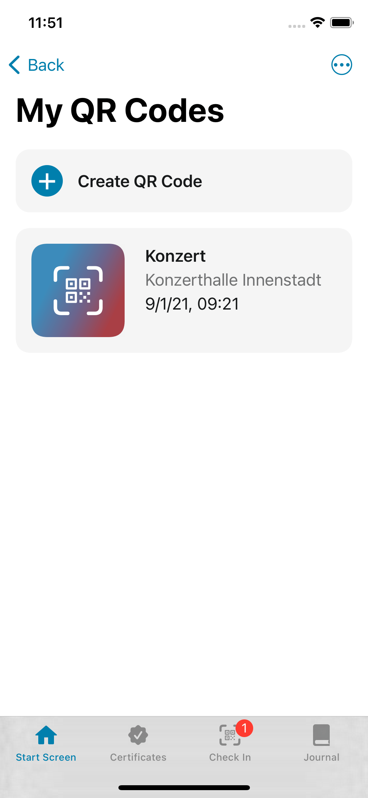
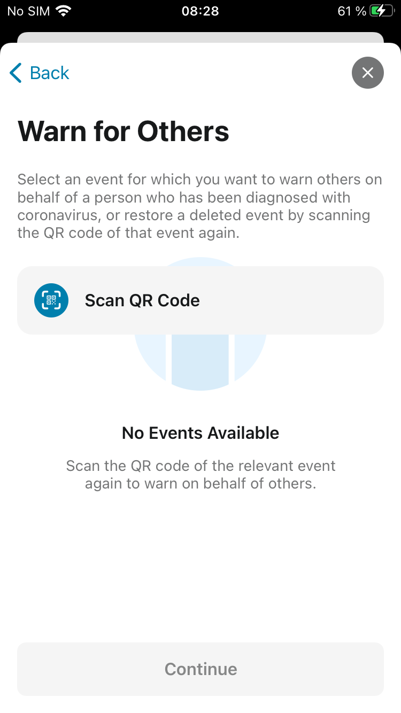
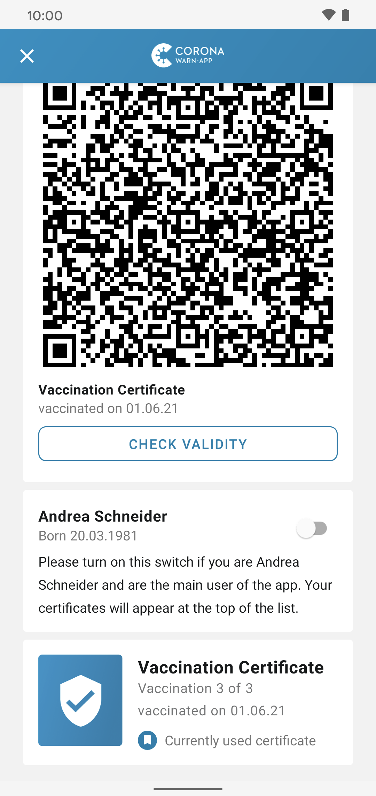
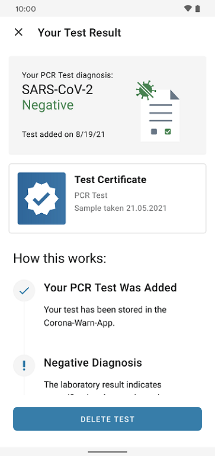

Deutsche Telekom and SAP’s project team have published version 2.9 of the Corona-Warn-App. The update enables event organizers to **warn guests in place of a person** who has tested positive later. In addition, the Corona-Warn-App now displays full vaccination status after the first vaccination for users who have recovered from a COVID infection. Users who have received a booster vaccination can now also transfer the digital certificate into the Corona-Warn-App. 

The update will be available to users over the next 48 hours.

<!-- overview -->

With Version 2.9, the project team enhances the check-in function and thus provides the option to **improve the interruption of infection chains:** Public health authorities and event organizers can warn their guests on behalf of a positively tested person who attended the event but had not checked in via the Corona-Warn-App.

If the health department, while tracing infection chains, discovers that a person who has tested positive was at an event but had not checked in with the Corona-Warn-App, it can contact the organizer. If this person created a QR code via the Corona-Warn-App, the public health office can give out a TAN so that the organizer can issue a warning to everyone who was checked in for the event. 

### Warn guests on behalf of a person who tested positive 

Under **“Planning an event?”** on the app’s home screen, organizers can go to their event overview. There, they select the three dots in the upper right corner and tap “Warn for Others”  

  

  

They can then select the relevant event and specify the date and duration according to the specifications of the public health department. Afterwards, they can then enter the TAN and issue a warning.

  

 
 
 
 

  

If the event no longer exists in the overview, organizers can scan the event’s QR code again. After selecting “Warning on behalf of” via the three dots in the upper right corner, they do not select the event but “Scan QR Code”.

  

  

  

### Full vaccination protection after first shot for people who have recovered from COVID

For those who have **recovered from a COVID infection and have been vaccinated**, full vaccination protection is now displayed in the Corona-Warn-App immediately after the first vaccination. 

Normally, vaccines do not have full protection until 14 days after the last required vaccination.
However, the two-week waiting period is not applicable to those who recovered from COVID and then got their first shot. In these cases, the Corona-Warn-App now recognizes this as a post-recovery vaccination and displays the full vaccination protection immediately. 

Users who get vaccinated with **Johnson & Johnson’s vaccine** after recovery are an **exception.** Since only one shot is required for this vaccine, the Corona-Warn-App cannot distinguish between those who have recovered and got vaccinated and those who have been vaccinated normally. In these cases, it always displays full vaccination status after 14 days. 

Furthermore, users who have received a **booster vaccination** can transfer their digital certificate into the Corona-Warn-App. Booster vaccinations are displayed like the other vaccination certificates with "Vaccination n of m".

  

  

  

With the update, users who have had a PCR or rapid test can access the EU's digital COVID test certificate directly from their test result. The certificate serves as official proof of a negative test result.

Users can select the test result on their app’s home screen and then tap on "Test Certificate" under the test result to directly navigate to the certificate – provided they’ve requested it in advance when registering the test (for more information see [here](https://www.coronawarn.app/en/blog/2021-06-24-cwa-version-2-4/)). 

  

  

  

Version 2.9 - like previous versions - will be delivered in a staged rollout and is made available for users in waves. While users can manually trigger an update in Apple’s App Store, this option is not available in the Google Play Store. There, the delivery of the Corona-Warn-App’s new version can take up to 48 hours.