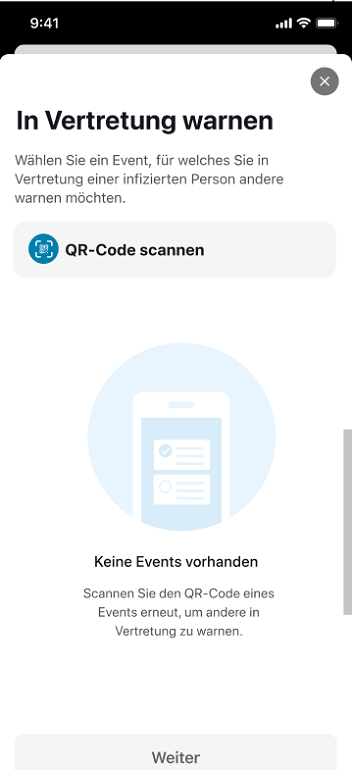
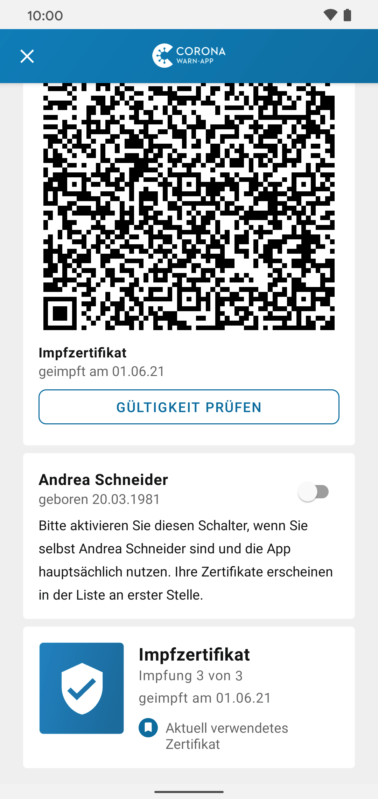

Das Projektteam aus Deutscher Telekom und SAP hat Version 2.9 der Corona-Warn-App veröffentlicht. Das Update ermöglicht es Organisator\*innen einer Veranstaltung Gäste **in Vertretung** für eine später positiv getestete Person zu warnen. Für Genesene wird außerdem künftig nach der ersten Impfung der **vollständige Impfschutz** in der Corona-Warn-App angezeigt. Nutzer\*innen, die eine Auffrischimpfung erhalten haben, können diese ab sofort in die Corona-Warn-App übertragen. 

Das Update steht Nutzer*innen über die nächsten 48 Stunden zur Verfügung.

<!-- overview -->

Mit Version 2.9 erweitert das Projektteam die Check-in-Funktion und bietet so die Möglichkeit, mögliche Lücken im Unterbrechen von Infektionsketten zu schließen: Künftig können Gesundheitsämter und Organisator\*innen von Veranstaltungen ihre **Gäste in Vertretung für eine positiv getestete Person warnen**, die am Event teilgenommen hat, aber nicht über die Corona-Warn-App eingecheckt war. 

Stellt das Gesundheitsamt bei der Nachverfolgung von Infektionsketten fest, dass eine positiv getestete Person auf einer Veranstaltung war, sich aber nicht mit der Corona-Warn-App eingecheckt hatte, kann es den oder die Veranstalter\*in kontaktieren. Hatte diese(r) einen QR-Code zum Check-in über die Corona-Warn-App erstellt, kann das Gesundheitsamt eine TAN ausstellen. Damit kann der/die Veranstalter*in eine Warnung aussprechen, die alle, die für das Event eingecheckt waren, erhalten. 

### Gäste einer Veranstaltung in Vertretung warnen

Veranstalter*innen können dafür unter **„Sie planen eine Veranstaltung“** auf der Startseite ihrer App zur Übersicht ihrer Events gehen. Dort wählen sie die drei Punkte in der rechten oberen Ecke aus und tippen auf „In Vertretung warnen“. 

  

 
 

  

Anschließend können sie die entsprechende Veranstaltung auswählen und  Datum und Dauer entsprechend der Vorgaben des Gesundheitsamtes angeben. Danach können die/der Veranstalter\*in die TAN eingeben und die Warnung verschicken. 

  

 
 
 
 

  

Sollte das entsprechende Event nicht mehr in der Übersicht stehen, können sie den QR-Code des Events noch einmal scannen. Nachdem sie über die drei Punkte in der oberen rechten Ecke „In Vertretung warnen“ ausgewählt haben, wählen sie dann nicht das Event aus, sondern „QR-Code scannen“.

  

 
 

  

### Vollständiger Impfschutz für Genesene nach erster Impfung

Für **Genesene, die geimpft wurden**, wird ab sofort direkt nach der ersten Impfung der vollständige Impfschutz in der Corona-Warn-App angezeigt. Normalerweise haben Geimpfte erst 14 Tage nach der letzten benötigten Impfung einen vollständigen Schutz.

Bei Genesenen, die geimpft werden, entfällt die zweiwöchige Wartezeit allerdings. Die Corona-Warn-App erkennt in diesen Fällen nun, dass es sich um eine Impfung nach Genesung handelt und zeigt den vollständigen Impfschutz sofort an und nicht erst nach zwei Wochen.  

Eine **Ausnahme** bilden die Nutzer\*innen, die nach Genesung mit dem Impfstoff von Johnson & Johnson geimpft werden. Da bei diesem Impfstoff grundsätzlich nur eine Impfung nötig ist, kann die Corona-Warn-App nicht zwischen denjenigen unterscheiden, die genesen sind und geimpft wurden und denjenigen, die regulär geimpft wurden. In diesen Fällen zeigt sie den vollständigen Impfschutz immer nach 14 Tagen an. 

Des Weiteren können Nutzer\*innen, die eine **Auffrischimpfung** erhalten haben, diese ab Version 2.9 in die Corona-Warn-App übertragen. Auffrischimpfungen werden so wie die anderen Impfzertifikate mit "Impfung n von m" angezeigt. 

  

  

  

Außerdem können nun sowohl Android- als auch iOS-Nutzer\*innen, die einen PCR- oder Schnelltest durchgeführt haben, direkt aus ihrem Testergebnis heraus das **digitale COVID-Testzertifikat der EU aufrufen**. Dazu wählen sie das Testergebnis auf der Startseite ihrer App. Anschließend können sie darunter „Testzertifikat“ auswählen. Voraussetzung ist, dass sie das Zertifikat vorab bei der Registrierung des Tests beantragt haben (mehr Informationen dazu finden Sie [hier](/de/blog/2021-06-24-cwa-version-2-4/)).

Das Testzertifikat dient Nutzer\*innen als offizieller Nachweis für das Vorliegen eines negativen Testergebnisses. 

  

  

  

Version 2.9 wird, wie vorherige Versionen auch, schrittweise über 48 Stunden an alle Nutzer\*innen ausgerollt. iOS-Nutzer\*innen können sich die aktuelle App-Version ab sofort aus dem Store von Apple manuell herunterladen. Der Google Play Store bietet keine Möglichkeit, ein manuelles Update anzustoßen. Hier steht Nutzer\*innen die neue Version der Corona-Warn-App innerhalb der nächsten 48 Stunden zur Verfügung.
